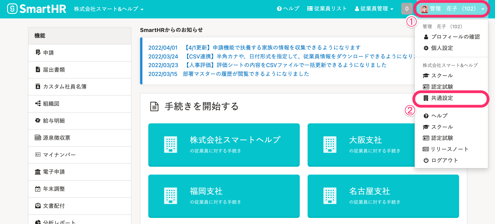
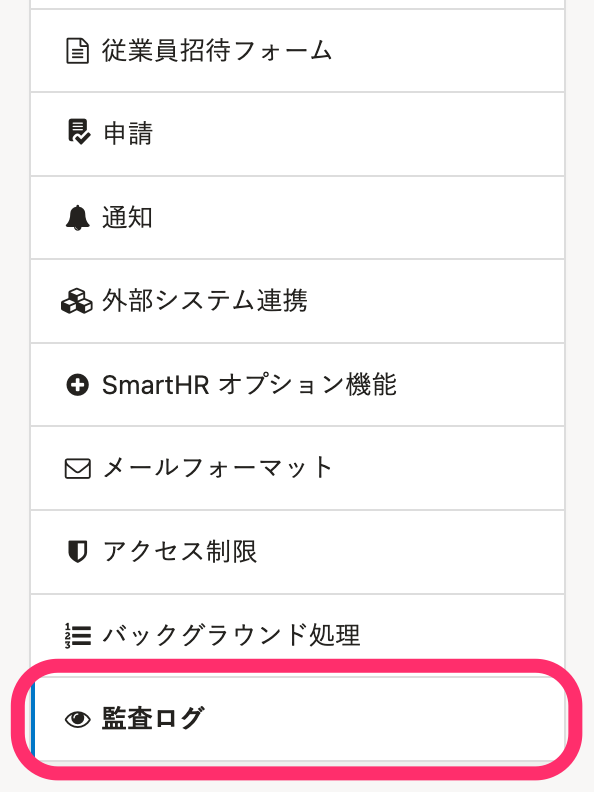
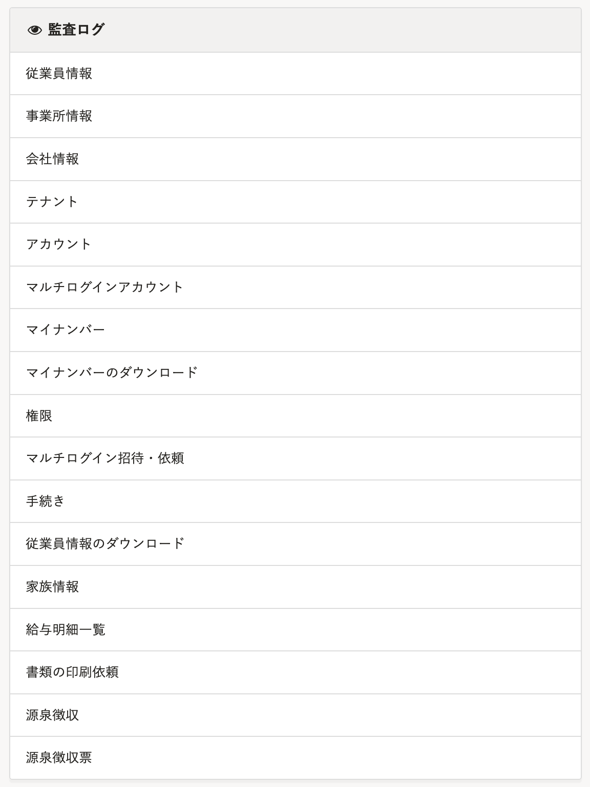

SmartHRでは従業員情報の作成・変更・削除や、マイナンバーの閲覧・編集など、重要な操作を **［監査ログ］** として保持しています。

監査ログは、 **［共通設定］>［監査ログ］** から確認できます。

# 1\. 画面右上のアカウント名 >［共通設定］をクリック

# 2.［共通設定］>［監査ログ］をクリック

 **［監査ログ］** は、画面左側の **［共通設定］** 内にあります。

# 3\. 監査ログを確認したい項目をクリック

 **［共通設定］>［監査ログ］** とクリックすると、画面中央に項目が表示されます。確認したい項目名をクリックしてください。

