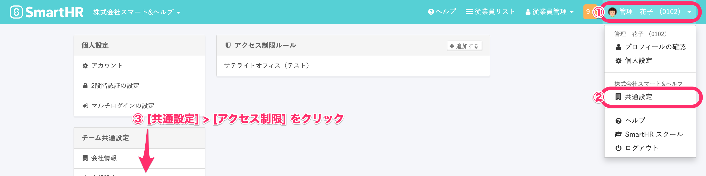
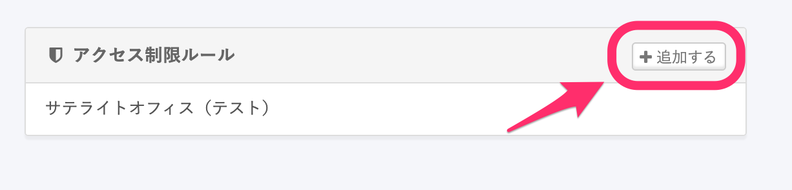
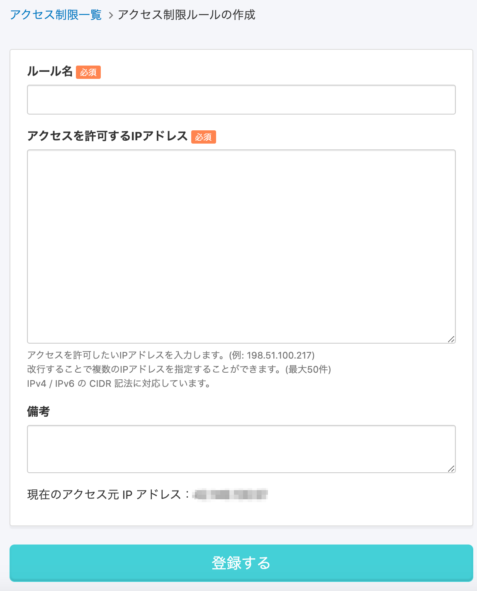
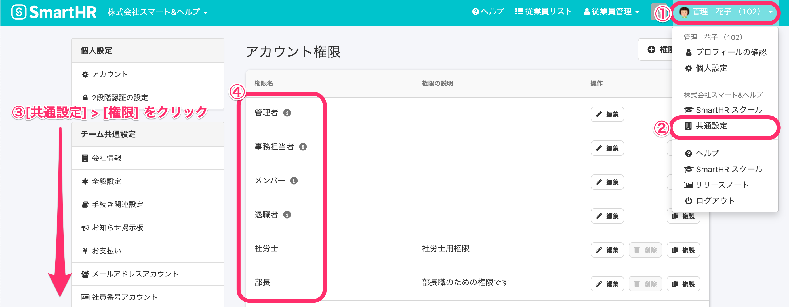
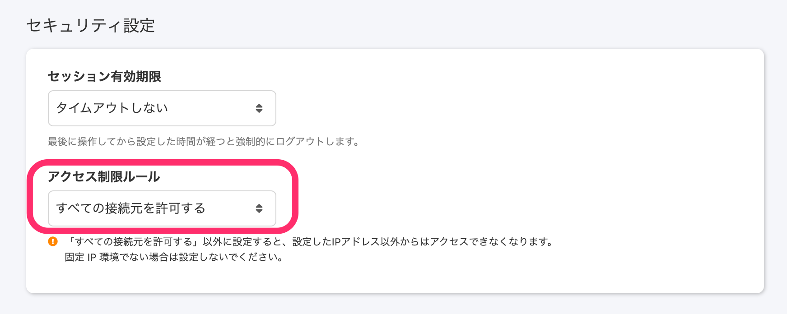

IPアドレス制限機能を使用して、SmartHRにアクセスできる環境を制限できます。

アクセス制限ルールの登録後、権限ごとの設定を行っていただく手順となります。

# 1\. 画面右上のアカウント名 > \[共通設定\] > \[アクセス制限\] をクリック

管理アカウントでログインし、画面右上の **\[アカウント名\] > \[共通設定\] > \[アクセス制限\]** をクリックします。

# 2\. \[追加する\] をクリック

**\[アクセス制限ルール\]** の右上にある **\[追加する\]** をクリックします。

# 3\. 必須項目を入力し \[登録する\] をクリック

**\[ルール名\]** および **\[アクセスを許可するIPアドレス\]** を入力し **\[登録する\]** をクリックします。

IPアドレスは最大 50件まで登録できます。

:::alert
登録したIPアドレス以外からはアクセスできなくなりますので、固定IP環境でない場合は設定しないようお気をつけください。
:::

# 4\. \[アカウント名\] > \[共通設定\] > \[権限\] > \[編集したい権限\] をクリック

画面右上の **\[アカウント名\] > \[共通設定\] > \[権限\] > \[編集したい権限\]** をクリックします。

# 5\. アクセス制限ルールを選択し \[更新する\] をクリック

**\[セキュリティ設定\]欄 > \[アクセス制限ルール\]** にて、任意のアクセス制限ルールをドロップダウンリストから選択し **\[更新する\]** をクリックします。

