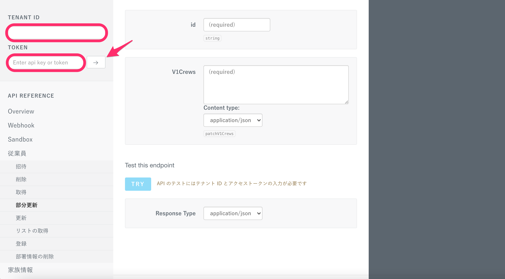

SmartHR APIの仕様についてのドキュメント「[SmartHR API仕様書](https://developer.smarthr.jp/api/index.html)」（以下、API仕様書という）について説明します。

API仕様書では、仕様確認のほか、実際にAPIのリクエストを試すことができます。

:::tips
APIに機能が足りない場合や、API仕様書にエンドポイントの記載がない場合は、要望としてお伺いしますので、チャットサポートへお問い合わせください。
:::

# ［RESPONSE SAMPLE］［RESPONSE SCHEMA］について

画面右にある **［Show samples </>］** をクリックすると、 **［RESPONSE SAMPLE］** と **［RESPONSE SCHEMA］** の項目が表示されます。

区分値の物理名と論理名の対応は、[SmartHR API 区分値リスト](https://docs.google.com/spreadsheets/d/1Tez9fCTMGP8b2ECa3dJMJElyWFNCPCbJNB-ka1jbF74/edit#gid=0)をご確認ください。

 **［RESPONSE SAMPLE］** は、リクエストした際のレスポンスのサンプルです。

 **［RESPONSE SCHEMA］** は、レスポンスを定義したものです。物理名・論理名の定義、各プロパティのデータタイプの定義、各プロパティが必須か、またはオプションか、などを示しています。

 **［RESPONSE SAMPLE］** と **［RESPONSE SCHEMA］** を参考に、JSON文字列を構築してリクエストしてください。

# レスポンス確認について

SmartHRに登録しているデータを用いたAPIのテスト（レスポンス確認）ができます。

画面左上にある  **［TENANT ID］［TOKEN］** に、SmartHRでのサブドメインとアクセストークンを入力し、 **［→］** をクリックすると、実行したレスポンスの確認ができます。

:::related
[サブドメイン（テナントID）とは](https://knowledge.smarthr.jp/hc/ja/articles/360026264893)
[アクセストークンの発行方法](https://knowledge.smarthr.jp/hc/ja/articles/360026266033)
:::
