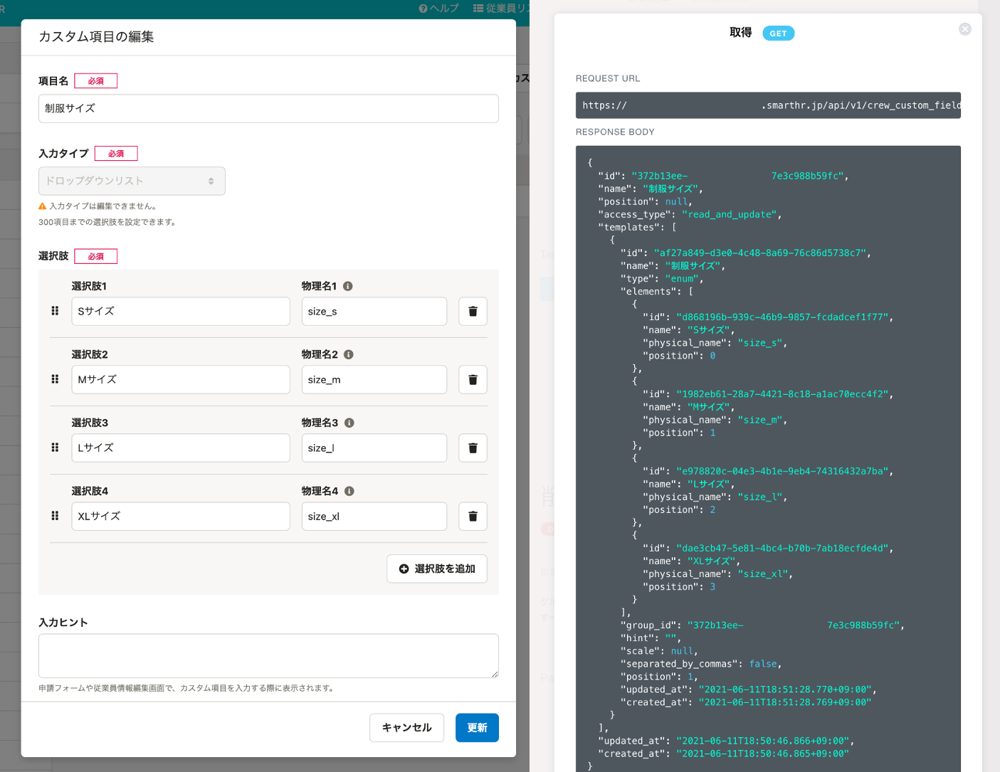

# Q. 画像URLの有効期限はありますか？

## A. あります。

180秒で無効になるため、有効期限が切れたものは再取得するか、ダウンロードし直してください。

# Q. 部署コードはどこを設定すれば良いですか？

## A. 部署設定で設定できます。

# Q. 従業員情報の「id」「user\_id」「emp\_code」とは何ですか？

## A. 以下のとおりです。

- id
    - 企業アカウント内で一意な、従業員情報のIDです。
    - 従業員情報を登録すると自動で発行されます。
- user\_id
    - 企業アカウント内で一意な、アカウントのIDです。
    - 招待や社員番号アカウントの作成を行なうと、自動で発行されます。
    - 従業員がSmartHRにログイン済みで、各自パスワードを設定している状態のアカウントです。
    - 従業員情報のみ登録され、アカウントの発行がされていない場合は「null」になります。
- emp\_code
    - 社員番号です。
    - 従業員情報で変更できます。

# Q. APIを使用して従業員カスタム項目のドロップダウンリストの項目を登録／更新できますか？

## A. はい、できます。

従業員カスタム項目のドロップダウンリストの項目をAPIで取得するには、物理名を設定する必要があります。

[ドロップダウンリスト｜【一覧】\[入力タイプ\] ごとのカスタム従業員項目の表示](https://knowledge.smarthr.jp/hc/ja/articles/360026264613#toc--13) のヘルプページを参考に設定してください。

