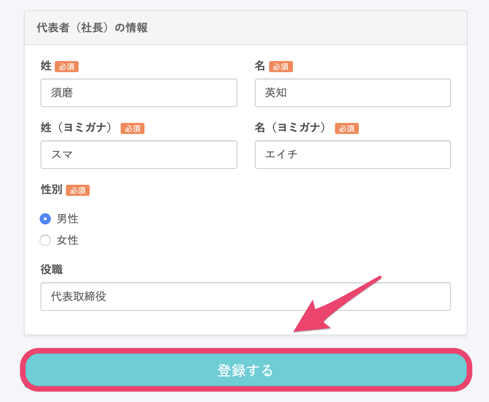

無料トライアル期間（スモールプランの機能を無料で使える期間）が終了したあとに、**¥0プラン**を選択すると、引き続き無料でSmartHRをご利用いただけます。

¥0プランについては、下記のページをご覧ください。

[¥0プランとは？](https://knowledge.smarthr.jp/hc/ja/articles/360026106754)

既に他のプランをご利用中で切り替えを検討されている場合は、下記のページをご覧ください。

[¥0プランの提供枠拡大に合わせ、有料プランから切り替える際の注意点は？](https://knowledge.smarthr.jp/hc/ja/articles/360036159293)

# 1\. 無料トライアルを開始する

[https://smarthr.jp/](https://smarthr.jp/) にアクセスし、 **［無料で試してみる］** をクリックすると、登録画面に遷移します。

登録画面でメールアドレス、パスワード、従業員規模を入力し、 **［**  **無料で試してみる］** をクリックすると、企業アカウントが作成されます。

# 2\. 事業所情報を登録する

企業アカウントが作成されると、事業所情報の登録画面が表示されます。

この画面で事業所名や代表者の情報などを入力し、最下部にある **［登録する］** をクリックすると、企業アカウントの登録が完了します。

# 3\. SmartHRをトライアルで活用する

15日間のトライアル期間は、無料で**[スモールプラン](https://smarthr.jp/pricing/)**の機能をお使いいただけます。

スモールプランでご利用いただけて、¥0プランでは制限されている機能については、下記のページをご覧ください。

[¥0プランとは？](https://knowledge.smarthr.jp/hc/ja/articles/360026106754)

# 4\. トライアル終了後、¥0プランを選択する

トライアル期間終了後、SmartHRにログインすると、プラン選択画面が表示されます。

プラン選択画面で**¥0プラン**を選択してください。

クレジットカード情報を登録すると、¥0プランでの利用が開始されます。

¥0プランでご利用いただく場合でも、不正利用防止のため、カード情報の登録が必要となります。

トライアル期間中もクレジットカード情報を登録できますが、この場合も自動で有料プランに切り替わることはないため、ご安心ください。
