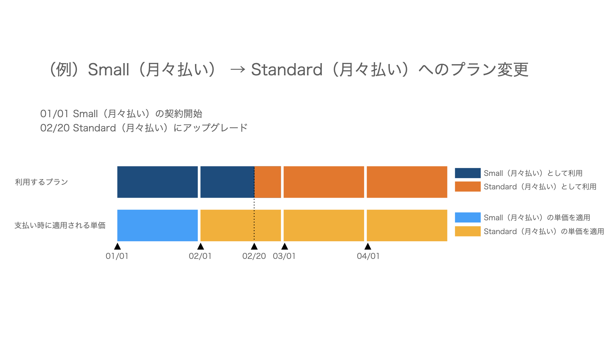

 **［共通設定］** の **［**  **お支払い］** から料金プランを変更した場合に、請求内容が切り替わるタイミングについて説明します。

変更前後のプランやお支払い方法によって、タイミングが異なります。

:::tips
有料プランから¥0プランに変更する場合は、下記のヘルプページをご確認ください。
[¥0プランの提供枠拡大に合わせ、有料プランから切り替える際の注意点は？](https://knowledge.smarthr.jp/hc/ja/articles/360036159293)
:::

## ¥0プランからスタンダードプランに変更する場合（年間一括払い/月々払い共通）

スタンダードプランに変更した日から、スタンダードプランの料金が適用されます。

年間一括払い・月々払いの詳細については下記ヘルプページをご覧ください。

:::related
[年間一括払いプランの料金体系（2018年4月以降）](https://knowledge.smarthr.jp/hc/ja/articles/360026105474)
[月々払いプランの料金体系（2018年4月以降）](https://knowledge.smarthr.jp/hc/ja/articles/360026105454)
:::

## ¥0プランからスモールプランに変更する場合（年間一括払い/月々払い共通）

スモールプランに変更した日から、スモールプランの料金が適用されます。

年間一括払い・月々払いの詳細については下記ヘルプページをご覧ください。

:::related
[年間一括払いプランの料金体系（2018年4月以降）](https://knowledge.smarthr.jp/hc/ja/articles/360026105474)
[月々払いプランの料金体系（2018年4月以降）](https://knowledge.smarthr.jp/hc/ja/articles/360026105454)
:::

## スモールプラン（年間一括払い）からスタンダードプラン（年間一括払い）に変更する場合

スタンダードプランに変更した日を起点として、すでにお支払いいただいているスモールプランの残契約期間分の代金が差し引きされた差額が追加請求されます。

例：

2021/1/1 スモールプラン（年間一括払い）のご契約開始

2021/2/1 スタンダードプラン（年間一括払い）にプラン変更

2021/2/1 ~ 2021/12/31 の残契約期間で、スモールプランとスタンダードプランの差額が追加請求として発生

## スモールプラン（月々払い）からスタンダードプラン（月々払い）に変更する場合

次回の請求から、スタンダードプランの料金で請求されます。

例：

2021/1/1 スモールプラン（月々払い）のご契約開始

2021/2/1 スモールプラン（月々払い）の1月分の請求が発生

2021/2/20 スタンダードプラン（月々払い）にプラン変更

2021/3/1 スタンダードプラン（月々払い）の2月分の請求が発生

※契約期間中にプラン変更した場合も、日割り計算はありません。

## スモールプラン（月々払い）からスタンダードプラン（年間一括払い）に変更する場合

スモールプランの初回の契約日を開始日とみなして、年間契約に切り替わります。

スタンダードプランに変更した日から年間契約の終了日までの利用料金が、スタンダードプランの単価で一括請求されます。

例：

2021/1/10 スモールプラン（月々払い）のご契約開始

2021/2/10 スモールプランの1月分の請求が発生

2021/2/15 スタンダードプラン（年間一括払い）にプラン変更

→スモールプランの初回の契約日（2021/1/10）を開始日とみなして、年間契約に切り替わる

2021/2/15 ~ 2022/1/9 の残契約期間で、スタンダードプランの一括請求が発生
