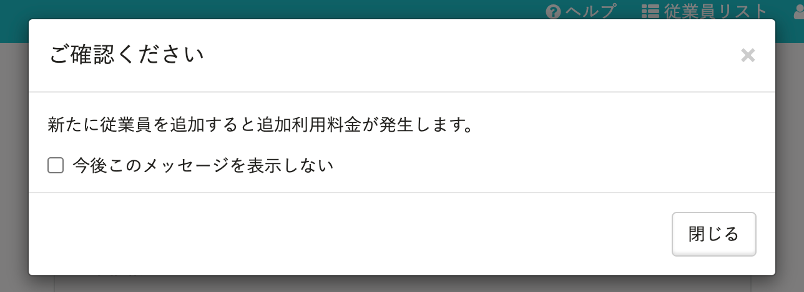
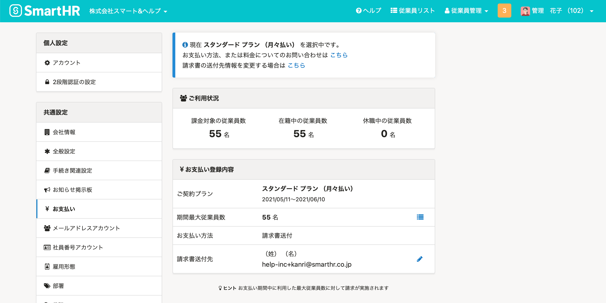
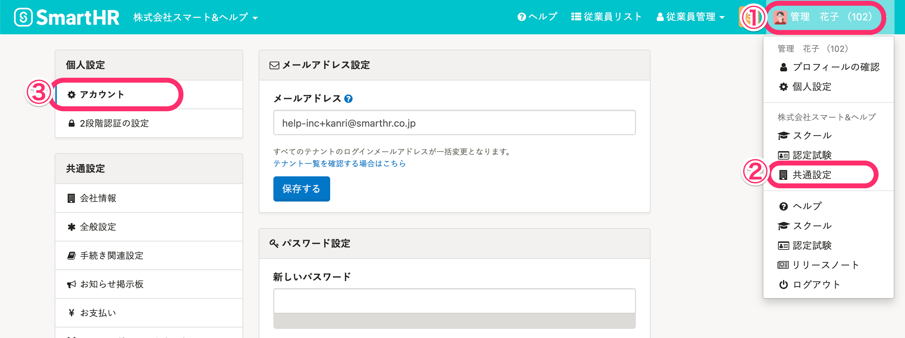
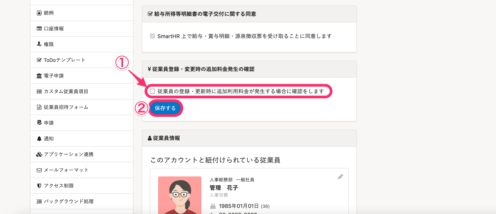

# A. 契約時の人数を超過し、追加でご利用料金が発生する場合に表示されます。

従業員を新規登録する際に、契約時に登録した従業員の人数を超え、ご利用料金が追加で発生する場合に、 **［新たに従業員を追加すると追加利用料金が発生します。］** というメッセージが表示されます。

ご契約・ご利用状況の確認は、［**共通設定**］＞ **［お支払い］** よりご確認ください。

また、ご契約状況の詳細、料金についてのご質問・ご不明点がある場合は、チャットサポートへお問い合わせください。

課金対象人数が追加になる際のメッセージの表示・非表示の設定方法は以下のとおりです。

## メッセージの表示・非表示を設定する

### 1\. ［共通設定］>［個人設定］の［アカウント］をクリック

アカウント名 >  **［共通設定］** をクリックし、画面左に表示される **［個人設定］** \> **［アカウント］** をクリックすると、個人のアカウント情報を設定する画面が表示されます。

### 2\. ［￥従業員登録・変更時の追加料金発生の確認］を設定

画面を下に移動すると、 **［￥従業員登録・変更時の追加料金発生の確認］** の項目が表示されます。

 **［従業員の登録・更新時に追加利用料金が発生する場合に確認をします］** にチェックを入れ、 **［保存］** をクリックすると追加料金が発生するメッセージが表示され、チェックを外すと表示されません。

