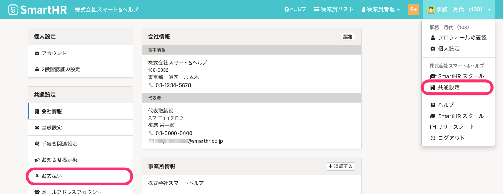
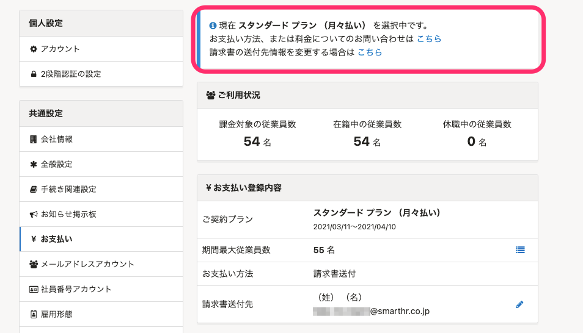
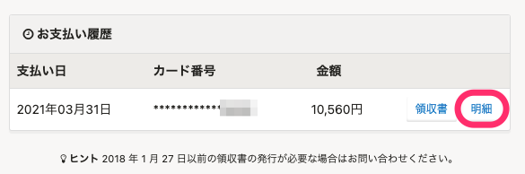
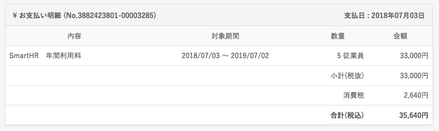
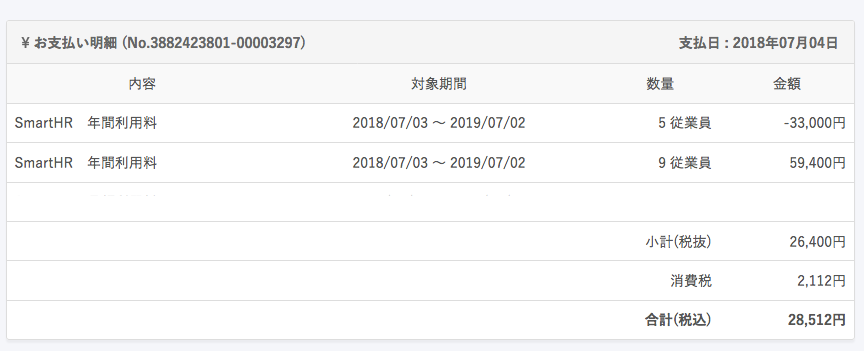

:::tips
2021年4月1日より、ご請求の対象となる従業員の条件を変更しました。
変更後は、在籍状況が「在職中」または「休職中」の従業員がご請求の対象となります。
詳しい変更点は、下記のお知らせをご覧ください。
[「ご請求の対象となる従業員の条件」と在籍状況の仕様変更に関するお知らせ | SmartHR](https://smarthr.jp/other/22960)
:::

現在ご契約中の料金プランや支払い履歴、支払い明細は、 **［共通設定］>［お支払い］** から確認できます。

お支払い方法はクレジットカード払い・請求書払い、どちらにも対応しています。

# 確認方法

 **画面右上のアカウント名 >［共通設定］** をクリックし、画面左に表示される **［**  **共通設定］** メニューで **［**  **お支払い］** をクリックします。

# 料金プランの確認

現在ご契約中の料金プランやご契約期間は、画面の上部に表示されるメッセージで確認できます。

# 支払履歴の確認

お支払い画面の下部にある、 **［お支払い履歴］** から、支払履歴・明細を確認できます。

確認したい明細の **「明細」** をクリックすると、支払い明細が表示されます。

# 支払明細の見方

## 従業員の追加がない場合

## 従業員の追加がある場合

5名で契約をスタートし、途中4名の追加があった場合、明細は下図のような表記となります。
（ – 5名 ＋ 9名（既存5名 + 新規4名））

