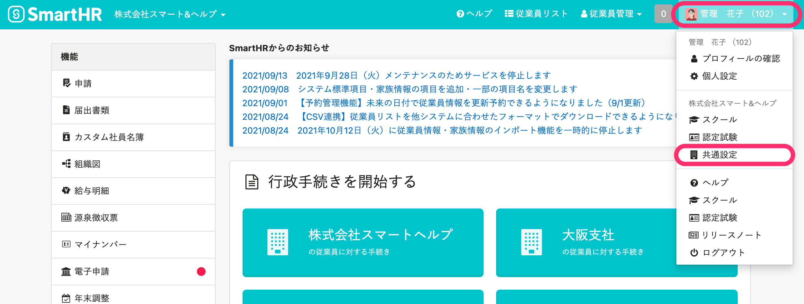
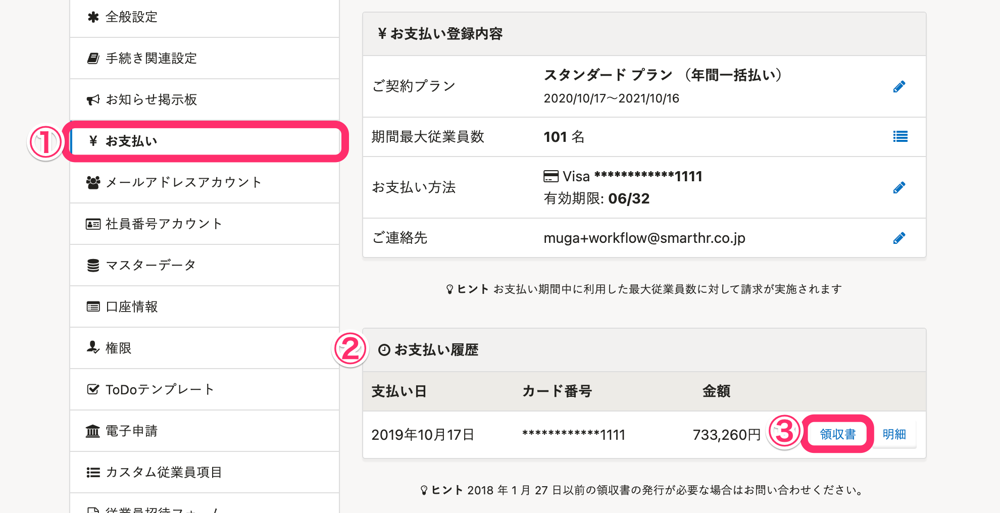
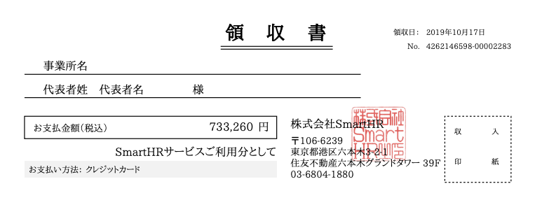

領収書は下記の手順で確認できます。

# 1\. 画面右上のアカウント名 >［共通設定］をクリック

画面右上にあるアカウント名 > **［共通設定］** をクリックすると、画面左側に **［共通設定］** の一覧が表示されます。

# 2\. ［お支払い履歴］で確認したい月の［領収書］をクリック

 **［お支払い］** をクリックし、 **［お支払い履歴］** 欄から、確認したい支払い月の **［領収書］** をクリックすると、別ウィンドウで領収書のPDFを表示します。

PDF形式で領収書をダウンロードできます。

:::related
[添付画像やPDFが開かない場合の対処法は？](https://knowledge.smarthr.jp/hc/ja/articles/360037217273)
:::
