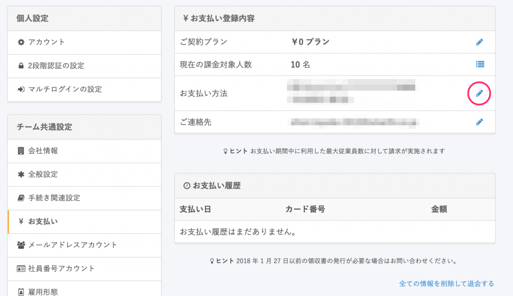

クレジットカード情報をご登録いただく場合や、ご登録済みのクレジットカード情報の変更をする場合の手順です。

# 注意点

クレジットカードは、VISA、MasterCard、American Express、JCB、Diners Clubが利用可能です。

その他のカードをご希望の場合は年払いプランであれば請求書での対応が可能です。

# 1\. 画面右上のアカウント > \[共通設定\] をクリック

管理者アカウントでログインし、画面右上のアカウント名をクリックして **\[共通設定\]** をクリックします。

# 2\. \[共通設定\] > \[お支払い\] をクリック

 左メニューにある **\[共通設定\]** にて **\[お支払い\]** をクリックします。

# 3\. \[お支払い方法\] の右にある \[鉛筆アイコン\] をクリック

**\[お支払い方法\]** の右にある **\[鉛筆アイコン\]** をクリックします。

# 4\. \[変更する\] をクリック

登録変更が必要な箇所に情報を記入し、**\[変更する\]** をクリックします。

