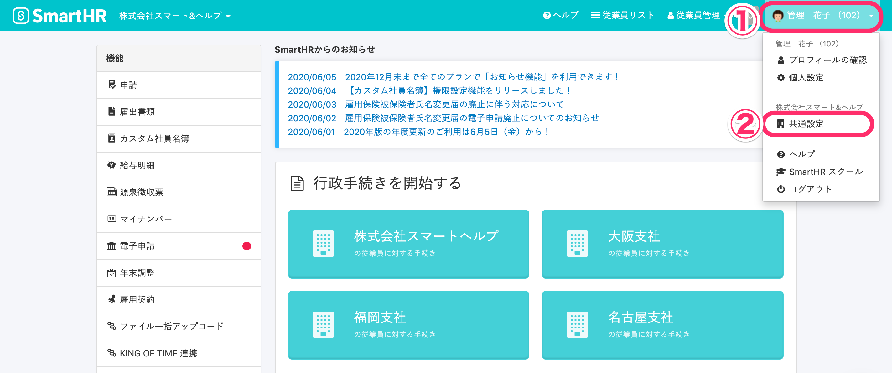
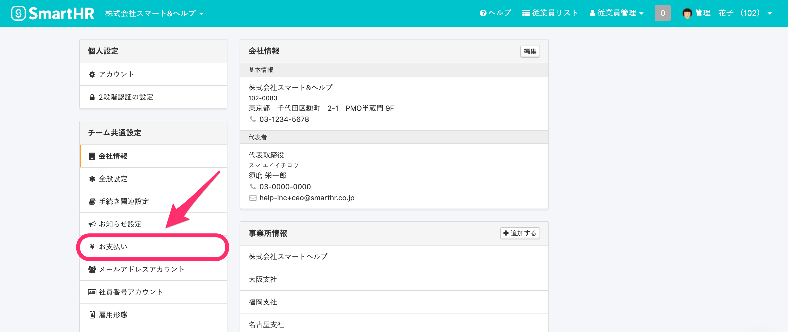
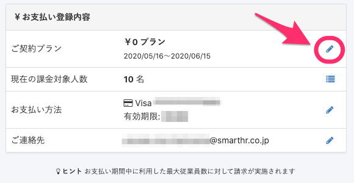
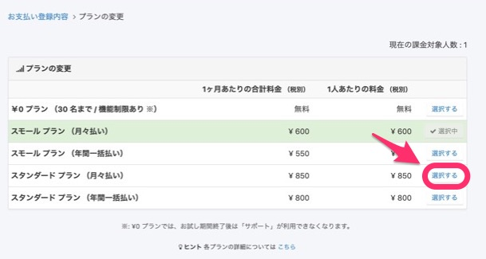
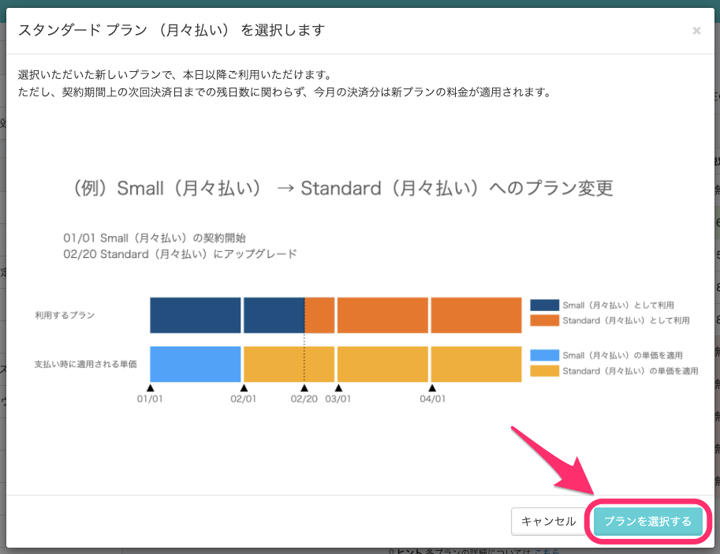

「¥0プラン」から有料プランへの変更や、「月々払い」から「年間一括払い」に変更したい場合などは、以下の手順で変更できます。

:::tips
料金プランを変更する際は、下記のヘルプページもご確認ください。
[料金プランを変更した際に、請求内容が切り替わるタイミングは？](https://knowledge.smarthr.jp/hc/ja/articles/1500002211762)
:::

# 変更手順

## 1\. \[アカウント名\] > \[共通設定\] をクリック

SmartHRにログイン後、画面右上のアカウント名をクリックして開くメニューから **\[共通設定\]** を選ぶと、画面左側に **\[共通設定\]** の一覧が表示されます。

## 2\. \[共通設定\] > \[お支払い\] をクリック

**\[共通設定\]** にある **\[お支払い\]** をクリックすると、お支払い登録内容などを確認できる画面に移動します。

## 3\. \[ご契約プラン\] の鉛筆アイコンをクリック

**\[お支払い登録内容\]** にある **\[ご契約プラン\] の鉛筆アイコン** をクリックすると、**\[プランの変更\]** 画面に移動します。

## 4\. \[選択する\] をクリック

変更したいプランの右側にある **\[選択する\]** をクリックすると、確認のダイアログが表示されます。

**\[問い合わせ\]** をクリックした場合は、 [お問い合わせフォーム | SmartHR](https://smarthr.jp/contact) へ遷移します。

表示されるフォームよりお問い合わせ内容を送信してください。

## 5\. \[プランを選択する\] をクリック

確認のダイアログに表示された内容を確認のうえ **\[プランを選択する\]** をクリックすると、変更内容が適用されます。

正常にプラン変更が完了すると、画面左下に完了のお知らせが表示されます。

