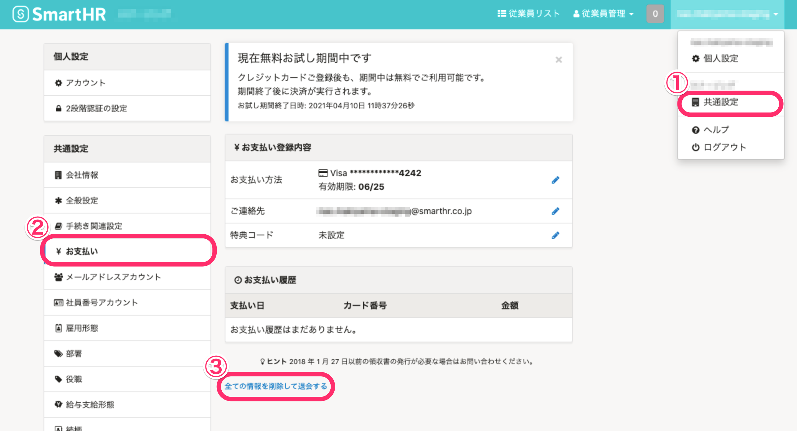
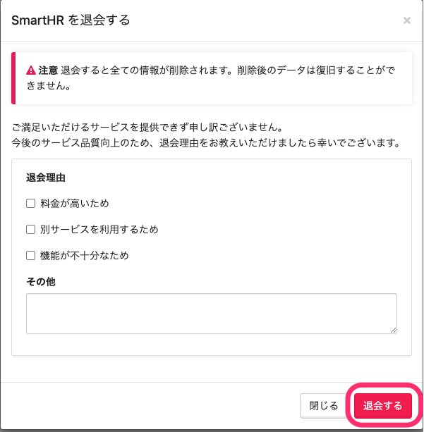
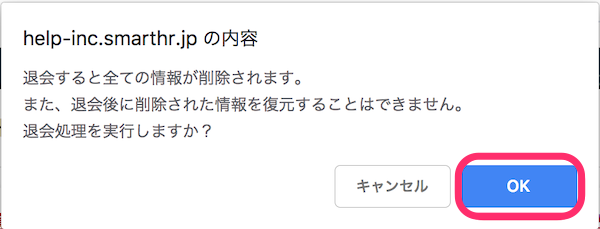

 **［共通設定］>［お支払い］** から、退会が可能です。

SmartHRを退会すると、過去に作成されたすべての情報が削除されますので、ご注意ください。

:::tips
この方法で退会できるのは、クレジットカード払いのお客さまのみです。
請求書払いのお客さまは、弊社担当者またはチャットサポートまでお問い合わせください。
:::

# 1\. ［アカウント名］>［共通設定］>［お支払い］>［すべての情報を削除して退会する］をクリック

画面右上の **［アカウント名］>［共通設定］>［お支払い］>［すべての情報を削除して退会する］** をクリックします。

# 2\. ［退会する］をクリック

 **［SmartHR を退会する］** 画面が表示されます。

差し支えなければ、 **［退会理由］** を選択・記入いただき、右下の **「退会する」** をクリックします。

# 3\. 確認画面で［OK］をクリック

確認画面で、注意事項を確認のうえ **［OK］** をクリックします。

:::alert
この処理によって、今まで登録された手続き・従業員情報などSmartHR上の全ての情報が削除されますので、ボタンを押す前に十分にご確認ください。
:::
