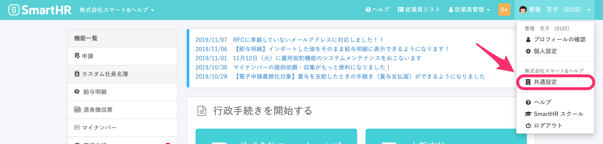
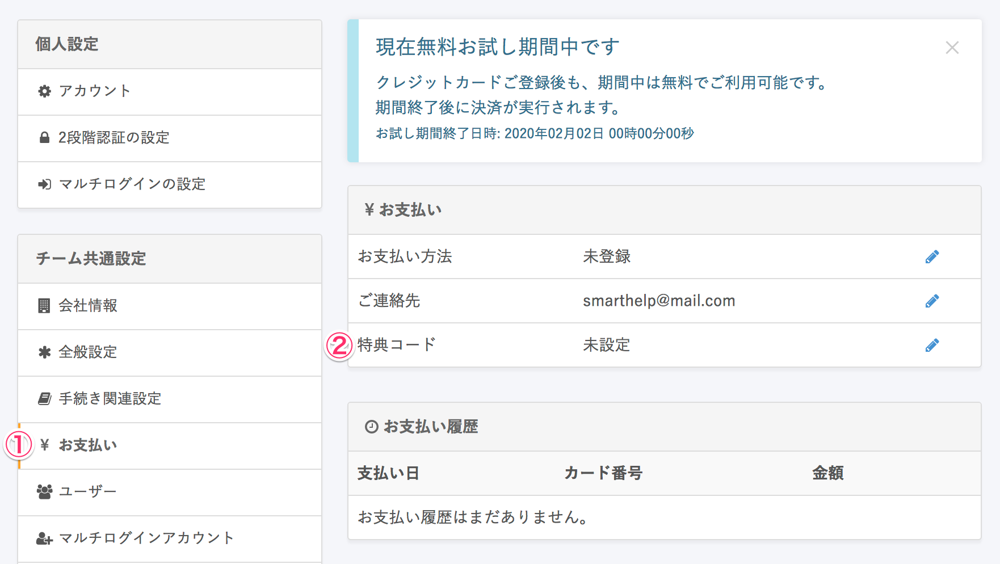
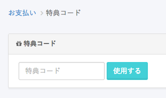
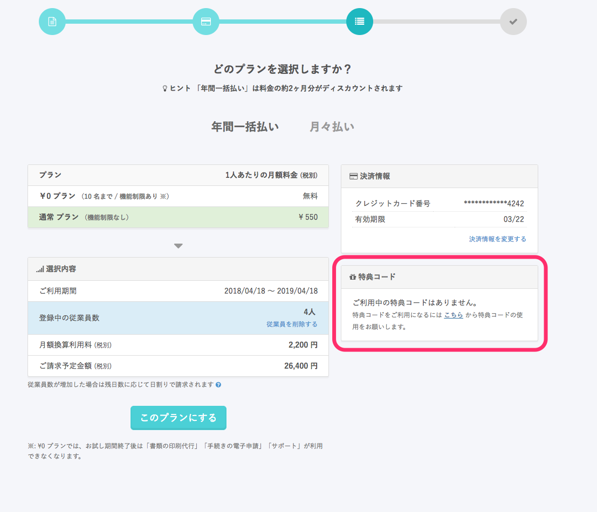

特典コードをお持ちの方は、下記を参考にご利用ください。

# 無料トライアル期間中の場合

## 1\. \[アカウント名\] > \[共通設定\] をクリック

画面右上の **\[アカウント名\] > \[共通設定\]** をクリックします。

## 2\. \[お支払い\] > \[特典コード\] をクリック

左メニュー内 **\[お支払い\] > \[特典コード\]** をクリックします。

## 3\. コードを入力する

「特典コード入力画面」でコードを入力してください。

# プラン選択時に入力する場合

## 1\. プラン選択時に \[特典コード\] 欄を利用する

クレジットカード情報を入力後、プランを選択する画面で、下記をクリックします。

## 2\. \[特典コード入力画面\] でコードを入力する

:::alert
プラン選択を完了し、契約開始された場合は特典コードの適用ができません。
特典コードの入力は、契約開始前に行ってください。
:::
