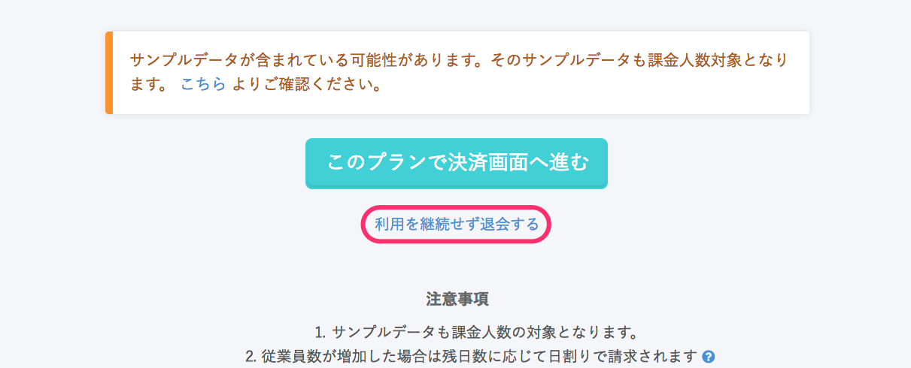

15日間のトライアル期間終了後、本利用いただくまでの流れをご案内いたします。
※ クレジットカード払いのユーザーさま向け手順となります

有料プランを選択して本利用を開始されない限りは、料金は発生しませんのでご安心ください。

# 継続利用される場合

## 1\. ログイン後に支払い方法と任意のプランを選択する

ログイン後にプラン選択画面が表示されますので、支払い方法と任意のプランを選択してください。

## 2\. \[このプランで決済画面へ進む\] をクリック

画面下部のご利用期間などをご確認いただき、**\[このプランで決済画面へ進む\]** をクリックしてください。

:::tips

従業員数は上記いずれかの **\[こちら\]** から確認可能です。
不要な従業員がいる場合は、チェックを入れ削除できます。
:::

## 3\. クレジットカード情報を登録し、 \[確認画面へ進む\] をクリック

クレジットカード情報を登録し、**\[確認画面へ進む\]** をクリックしてください。
※ トライアル期間中に登録済みの場合は、この画面はスキップされます
※ ¥0プランでご利用いただく場合でも、不正利用防止のため登録が必要となります

## 4\. \[上記の内容で決済する\] をクリックする

ご登録内容に問題が無ければ、 **\[上記の内容で決済する\]** をクリックして本利用を開始してください。

# 退会される場合

:::alert
退会すると全ての情報が削除され、削除後のデータは復旧することができません。
:::

## 1\. ログイン後 \[利用を継続せず退会する\] をクリック

ログイン後の画面下部にある、**\[利用を継続せず退会する\]** をクリックしてください。

**\[退会する\]** をクリックし、確認画面で **\[OK\]** をクリックすると、退会処理完了となります。
差し支えなければ、「退会理由」の選択・記入をお願いいたします。

