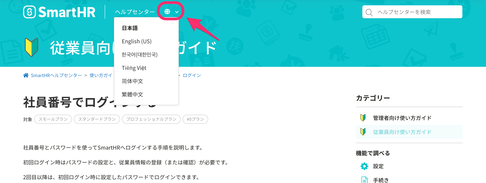

日本語以外の言語でのヘルプページの提供について、説明します。

SmartHRの画面上の多言語化対応については、以下のページを参照してください。

[多言語化対応について](https://knowledge.smarthr.jp/hc/ja/articles/360035659594)

# 対応言語

SmartHRで対応している言語と同じ、以下の5ヶ国語に対応しています。

- 英語
- 中国語（簡体）
- 中国語（繁体）
- 韓国語
- ベトナム語

# 多言語化対応しているヘルプページ一覧

以下のページのみ、言語の切り替えが可能です。

- #### SmartHR基本機能
    
    - [多言語表示が正しく表示されない場合の対応方法は？](https://knowledge.smarthr.jp/hc/ja/articles/360056003974)
    - [社員番号でログインする](https://knowledge.smarthr.jp/hc/ja/articles/360026263133)
    - [ログイン・通知用メールアドレスを設定（変更）する](https://knowledge.smarthr.jp/hc/ja/articles/360026263093)
    - [パスワードを忘れてしまったら？](https://knowledge.smarthr.jp/hc/ja/articles/360026265593)
    - [発行された給与明細を確認する](https://knowledge.smarthr.jp/hc/ja/articles/360026266213)
    - [書類の破棄依頼が届いたら？](https://knowledge.smarthr.jp/hc/ja/articles/360047258053)
    - [ゆうちょ銀行の「支店番号」「口座番号」を入力する](https://knowledge.smarthr.jp/hc/ja/articles/360026107394)
    - [雇用保険 被保険者番号とは](https://knowledge.smarthr.jp/hc/ja/articles/360026107734)
- #### 年末調整機能
    
    - [年末調整の用語集](https://knowledge.smarthr.jp/hc/ja/articles/360052694653)
    - [所得金額調整控除額（年金等）と特定支出控除の適用がある場合の注意点](https://knowledge.smarthr.jp/hc/ja/articles/360055839553)
    - [「給与所得者の基礎控除申告書 兼 給与所得者の配偶者控除等申告書 兼 所得金額調整控除申告書」への合計所得金額の表示仕様](https://knowledge.smarthr.jp/hc/ja/articles/360056738313)
    - [Q. 年末調整のアンケートを中断・再開するには？](https://knowledge.smarthr.jp/hc/ja/articles/4404551179417)
    - [Q. 収入の内訳には何を入力すればいいですか？](https://knowledge.smarthr.jp/hc/ja/articles/4404551726745)
    - [Q. 配偶者控除が適用されていない場合、アンケートはどう修正したらいいですか？](https://knowledge.smarthr.jp/hc/ja/articles/4404573121433)
    - [Q. 寡婦・ひとり親控除が適用されていない場合、アンケートはどう修正したらいいですか？](https://knowledge.smarthr.jp/hc/ja/articles/4404565167513)
    - [従業員が年末調整依頼を受けてから書類提出までの流れ（PCの場合）](https://knowledge.smarthr.jp/hc/ja/articles/360037014354)
    - [従業員が年末調整依頼を受けてから書類提出までの流れ（スマートフォンの場合）](https://knowledge.smarthr.jp/hc/ja/articles/4405556671641)
    - [控除の申請内容が従業員の年末調整書類へ表示される条件](https://knowledge.smarthr.jp/hc/ja/articles/360035370033)
    - [あなたの年末調整画面の使い方](https://knowledge.smarthr.jp/hc/ja/articles/4405811371801)
- #### その他
    
    - [パスワードポリシー](https://knowledge.smarthr.jp/hc/ja/articles/4415296771993)
    - [Q. ログイン後にパスワード設定画面が表示される場合は？](https://knowledge.smarthr.jp/hc/ja/articles/4415589321241)
    - [パスワードポリシーに関するよくある質問](https://knowledge.smarthr.jp/hc/ja/articles/4415576721177)

# 言語の切り替え方法

## 1\. 翻訳したいヘルプページ上部の地球儀アイコンをクリック

翻訳したいヘルプページの画面上部にある地球儀アイコンをクリックすると、言語切り替えメニューが表示されます。

## 2\. 翻訳したい言語を選択

翻訳したい言語を選択すると、画面の言語が切り替わります。

:::tips
多言語対応していない記事で言語を切り替えると、該当言語のトップページに移動します。
:::
