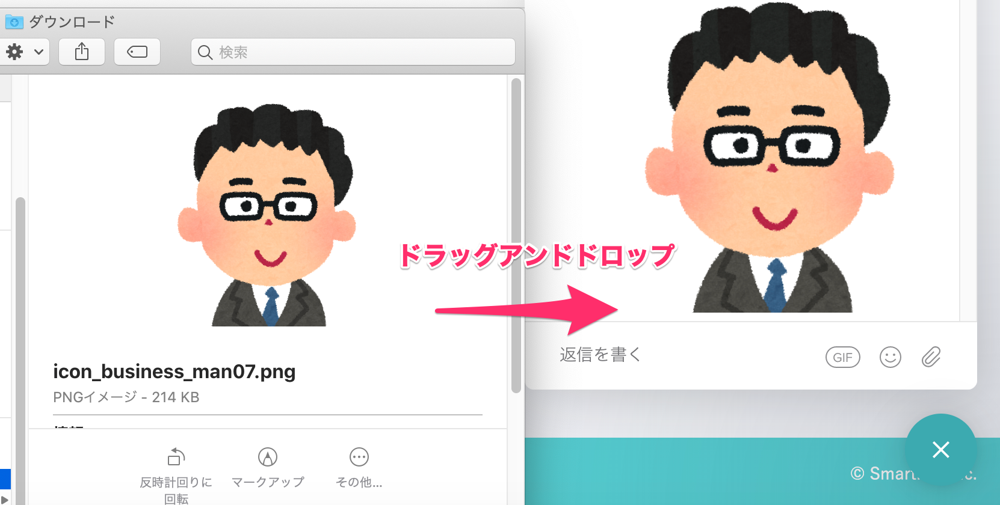

# オペレーターへの情報提供のお願い

オペレーターによる有人チャットは、SmartHRの設定画面を確認していただくケースも多いため、SmartHRを管理者権限アカウントで利用している方、一部オプション機能の機能管理者権限を付与されている方に限って提供しています。

オペレーターから状況を把握するための質問をすることがあります。

迅速かつ正確な回答のため、以下の情報をあらかじめご準備の上、チャットに問い合わせをお送りください。

- 問い合わせ事象の概要
- 事象が起きたページのURL
- 企業アカウント情報（[サブドメイン](https://knowledge.smarthr.jp/hc/ja/articles/360026264893) or SmartHRトップページのURL）
- 操作していたアカウントのメールアドレス　もしくは、従業員の社員番号
- 利用環境端末　（PC or スマートフォン、OS）
- 利用ブラウザ

必要な情報の詳細は、[エラー発生時に教えていただきたい内容](https://knowledge.smarthr.jp/hc/ja/articles/360036353773)を参照してください。

また、お問い合わせの内容によっては、調査に数時間〜数日を要する場合があります。あらかじめご了承ください。

:::alert
書類の書き方など社会保険労務士法の関係でご案内ができない内容もあります。ご了承ください。
オペレーターが回答できない内容の詳細は、[SmartHRサポートポリシー](https://knowledge.smarthr.jp/hc/ja/articles/360044805593)を確認してください。
:::

# チャットからオペレーターに問い合わせる

## 有人チャットの利用をはじめる

管理者権限のアカウントでSmartHRにログイン後、**画面右下のアイコン** > **［新しい会話を開始］** \> **［オペレーターに質問したい］** をクリックすると、オペレーターのチャットに繋がります。

※ **［オペレーターに質問したい］** ボタンが表示されるのは、有人チャットを利用できるアカウントでログインした場合のみです。

スマートフォンなどモバイル端末をお使いの場合には画面上部のアイコンからご利用いただけます。

### 利用にあたっての注意点

- サポート品質およびサービス品質向上のため、チャット内容は社内に共有します。
- 正確な案内やご要望内容の把握のため、いくつか質問をさせていただく場合がございます。また、個人情報は削除または見えないように加工した状態で、画面のキャプチャやCSVのヘッダ行のご提供をお願いする場合がございます。
- 個人情報に関わる、または不適切な内容や画像は、弊社側で削除いたします。
- オペレーターは指名できません。また、途中でオペレーターが変わる場合もございます。

## メッセージを送信する

### 文章を入力する

 **［返信を書く］** 欄に文字を入力します。 **「Shift + Enter」** 押すと、改行できます。

**Enterキー**、もしくは**紙飛行機アイコン**を押すと送信できます。

### 画像やCSVファイルを送信する

入力欄右側にあるクリップのアイコンをクリックすると、画像やファイルを添付できます。

エラー画面などのスクリーンショットを送っていただけると、事象を把握しやすくなります。

ファイルを、入力欄にドラッグアンドドロップをしても、送信できます。

:::related
スクリーンショットの撮り方は、Microsoftもしくは、Appleのヘルプページを参照してください。
[Snipping Tool を使ってスクリーン ショットをキャプチャする｜Microsoft](https://support.microsoft.com/ja-jp/windows/00246869-1843-655f-f220-97299b865f6b)
[Mac でスクリーンショットを撮る｜Apple](https://support.apple.com/ja-jp/HT201361)
:::

### 絵文字を使用する

入力欄右側にある顔アイコンをクリックすると、絵文字の検索画面が表示されます。

画面から絵文字を選んで、挿入できます。

オペレーターからも絵文字を使ったメッセージをお送りすることがあります。

## 届いたメッセージを確認する

画面右下のアイコンをクリックすると最新の会話が表示されます。

 **［会話を続行］** に表示されている会話をクリックすると内容を確認でき、会話が既読になります。

既読にした会話から、続きの返信もできます。

:::tips
### チャットのメッセージをメールで受け取る
オペレーターからの回答を送信し、2分間チャット画面で未読の状態が続くと、メッセージの内容がメールとして、SmartHRのアカウントとしてご登録のメールアドレス宛送信されます。
メールを受け取りたい場合は、すぐに既読にせず、メールが届くのを待ってからチャット画面をクリックしてください。
:::

### メッセージをダウンロードする

チャット画面の右上のダウンロードボタンを押すと、チャットの内容がテキストファイルとしてダウンロードできます。

# チャット終了について

お問い合わせに対するご案内を終え、ご了承いただき次第、オペレーターがチャット終了の操作をいたします。しばらく会話がなかったり、サポート対応時間を過ぎた場合でも、自動的に終了することはございませんのでご安心ください。

ただし、弊社からの回答を送信後、3営業日を目安にお返事がいただけなかった場合には、チャットを終了します。

チャットの終了後も、メッセージは送信できます。

また、終了後に、今回のご案内に対するアンケートをお送りする場合がございます。アンケートにご回答いただいた後も、続けてお問い合わせいただけます。

# 過去のチャットを確認する

終了済みの会話や、やりとりしている最中に閉じた会話もチャット欄から確認できます。

 **［すべての会話を表示］** をクリックすると、これまでの会話の一覧が表示されます。

なお、チャットには、これまでの会話の内容を検索する機能はありません。

# 新しい問い合わせを開始する

チャット終了から31日経過すると、チャット画面から返信できなくなります。

その場合は、 **［メッセージを送信］** をクリックして、新しいチャットを開始してください。

# 有人チャットを利用できる条件

以下2つの条件を満たしている方に提供しています。

- スモールプラン、スタンダードプラン、プロフェッショナルプラン、人材マネジメントプランをご契約中の方
    - ¥0プランでは、**無料トライアル中の15日間のみ提供**しています
- アカウント権限が管理者※の方

※お問い合わせの内容が SmartHR の設定に関わる場合があるため、設定を確認できる管理者権限をお持ちの方に限らせていただきます。
※管理者権限以外の方で、SmartHRの使い方についてご不明点がある場合は、貴社の管理者さま経由でお問い合わせください。

## オペレーターによるチャットの対応時間

平日10:00〜17:00 （12:00〜13:30を除く）
※年末年始、祝日は除きます。

- 対応時間内に順にご案内をいたします。
- 休み明けや繁忙期、お問い合わせの内容によっては、ご案内まで1〜2時間ほどお時間をいただく場合があります。
- 12:00や17:00直前にお問い合わせをいただいた場合、混雑状況によっては、午後または翌営業日のご案内になる場合があります。
- 年末年始や祝日の他、社内研修でお休みをいただく場合があります。その場合はあらかじめお知らせをいたします。
- チャットサポートに利用しているサービス（ [INTERCOM](https://www.intercom.com/) ）のメンテナンスや不具合発生等によりチャットサポートをご利用いただけなくなる場合がございます。

## 特別な休業予定を確認する

オペレーターの研修など、特別な休業日や対応時間変更に関するお知らせは、SmartHR基本機能トップページの画面上部にある、お知らせの通知一覧に表示されます。

