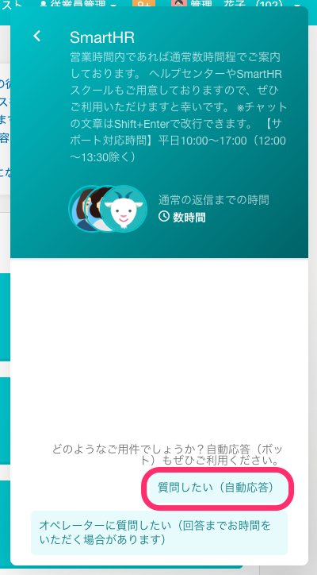
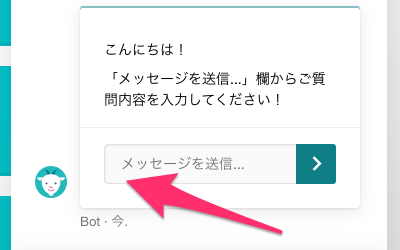
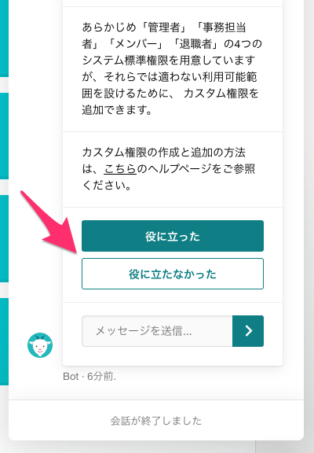
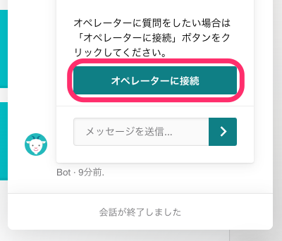

# チャットボットとは

自動会話プログラムを利用したチャットツールです。

SmartHRの操作方法や仕様について、自動応答でご案内します。

給与明細の内訳、エラーの詳細など個別事情に関するご案内はできません。また、個人情報の入力はお控えください。

# チャットボットにメッセージを送信する

## チャットボットの利用をはじめる

SmartHRにログイン後、**画面右下のアイコン** >  **［新しい会話を開始］** の **［メッセージを送信］** \> **［質問したい（自動応答）］** をクリックすると、チャットボットに繋がります。

スマートフォンなどモバイル端末をお使いの場合には画面上部のアイコンからご利用いただけます。

## メッセージを送信する

メッセージ送信欄に、お問い合わせ内容を直接入力してEnterキーを押してください。

お問い合わせ内容を入力すると、ボットが回答を送信します。

「〇〇について知りたい」など機能名と知りたいことをメッセージに含めると、適切な回答を得やすいです。

## フィードバックを送る

回答画面の最後に **［役に立った］**  **［役に立たなかった］** のボタンが表示されます。

ボットの回答内容で、知りたかったことが解決した場合に **［役に立った］** をクリックしていただけると、今後のボットの回答精度の向上に繋がるため、大変助かります。

別の質問をする場合には、メッセージ送信欄にお問い合わせ内容を入力してください。

# チャットボットで解決できなかった場合

チャットボットによる回答で解決しなかった場合、 **［役に立たなかった］** をクリックしてフィードバックをお送りください。

有人チャットを利用できる権限でSmartHRにログイン中のときは、 **［オペレーターに接続］** ボタンが表示されます。

 **［オペレーターに接続］** をクリックすると、有人チャットサポートへのお問い合わせに切り替わります。

有人チャットのサポート対象外の方は、貴社のSmartHRの管理者の方にお問い合わせください。
