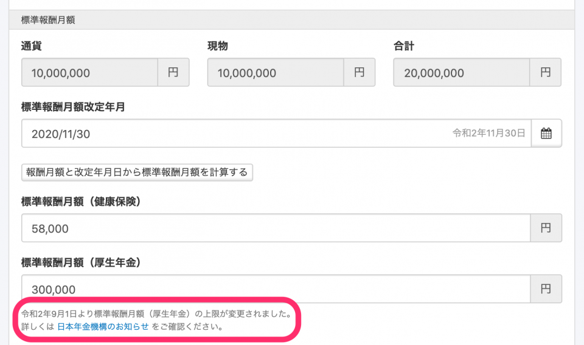
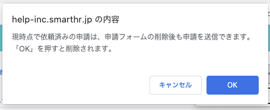

2020年8月31日（金）に行なったアップデートの詳細をお知らせします。

SmartHR基本機能の変更点は、カイゼン2点でした。

# 📈カイゼン

## 標準報酬月額テーブルの改定にあわせてヒントを変更しました

厚生年金保険法の標準報酬月額の等級区分が改定されたため、報酬月額変更届の手続き画面と従業員情報の編集画面に表示しているヒントを変更しました。

ただし現在、SmartHR内のヒントメッセージに含まれるリンクは、対象記事のURLが変更されたため、リンク切れの状態になっています。

正しくは以下のリンクです。

:::related
[厚生年金保険における標準報酬月額の上限の改定：日本年金機](https://www.nenkin.go.jp/oshirase/taisetu/2020/202009/20200901.html)
:::

ヒントメッセージのリンクは近日中に修正します。

## 申請フォームを削除する際の警告メッセージを変更しました

申請機能で使用するフォームを削除する際の警告メッセージを以下のように変更しました。

