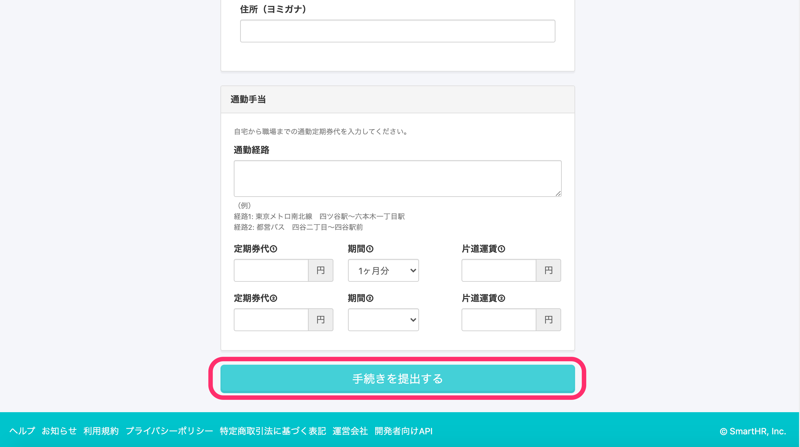
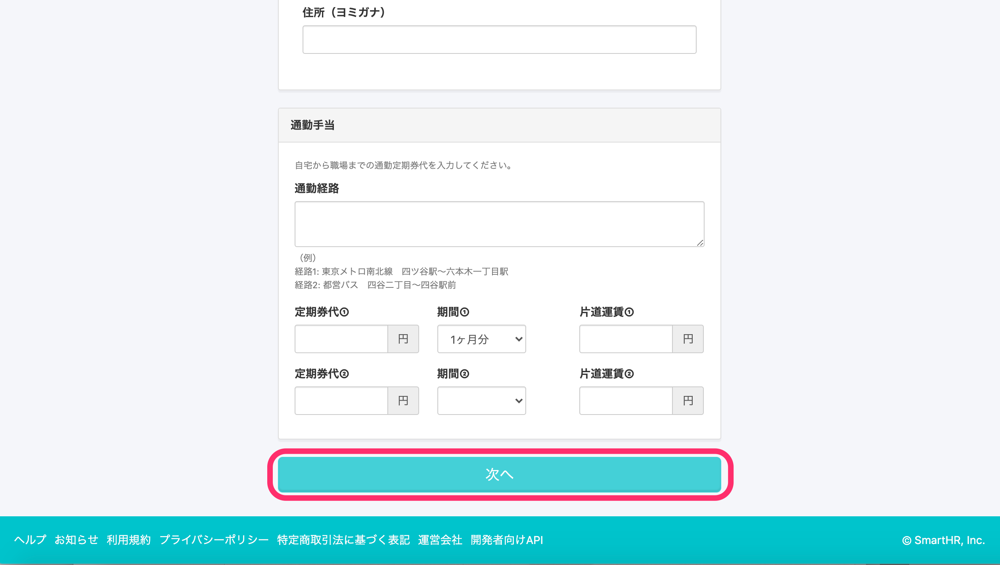
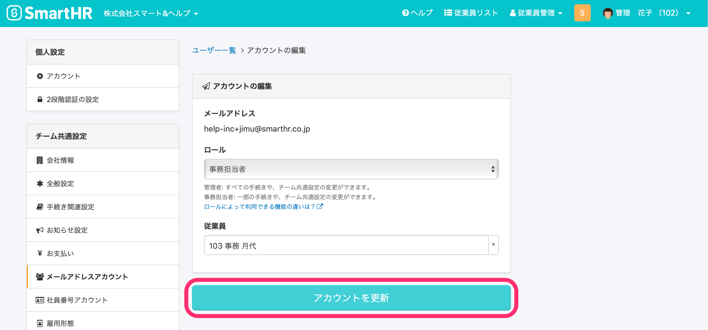
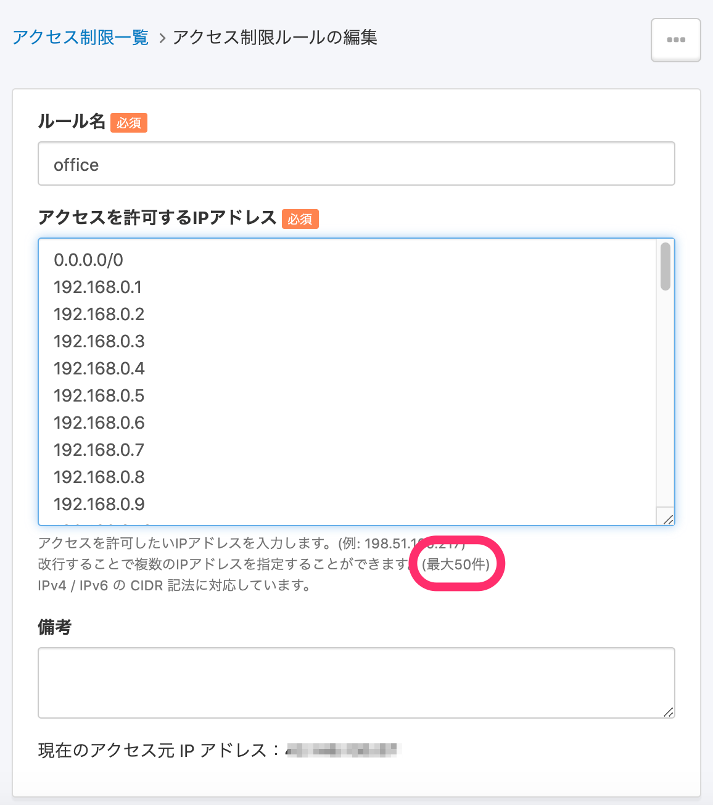

2020年9月1日（火）に行なったアップデートの詳細をお知らせします。

SmartHR基本機能の変更点は、カイゼン3点・不具合1点でした。

# 📈カイゼン

## 権限に応じて手続き作成時のボタンの文言を出し分けるように変更しました

手続きの作成権限はあるが、更新権限がない従業員が手続きを作成しようとしたとき、これまでは **\[次へ\]** ボタンを押したタイミングで手続きが提出されてしまっていました。

これに対して「送信が実行されるのか、単に次のステップに進むだけなのかわかりにくい」という声をいただいていました。

そこで、手続きの作成権限のみの従業員の場合は **\[手続きを提出する\]** というボタンに変更し、ボタンを押したタイミングで提出されることを明示するようにしました。

管理者など、手続きの更新権限もあるユーザーの場合は、これまで通り **\[次へ\]** というボタンが表示されます。

**対象手続き**

- 退職
- 扶養追加（TJKの扶養追加の手続きは、メンバー権限でもステップ画面まで進めるので **\[次へ\]** のままです）
- 扶養削除
- 住所変更
- 氏名変更
- 事業所変更
- 高年齢雇用継続給付申請

※入社手続きは、 **\[次へ\]** を押すと提出確認画面が出るようになっているので、今回のカイゼンの対象外としました。

**手続き更新権限なし**
手続きが作成されるボタンの文言が **\[手続きを提出する\]** になっています。

**手続き更新権限あり or 権限がなくてもステップに進める手続き**
ボタンの文言が **\[次へ\]** になっています。

## アカウント更新ボタンのラベルを \[アカウントを更新\] に統一しました

メールアドレスアカウント、社員番号アカウントのアカウント更新ボタンのラベルを **\[アカウントを更新\]** に統一しました。

これまでは **\[更新する\]** や **\[アカウントを編集する\]** など、場所によってラベルのテキストがブレていました 🙇‍♂️

:::related
[アカウントの権限（ロール）を変更する](https://knowledge.smarthr.jp/hc/ja/articles/360026106574)
:::

## アクセス制限の対象として登録できるIPアドレスの数を10件から50件に増やしました

**\[共通設定\] > \[アクセス制限\]** で設定できる、アクセス制限の対象となるIPアドレスの数を、これまでの1ルールあたり10件から、1ルールあたり50件に増やしました。

多くの店舗をもっている場合など、これまでの最大10件では足りないケースがあり、件数を増やしたいというリクエストをいただいていたものです 🙏

:::related
[IPアドレス制限を設定する](https://knowledge.smarthr.jp/hc/ja/articles/360026265753)
:::

# 👨‍⚕️不具合修正

家族情報取り込みに関する不具合1点を修正しました。
