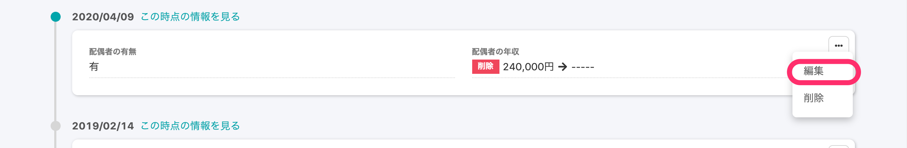

2020年9月2日（水）に行なったアップデートの詳細をお知らせします。

SmartHR基本機能の変更点は、新機能1点でした。

# ✨新機能

## 配偶者情報と通勤手当の項目も、履歴の直接編集に対応しました

これまでは、 **\[基本情報\] \[履歴書・職務経歴書\] \[給与振込口座\]** のみ履歴の直接編集に対応していましたが、新たに **\[配偶者情報\]** と **\[通勤手当\]** も履歴を編集できるようになりました。

その他の項目も、随時対応を進めていきます。

:::related
[従業員情報の履歴を編集する](https://knowledge.smarthr.jp/hc/ja/articles/360052967933)
:::
