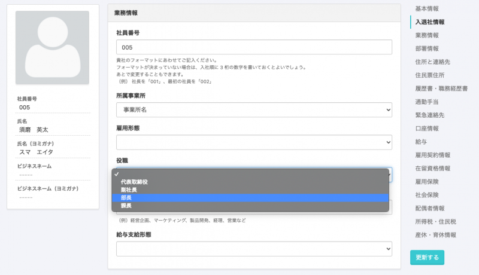
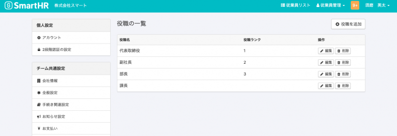
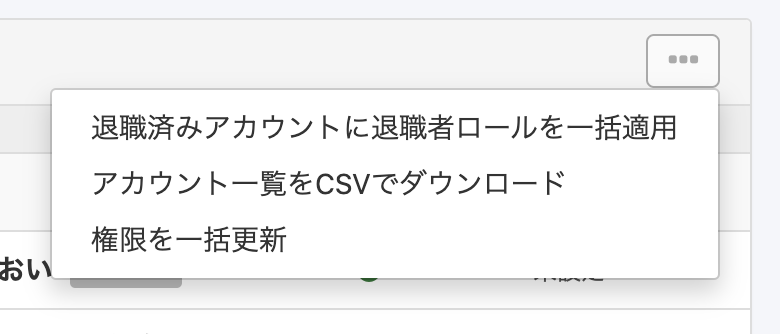
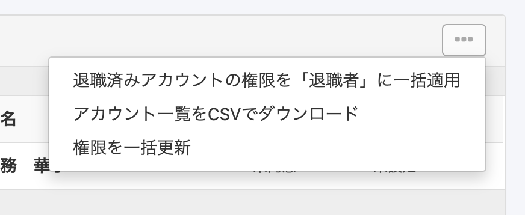

2020年9月7日（月）に行なったアップデートの詳細をお知らせします。

SmartHR基本機能の変更点は、新機能2点・カイゼン1点・不具合3点でした。

# ✨新機能

## 役職をマスターデータで管理できるようになりました

従業員情報の **\[業務情報\]** グループの中の項目、 **\[役職\]** をマスターデータとして管理できるようになりました。

これまで、**\[役職\]** の欄はフォームに自由記述方式で入力・管理していただいていましたが、マスターデータとして管理することにより、部署や雇用形態のようにプルダウンメニューから選択できるよう変更を行ないました。

これまでは手入力で登録していただいていたため、本来同じ役職であるはずの肩書きが重複登録されてしまうようなケースもありましたが、今後は役職をマスターデータにて管理していただくことで、企業アカウント内で適切な情報を適用していただけます。

役職マスターにはランクの値も設定でき、役職一覧で並びかえに利用できます。

詳細は下記のお知らせページをご覧ください。

:::related
[従業員情報の役職をマスタ化します](https://smarthr.jp/update/19938)
:::

## 備考の項目も、履歴の直接編集に対応しました

これまでは、 **\[基本情報\] \[履歴書・職務経歴書\] \[給与振込口座\]** **\[配偶者情報\]** **\[通勤手当\]**のみ履歴の直接編集に対応していましたが、新たに **\[備考\]** も履歴を編集できるようになりました。

その他の項目も、随時対応を進めていきます。

:::related
[従業員情報の履歴を編集する](https://knowledge.smarthr.jp/hc/ja/articles/360052967933)
:::

# 📈カイゼン

## メールアカウント一覧・社員番号アカウント一覧のメニュー文言を変更しました

**\[共通設定\]** の **\[メールアドレスアカウント\] \[社員番号アカウント\]** にある一覧のメニューの文言を変更しました。

| **変更前** |  |
| --- | --- |
| **変更後** |  |

# 不具合修正

年金機構へのリンクの修正など、3点の不具合修正を行ないました。
