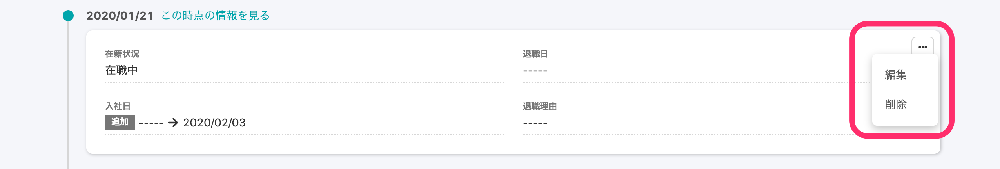
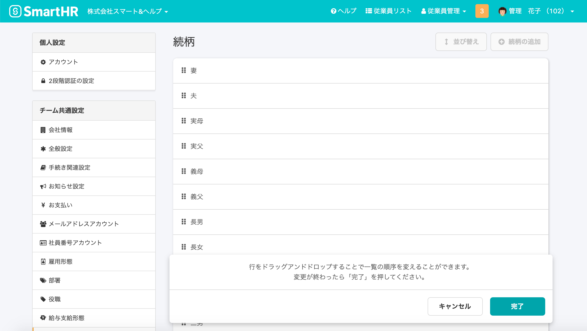

2020年9月9日（水）に行なったアップデートの詳細をお知らせします。

SmartHR基本機能の変更点は、新機能1点・カイゼン2点・不具合修正2点でした。

# ✨新機能

## 入退社情報も、履歴の直接編集に対応しました

これまでは、 **\[基本情報\] \[履歴書・職務経歴書\] \[給与振込口座\]** **\[配偶者情報\]** **\[通勤手当\] \[備考\] \[雇用契約情報\]**のみ履歴の直接編集に対応していましたが、新たに **\[入退社情報\]** も履歴を編集できるようになりました。

その他の項目も、随時対応を進めていきます。

:::related
[従業員情報の履歴を編集する](https://knowledge.smarthr.jp/hc/ja/articles/360052967933)
:::

# 📈カイゼン

## 続柄一覧を並び替える画面のデザインを変更しました

新しいデザインへ統一するため、続柄一覧の並び替え画面の見た目を変更しました。

機能的な変更はありません。

## API経由での従業員更新時のWebhook発火を制御できるようにしました

APIの話なので少し専門的になりますが、2つのサービスを相互にWebhookで同期する際に、無限ループが発生しないよう、パラメータで制御できるようにしました。

詳しくはSmartHR APIのドキュメントをご覧ください。

:::related
[SmartHR API Specifications](https://developer.smarthr.jp/api/index.html) 
:::

# 不具合修正

従業員リストのリンク色の変更など、2点の不具合修正を行ないました。
