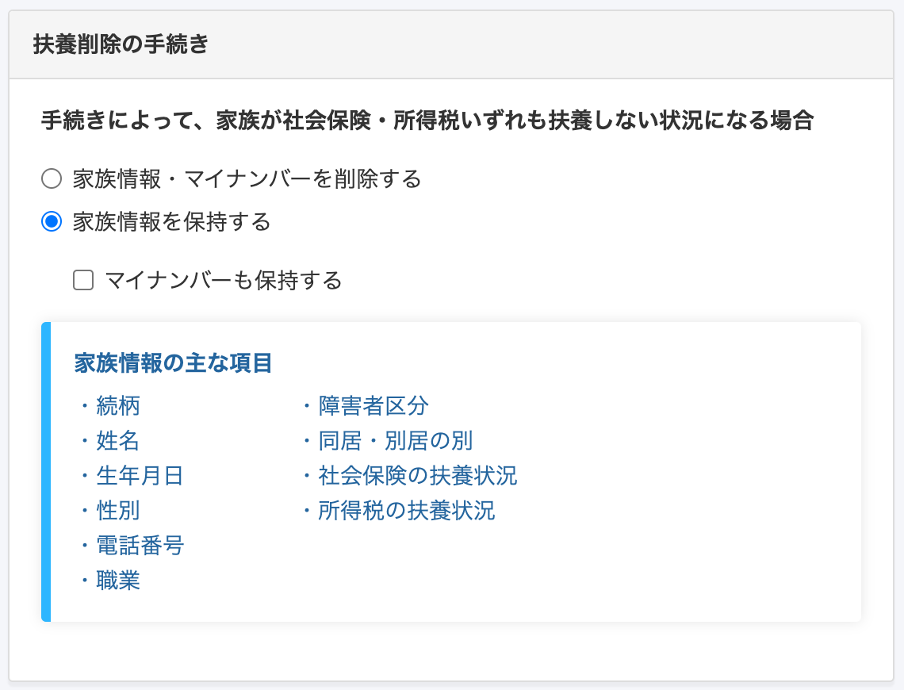
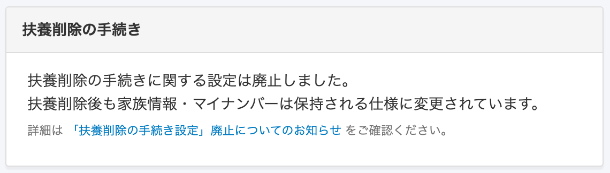
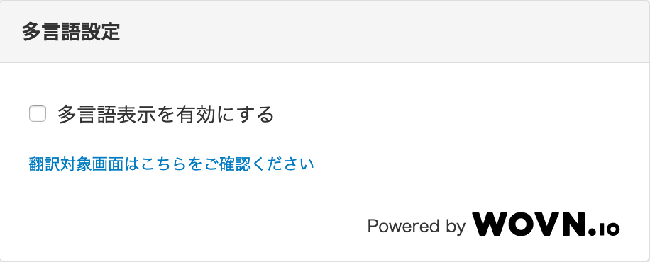
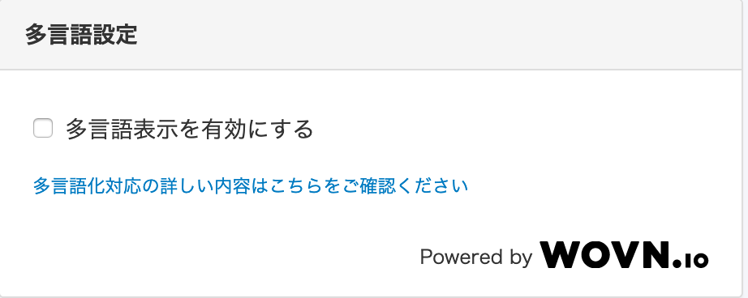

2020年9月16日（水）に行なったアップデートの詳細をお知らせします。

SmartHR基本機能の変更点は、新機能1点・カイゼン1点・不具合修正2点でした。

# ✨ 新機能

## 扶養削除の手続き時、扶養から外れた家族の情報を必ず保持するようにしました

**\[手続き関連設定\]** > **\[扶養削除の手続き\]** を削除し、扶養削除手続きで扶養から外れた家族の情報は必ず保持されるようにしました。

これまでは、「家族情報とマイナンバーを保持する／しない」の設定によって手続き時の動作が変わっていましたが、その設定を削除し、扶養からはずれた家族の家族情報とマイナンバーは扶養削除後も必ず保持されるようにしました。

削除が必要な場合は、対象従業員の家族情報画面や、マイナンバー管理画面から削除してください。

**変更前**

**変更後**

[「扶養削除の手続き設定」廃止についてのお知らせ](https://smarthr.jp/update/19689)

**扶養削除の手続きを行なった際のToDo画面**

# 📈カイゼン

## 多言語設定の文言を変更しました

以前は多言語対応されたページは一部でしたが、現在ではほとんどのページで対応されるようになったため、文言を **\[多言語化対応の詳しい内容はこちらをご確認ください\]** に変更しました。

**変更前**

**変更後**

# 👨‍⚕️不具合修正

従業員情報取り込みに関する修正など、2点の不具合修正を行ないました。
