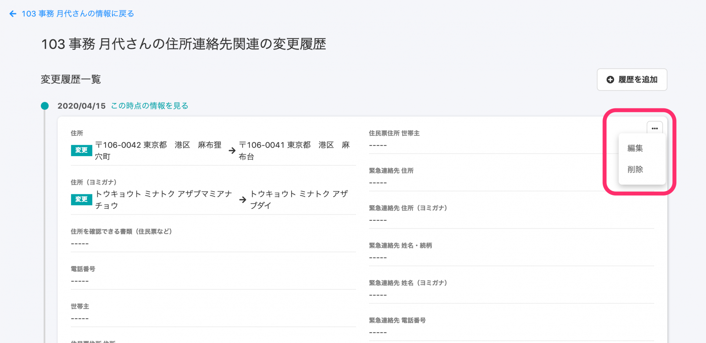

2020年9月18日（金）に行なったアップデートの詳細をお知らせします。

SmartHR基本機能の変更点は、新機能1点でした。

# ✨新機能

## 住所と連絡先も、履歴の直接編集に対応しました

これまでは、 **\[基本情報\] \[履歴書・職務経歴書\] \[給与振込口座\] \[配偶者情報\] \[通勤手当\] \[備考\] \[雇用契約情報\] \[入退社情報\]** のみ履歴の直接編集に対応していましたが、新たに住所連絡先関連の **\[住所と連絡先\]** **\[住民票住所\]**も履歴を編集できるようになりました。

その他の項目も、随時対応を進めていきます。

:::related
[従業員情報の履歴を編集する](https://knowledge.smarthr.jp/hc/ja/articles/360052967933)
:::
