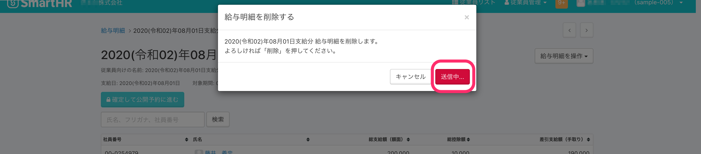

2020年9月25日（金）に行なったアップデートの詳細をお知らせします。

SmartHR基本機能の変更点は、カイゼン3点でした。

# 📈 カイゼン

## 給与明細一覧の表示速度を改善しました

給与明細の数が多くなると表示に時間がかかっていましたが、今回の改善作業で、表示にかかる時間を短縮しました。

## 給与明細の削除にかかる速度を改善しました

一部のテナントで、給与明細の削除に時間がかかってしまうケースがありましたが、今回の改善作業で、削除にかかる時間を短縮しました。

また、2度押し防止のため、削除ボタンをクリックした後は **\[送信中…\]** と表示するようにしました。

## 従業員フォームから単身児童扶養者の項目を削除しました

従業員フォーム（下記の一覧）から単身児童扶養者の項目を削除しました。

- 従業員新規登録画面
- 従業員情報編集画面
- 履歴追加画面
- 入社手続き画面
- 招待フォーム（プレビュー含）
- 従業員情報一括登録/更新

『令和２年４月１日から、給与所得者の扶養控除等（異動）申告書の「単身児童扶養者」についての記載は不要』というアナウンスが総務省から出たため、単身児童扶養者の項目を削除しました。

[総務省：個人住民税の「給与所得者の扶養親族申告書」等について](https://www.soumu.go.jp/main_sosiki/jichi_zeisei/czaisei/34623.html)
