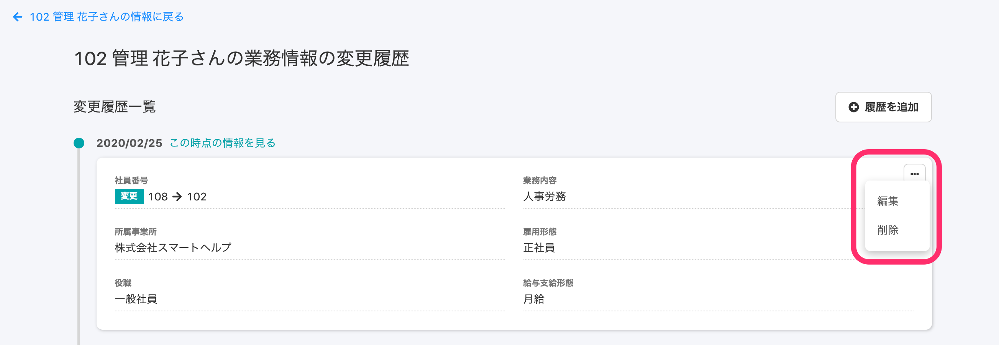
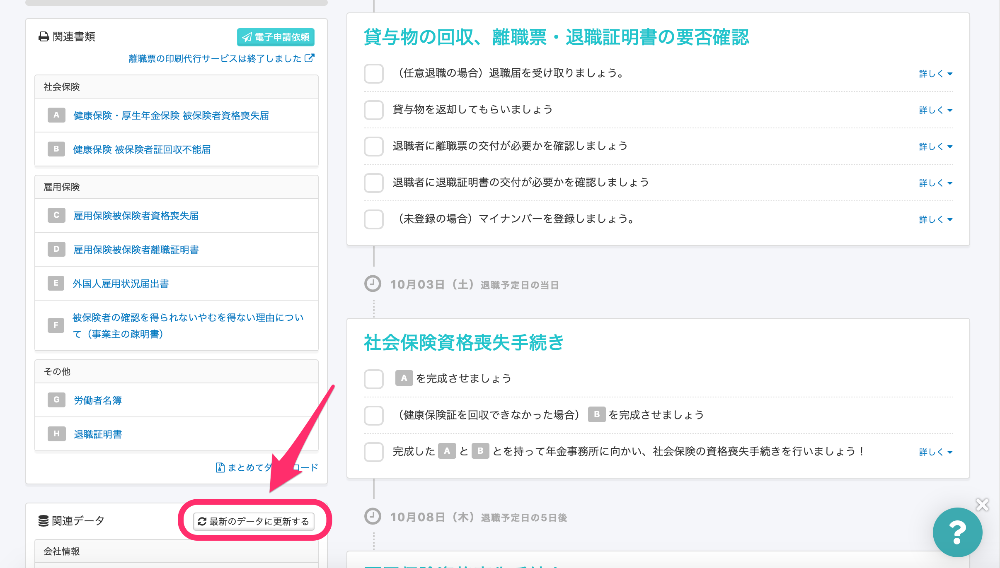

2020年9月28日（月）に行なったアップデートの詳細をお知らせします。

SmartHR基本機能のリリースは、新機能1件でした。

# ✨ 新機能

## 業務情報も、履歴の直接編集に対応しました

これまでは、 **\[基本情報\] \[履歴書・職務経歴書\] \[給与振込口座\] \[配偶者情報\] \[通勤手当\] \[備考\] \[雇用契約情報\] \[入退社情報\]** **\[住所と連絡先\]** **\[住民票住所\]**の履歴の直接編集に対応していましたが、新たに **\[業務情報\]** も履歴を編集できるようになりました。

また、手続き書類の作成では、手続き対象従業員の **\[業務情報\]** の履歴を直接編集しても、手続き書類の内容は変わりません。

手続き詳細画面の **\[最新のデータに更新する\]** をクリックすると、変更された内容が書類に反映されます。

その他の項目も、随時対応を進めていきます。

:::related
[従業員情報の履歴を編集する](https://knowledge.smarthr.jp/hc/ja/articles/360052967933)
:::
