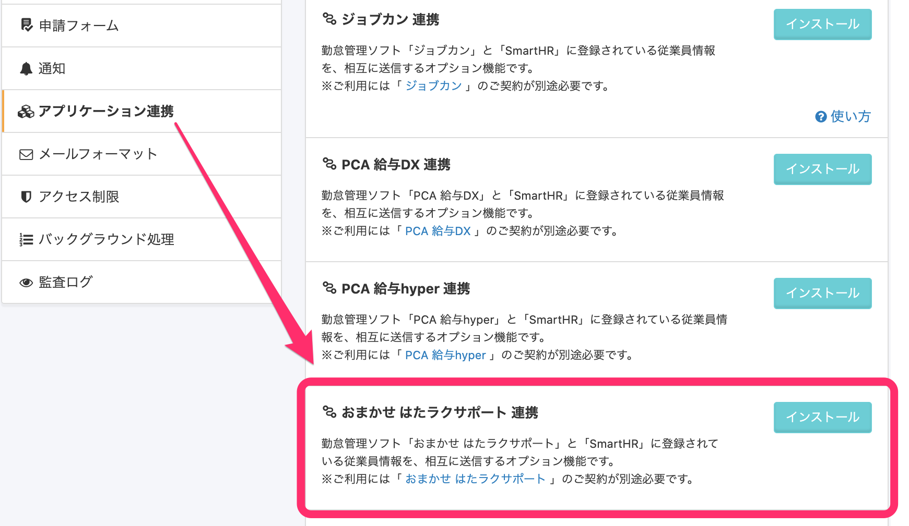
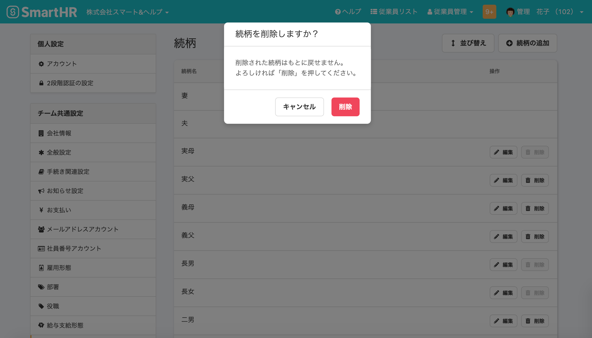

2020年9月29日（火）に行なったアップデートの詳細をお知らせします。

SmartHR基本機能のリリースは、新機能1件、カイゼン1件でした。

# ✨ 新機能

## はたラクサポートの連携機能を追加しました

勤怠管理ソフト「おまかせ はたラクサポート」と「SmartHR」に登録されている従業員情報を相互に連携し、従業員情報の新規登録や更新ができるオプション機能です。

オプション機能のインストールについて詳しくは、以下のページをご覧ください。

:::related
[SmartHRオプション機能をインストールする](https://knowledge.smarthr.jp/hc/ja/articles/360026262553)
:::

# 📈 カイゼン

## 続柄一覧で削除ボタンを押したときに表示されるダイアログを変更しました

続柄一覧で \[削除\] ボタンをクリックした際に表示される確認のためのダイアログは、これまでブラウザ標準のものが表示されていましたが、SmartHR UIに則ったものに変更しました。

