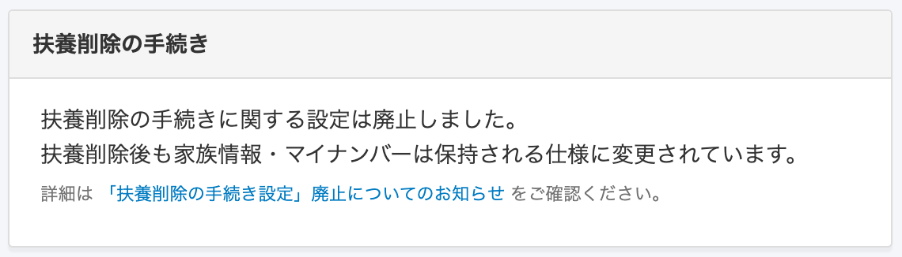
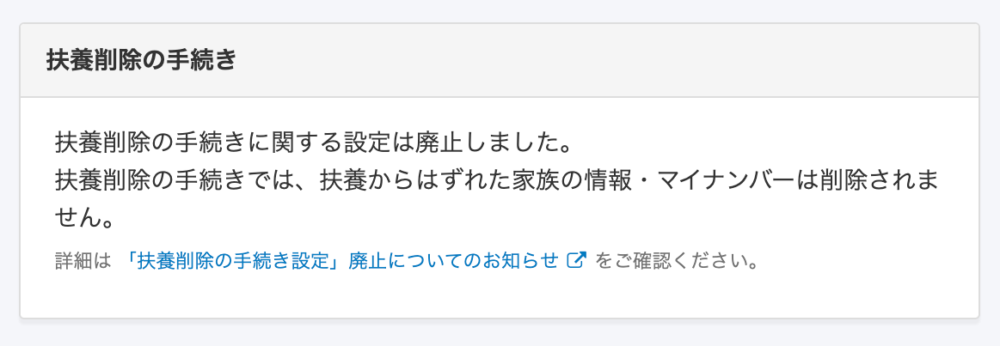
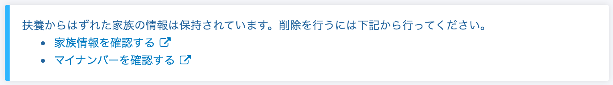
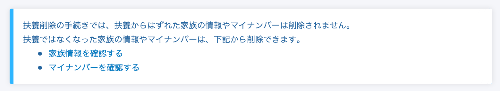
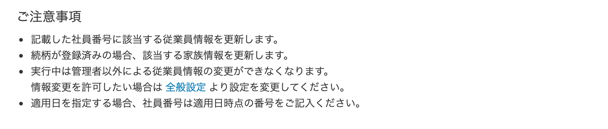
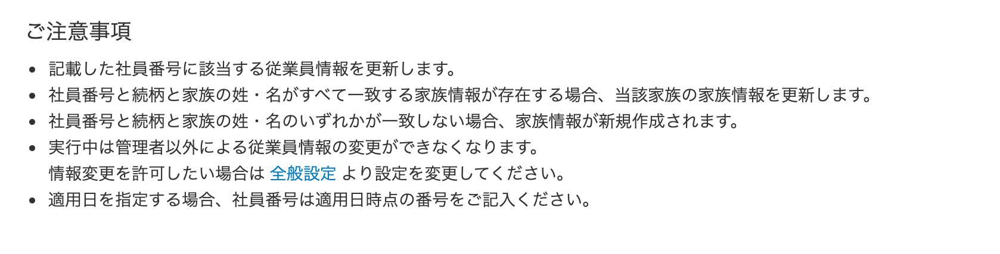
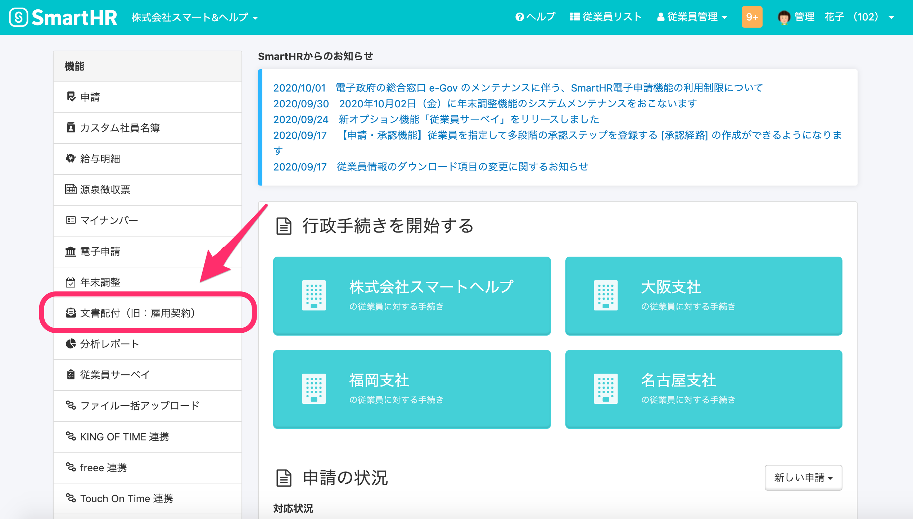
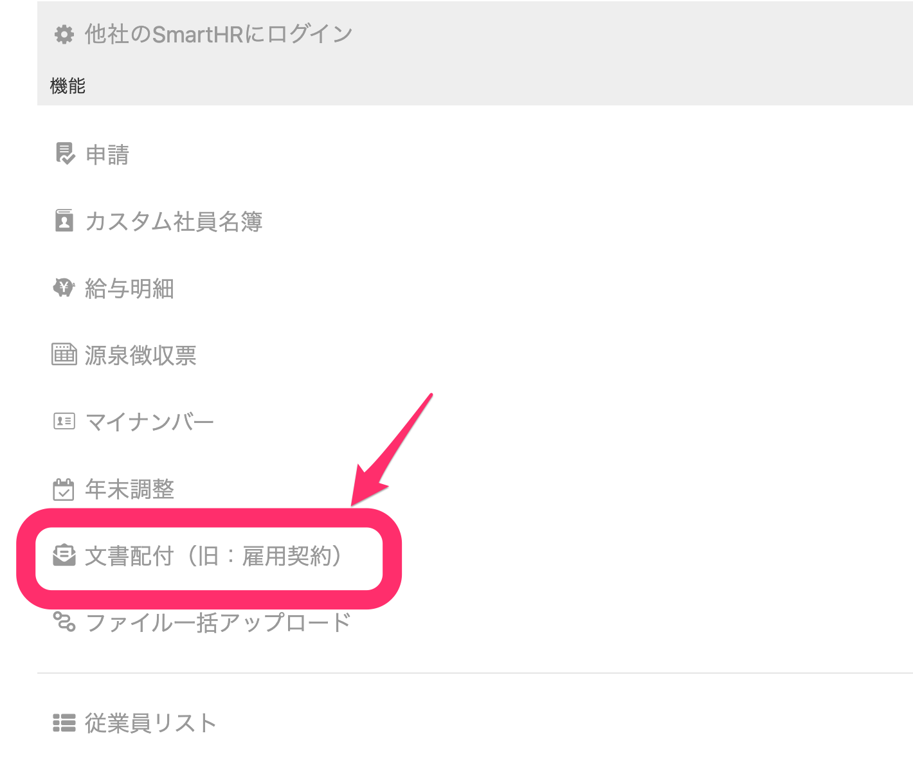
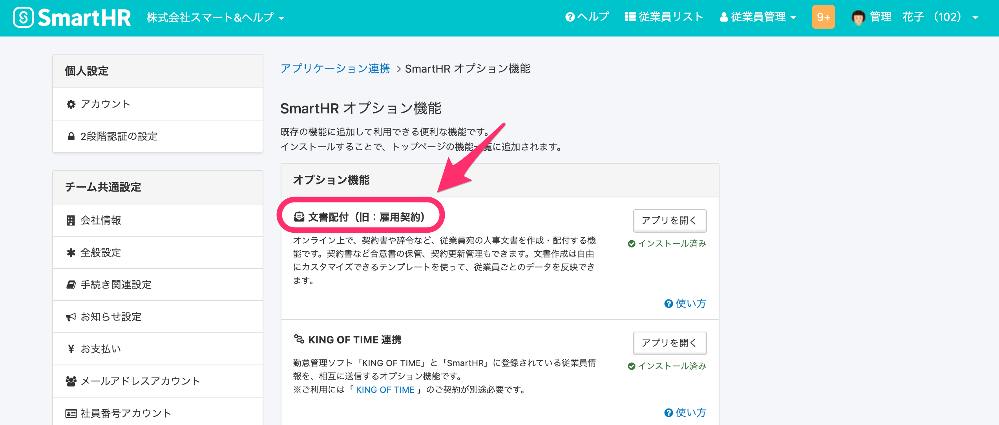

2020年9月30日（水）に行なったアップデートの詳細をお知らせします。

SmartHR基本機能のリリースは、カイゼン3件、不具合修正2件でした。

# 📈 カイゼン

## 扶養削除の手続きに関する文言を修正しました

2020年9月16日に、扶養削除の手続きを行なった際、扶養から外れた家族の情報とマイナンバーを保持するか否かのオプションを廃止し、一律で保持する仕様に変更しました。

:::related
[2020/9/16 扶養削除の手続き時、扶養から外れた家族の情報を必ず保持するようにしました 他3件](https://knowledge.smarthr.jp/hc/ja/articles/360055392013)
:::

その仕様変更の影響がわかりやすくなるよう、共通設定と、扶養削除の手続き画面の文言を変更しました。

**\[共通設定\] > \[手続き関連設定\]**

| 変更前 |  |
| --- | --- |
| 変更後 |  |

**扶養削除の手続きToDo画面**

| 変更前 |  |
| --- | --- |
| 変更後 |  |

## 家族情報を登録する際の注意事項を、説明文に追記修正しました

家族情報の登録をする際の細かい挙動を、**\[ご注意事項\]** の説明文に追記しました。

ヘッダーメニュー **\[従業員管理\] > \[更新する（ファイル）\] > \[ご注意事項\]**

| 変更前 |  |
| --- | --- |
| 変更後 |  |

## 文書配付（旧：雇用契約）のアイコンや機能名を一新しました

雇用契約機能が「文書配付機能」としてリニューアルしたため、機能名やアイコンを切り替えました。

 **トップページ （スマートフォン表示）** 

**SmartHRオプション機能の画面**

# 👨‍⚕️ 不具合修正

住所情報の表示に関する修正など、2点の不具合修正を行ないました。
