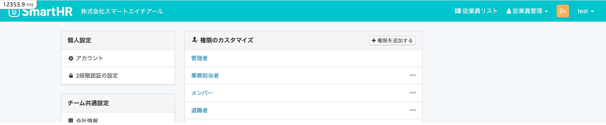
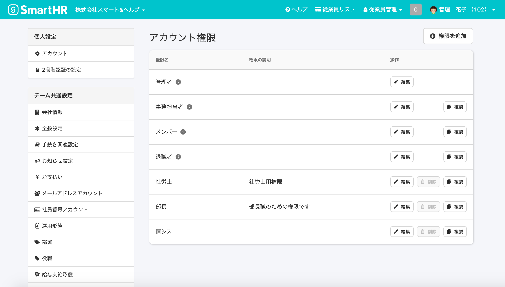
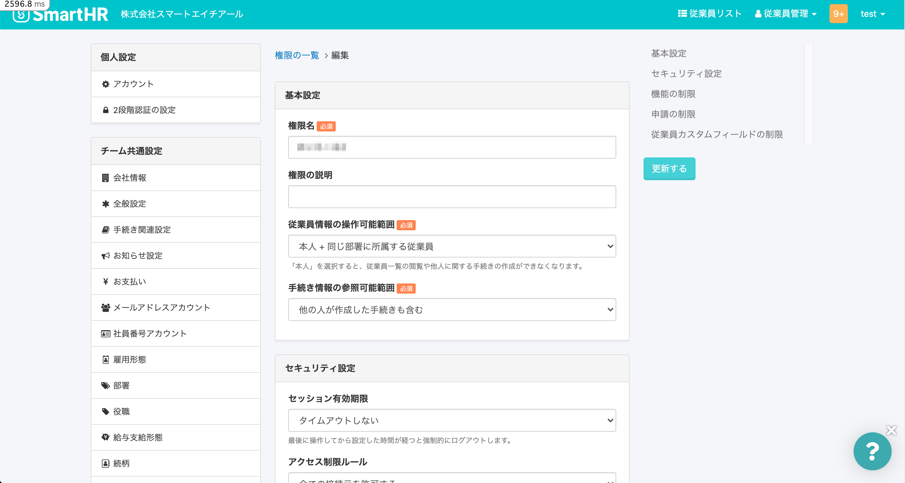
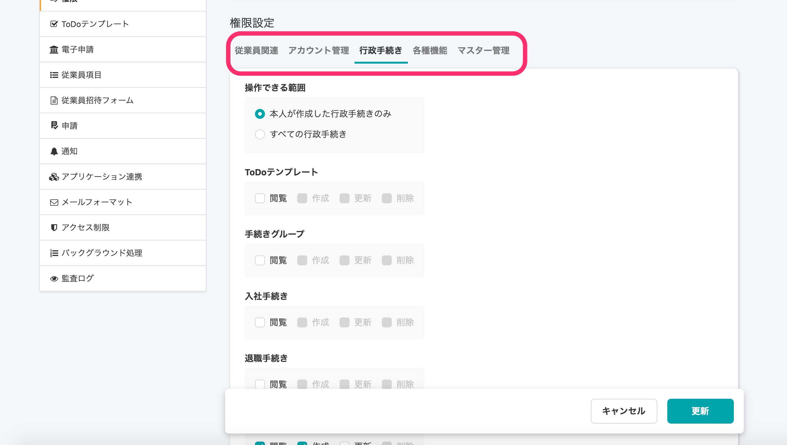
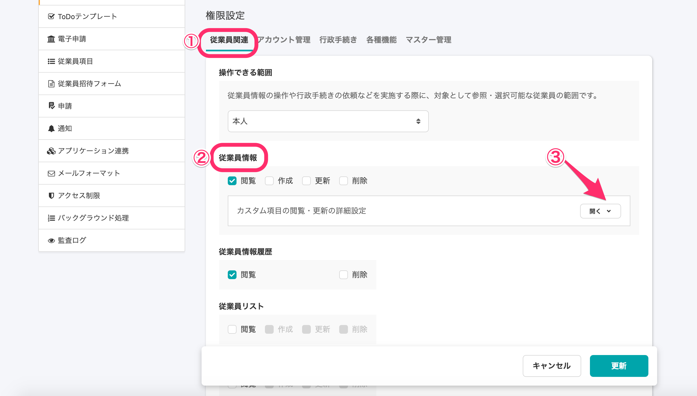
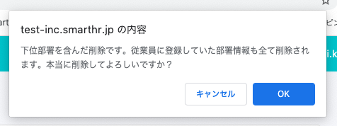
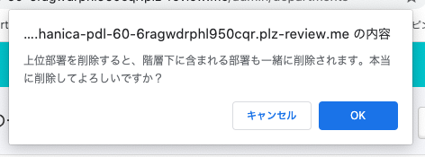

2020年10月5日（月）に行なったアップデートの詳細をお知らせします。

SmartHR基本機能の変更点は、新機能1件・カイゼン1件・不具合修正4件でした。

# ✨ 新機能

## 権限設定画面を一新しました

権限管理画面（権限の一覧・編集画面）をリニューアルしました。

今回のリニューアルにより、権限管理画面が見やすくなり、より簡単に権限管理機能をご利用いただけけるようになりました。

なお、今回は見た目の変更のみであり、権限管理機能に変更はありません。

今後も権限管理機能がさらに便利に使えるように、従業員情報の項目ごとの権限設定など、機能を段階的に広げていく予定です 😄

### 権限一覧画面：権限名の横に **\[編集\] \[複製\] \[削除\]** ボタンを設置

これまで権限の操作ボタンは権限一覧画面と権限編集画面に点在していましたが、権限一覧画面の権限名の横にまとめて設置しました。

| 変更前 |  |
| --- | --- |
| 変更後 |      |

### 権限編集画面：各機能に対する権限設定をカテゴリに分けて表示

これまでSmartHRの各機能に対する権限設定は縦一列の表示になっていましたが、目的の設定が見つけやすくなるよう、カテゴリごとにタブを分けて表示するようにしました。

| 変更前 |  |
| --- | --- |
| 変更後 |        |

### 権限編集画面：カスタム項目の権限設定を **\[従業員情報\]** の権限設定の下に表示

従業員情報の **\[カスタム項目の閲覧・更新の詳細設定\]** は、従業員情報の権限設定下部に移動しました。

**\[開く\]** をクリックすると、カスタム項目の閲覧・更新などの設定が開きます。

お知らせも合わせてご覧ください。

[権限管理画面のリニューアルを行います](https://smarthr.jp/update/20580)

# 📈 カイゼン

## 部署マスター削除時のアラート文言を変更しました

部署マスターの一覧から部署を削除する際のメッセージがより正確になるように **\[上位部署を削除すると、階層下に含まれる部署も一緒に削除されます。本当に削除してよろしいですか？\]** に変更しました。

| 変更前 |  |
| --- | --- |
| 変更後 |  |

# 👨‍⚕️ 不具合修正

単身児童扶養者の項目に関する修正など、4件の不具合修正を行ないました。
