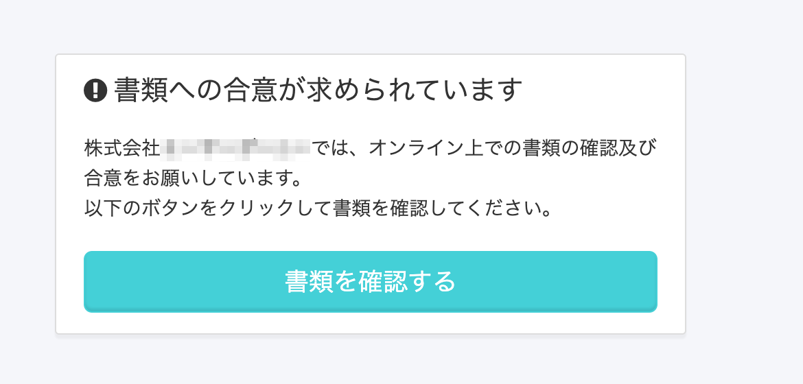
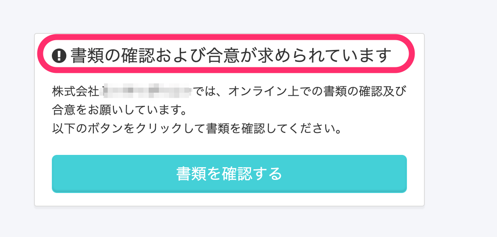

2020年10月6日（火）に行なったアップデートの詳細をお知らせします。

SmartHR基本機能のリリースは、カイゼン1件・不具合修正1件でした。

# 📈 カイゼン

## 従業員招待時に、文書配布機能でも依頼をしている従業員への開始画面の文言を修正しました

文書配付機能（旧：雇用契約機能）がリニューアルされ、「合意を必要としない書類」も従業員に配付できるようになりました。

それにともない、従業員を招待する際に表示される開始画面の文言を **\[書類の確認および合意が求められています\]** に変更しました。

従業員招待と同時に文書配付をしている従業員には、以下の画面が表示されます。

| 変更前 |  |
| --- | --- |
| 変更後 |  |

# 👨‍⚕️ 不具合修正

従業員情報の一括更新に関する1点の不具合修正を行ないました。
