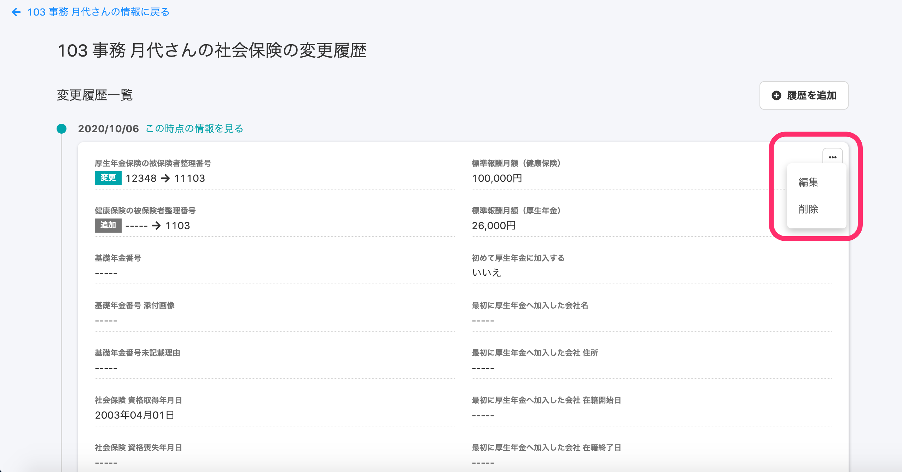

2020年10月7日（水）に行なったアップデートの詳細をお知らせします。

SmartHR基本機能のリリースは、新機能3件、カイゼン1件、不具合修1件でした。

# ✨ 新機能

## 在留資格、社会保険、雇用保険も履歴の直接編集に対応しました

これまでは、 **\[基本情報\] \[履歴書・職務経歴書\] \[給与振込口座\] \[配偶者情報\] \[通勤手当\] \[備考\] \[雇用契約情報\] \[入退社情報\]** **\[住所と連絡先\]** **\[住民票住所\] \[業務情報\]** の履歴の直接編集に対応していましたが、新たに **\[在留資格\] \[社会保険\] \[雇用保険\]**も履歴を編集できるようになりました。

**\[在留資格\]** の履歴一覧

**\[社会保険\]** の履歴一覧

**\[雇用保険\]** の履歴一覧

# 📈 カイゼン

## カスタムリスト名の文字数上限を50文字に変更しました

従業員リストのカスタムリスト名の文字数上限を30文字から50文字に変更しました。

カスタムリストとは、従業員リストで従業員を検索する際に、自由にフィルタを設定して従業員の絞り込みや表示項目を設定し、適用された条件をリストとして保存したものです。

| 変更前 |  |
| --- | --- |
| 変更後 |  |

カスタムリストの作成方法は下記のページをご覧ください。

:::related
[従業員リストの使い方](https://knowledge.smarthr.jp/hc/ja/articles/360043824473)
:::

# 👨‍⚕️ 不具合修正

従業員の多い事業所での編集画面に関する1件の不具合修正を行ないました。
