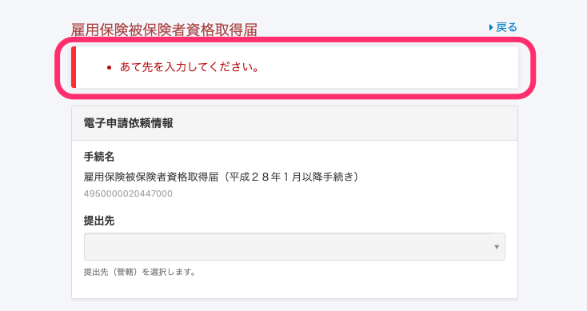
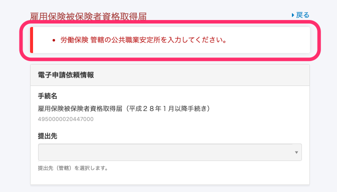

2020年10月12日（月）に行なったアップデートの詳細をお知らせします。

SmartHR基本機能のリリースは、カイゼン1件、不具合修正3件でした。

# 📈 カイゼン

## 雇用保険の電子申請の際、「管轄の公共職業安定所」が未入力の場合に表示されるエラーメッセージを変更しました

雇用保険の電子申請をするときに、「管轄の公共職業安定所」が未入力の場合のエラーメッセージを **\[労働保険 管轄の公共職業安定所を入力してください。\]** に変更しました。

これまでは、どの欄を入力してないかわかりづらい文言だったので、入力する欄を特定できるようにするのが目的です。

労働保険の管轄の公共職業安定所は、**\[共通設定\] > \[会社情報\] > \[事業所情報\] > \[労働保険\] > \[管轄の公共職業安定所\]** から入力できます。

| 変更前 |  |
| --- | --- |
| 変更後 |  |

# 👨‍⚕️ 不具合修正

健保組合がTJKの事業所に所属するメンバー権限の従業員が自分の扶養追加手続きを作成しようとした際にエラーが発生する不具合など、3件の修正を行ないました。
