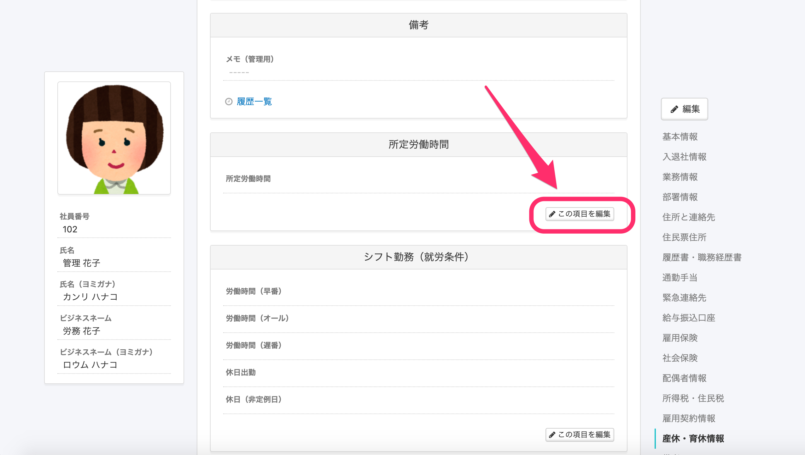
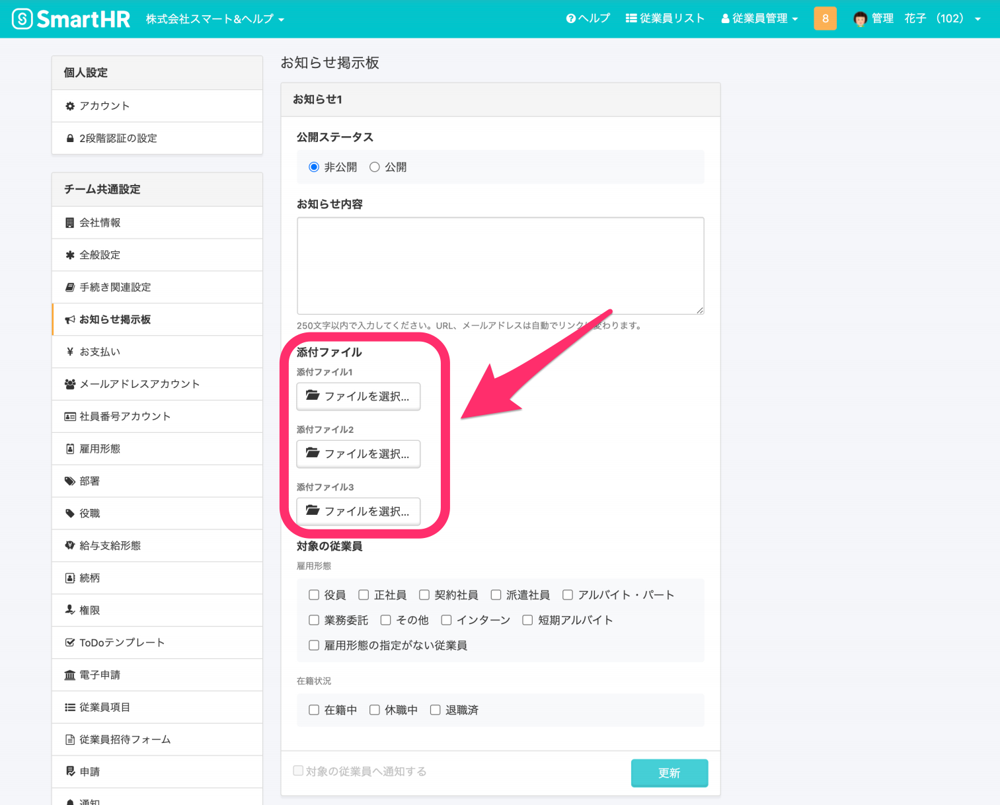
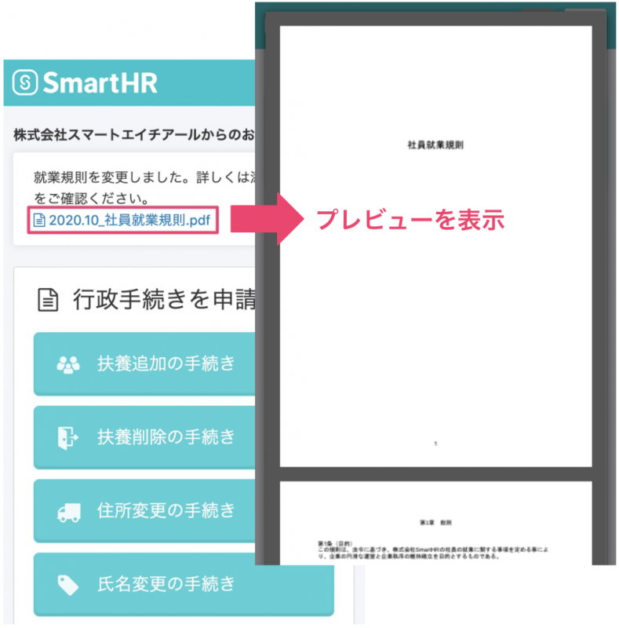
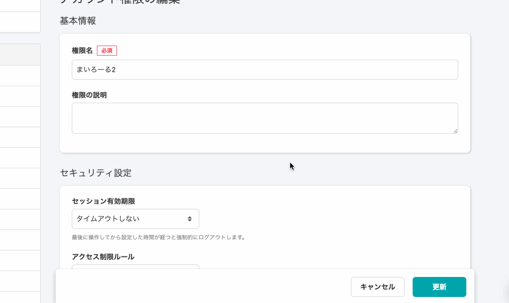
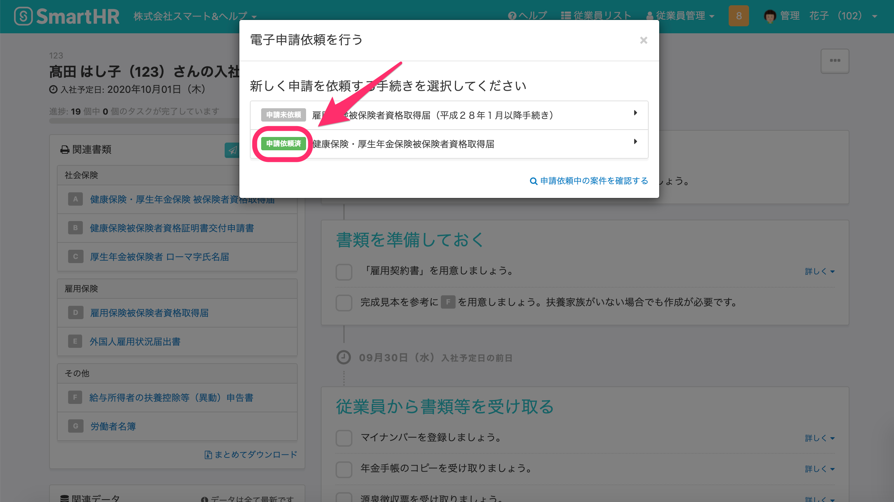

2020年10月14日（水）に行なったアップデートの詳細をお知らせします。

SmartHR基本機能のリリースは、新機能2件、カイゼン4件、不具合修1件でした。

# ✨ 新機能

## カスタム項目も履歴の直接編集に対応しました

カスタム項目も新たに履歴を編集できるようになりました。

これで部署情報を除くすべての従業員項目で、各項目ごとに履歴を編集できるようになりました。

## お知らせ機能でファイルを添付できるようにしました

これまで、お知らせ機能では文字情報のみを設定できましたが、最大3つまでファイルを添付できるようにしました。

このアップグレードにともない、名称を \[お知らせ機能（β版）\] から **\[お知らせ掲示板\]** に変更しました。

就業規則や社内規定変更のお知らせや、社内報の掲載などにご活用ください。

管理者画面：1つのお知らせで最大3つのファイルが添付できます。

従業員画面：トップページにお知らせが表示され、ファイル名をクリックするとプレビュー画面で表示されます。

お知らせも合わせてご覧ください。

[お知らせ機能（ベータ版）でファイルを添付できるようになりました！](https://smarthr.jp/update/21174)

# 📈 カイゼン

## 旧従業員リストで、一覧とダウンロードで異なっていた時刻を合わせました

旧従業員リスト画面で日付を指定したとき、「従業員リストの一覧表示」と「従業員情報のダウンロード」で基準となる日付（時刻）が異なっていたため、時刻を一致させました。

## 権限のチェックボックスを操作したときに自動でスクロールされる動きをカイゼンしました

権限編集画面でチェックボックスを操作した際、画面が自動でスクロールされてしまう挙動をカイゼンしました。

| 変更前 |      |
| --- | --- |
| 変更後 |  |

## 従業員が多いとき、入社手続き画面が開かない事象をカイゼンしました

従業員登録の多い企業アカウントで、入社手続き画面が開かない事象をカイゼンしました。

## 電子申請依頼済みの表示をラベルに変更しました

「電子申請依頼済」の電子申請を重複して依頼作成してしまうことがあったため、これまでテキストのみだった「電子申請依頼済」の情報を **\[申請依頼済\]** のラベルで表示するように変更しました。

# 👨‍⚕️ 不具合修正

従業員リストのフィルタ設定に関する1件の不具合修正を行ないました。
