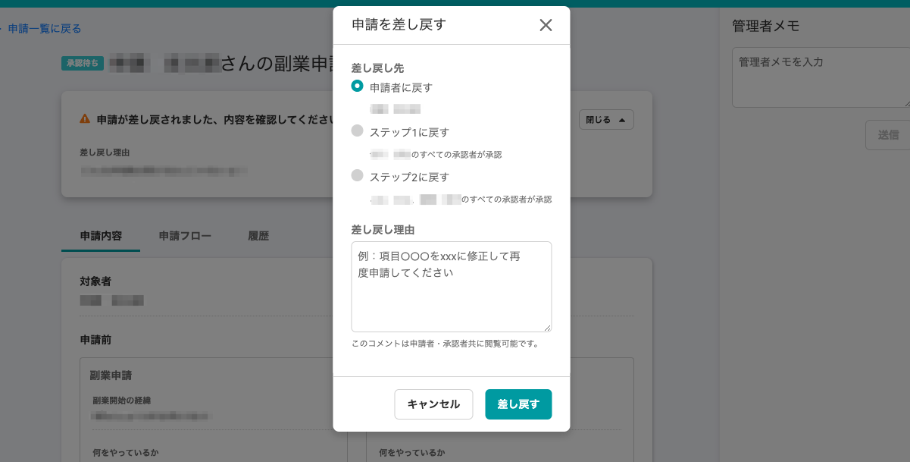
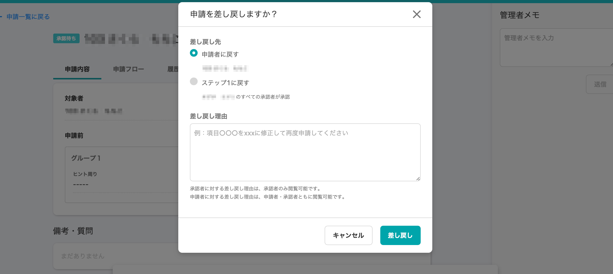

2020年10月16日（金）に行なったアップデートの詳細をお知らせします。

SmartHR基本機能のリリースは、カイゼン1件、不具合修正3件でした。

# 📈 カイゼン

## 申請の差し戻しダイアログの横幅を広くしました

申請機能に関する他のダイアログの幅と同じにすることで、機能全体に統一感を持たせました。

| 変更前 |  |
| --- | --- |
| 変更後 |  |

# 👨‍⚕️ 不具合修正

メールアドレスアカウントの削除に関する修正など、3件の修正を行ないました。
