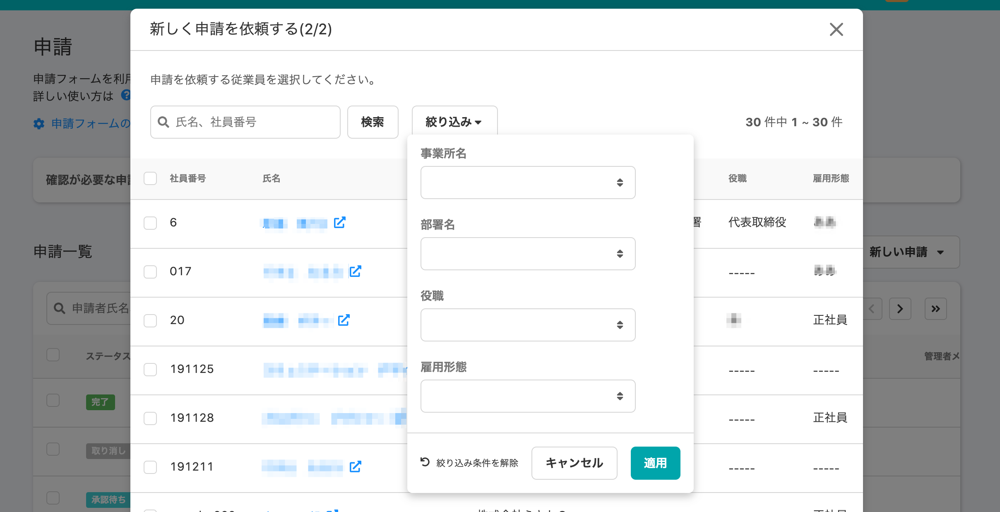
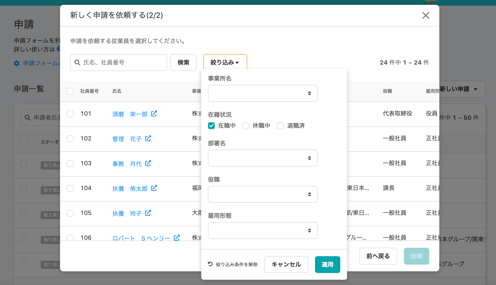
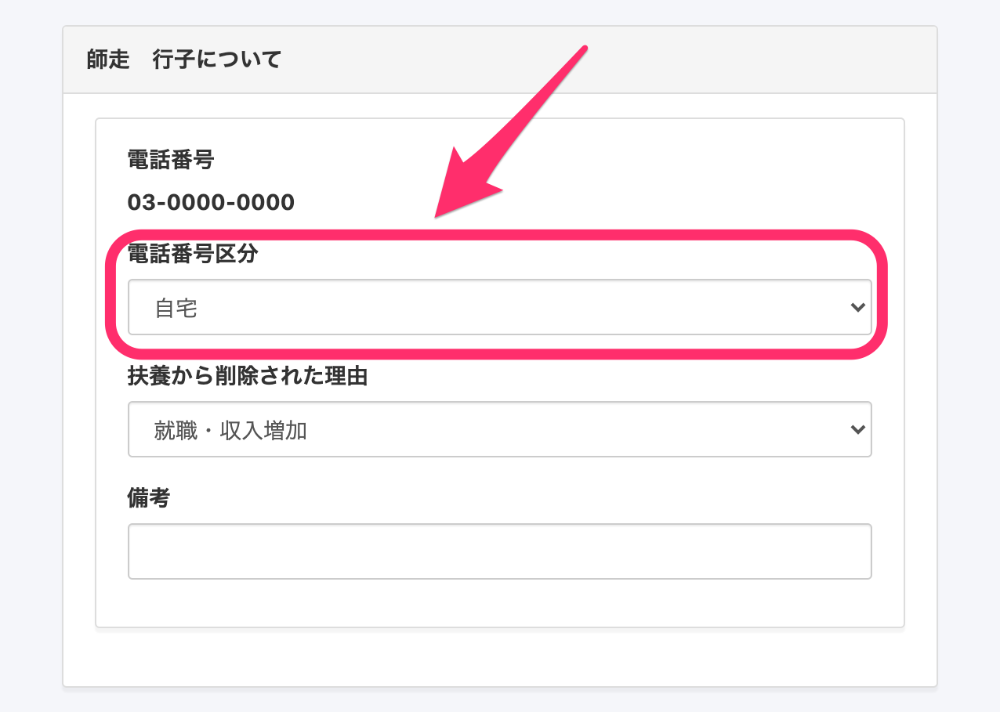
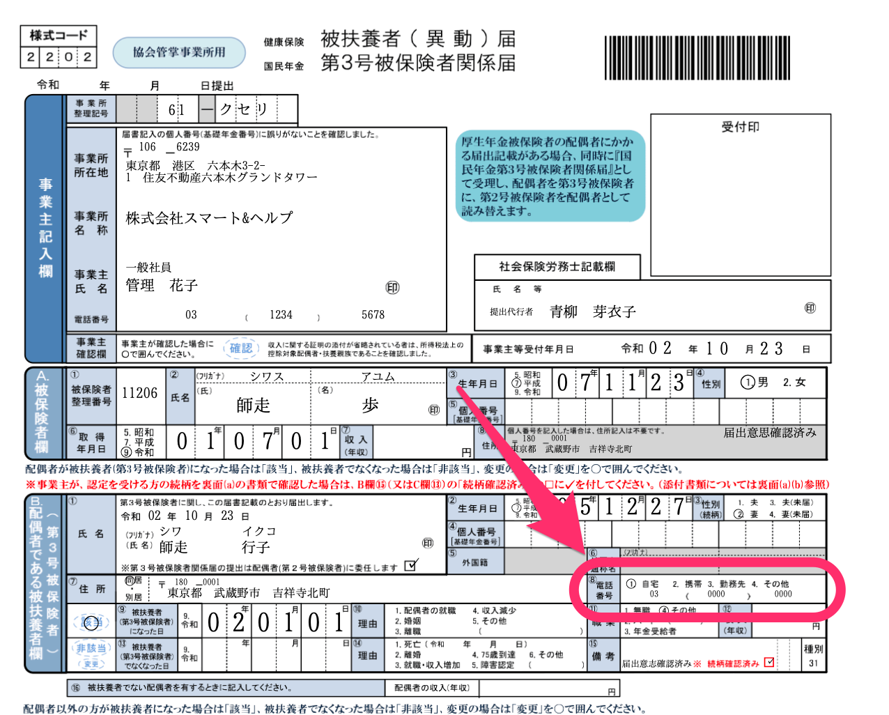
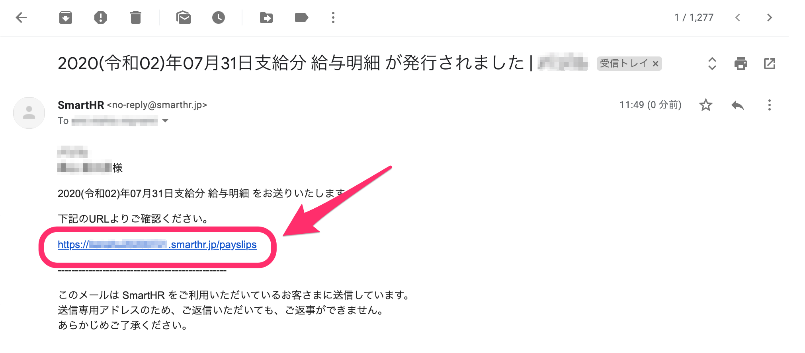

2020年10月22日（木）に行なったアップデートの詳細をお知らせします。

SmartHR基本機能の変更点は、カイゼン3件でした。

# 📈 カイゼン

## 申請を依頼する際に従業員を在籍状況で絞り込めるようにしました

これまで申請依頼をする従業員を絞り込む際に「退職済」の従業員にも依頼を送ってしまうことがあったため、今回のアップデートで **\[在職中\] \[休職中\] \[退職済\]** の **\[在籍状況\]** で従業員を絞り込めるようにしました。

デフォルトは **\[在籍中\]** の絞り込み設定になっています。

| 変更前 |  |
| --- | --- |
| 変更後 |  |

## 「健康保険被扶養者（異動）・国民年金第３号被保険者関係届」で配偶者の電話番号区分を入力できるようにしました

「健康保険被扶養者（異動）・国民年金第３号被保険者関係届」の配偶者である被扶養者の電話番号について、厚生労働省から下記のとおりお知らせがありました。

”電話項目欄は、区分（自宅、携帯　等）と番号が対のため、片方だけの入力はエラーとなります。次回より、両方とも入力するか、または（番号不明等の時は）両方とも未入力として下さい。”

こちらのアナウンスにともない、「健康保険被扶養者（異動）・国民年金第３号被保険者関係届」の書類に、配偶者の電話番号区分（1.自宅 2.携帯 3.勤務先 4.その他）を入力できるようにしました。

配偶者情報に電話番号が登録されている場合、入社手続き、扶養追加の手続き、扶養削除の手続きの画面で **\[電話番号区分\]** から **\[自宅\] \[携帯\] \[勤務先\] \[その他\]** を選択できます。

各健康保険タイプ（協会けんぽ、関東ITソフトウェア健保、東京都情報サービス産業健保、その他健保）に対応しています。

**\[健康保険被扶養者（異動）・国民年金第３号被保険者関係届\] > \[****B.配偶者である被扶養者欄 ⑧電話番号\]** の電話番号区分

電話番号区分未選択の場合 **\[○\]** はつきません。

## 通知メールに記載されるURL末尾の 「?」 をはずしました

お知らせや給与明細などで従業員に通知される際に、メールで記載されているURLの末尾に 「?」 が付いていたため、従業員がURLをクリックしないというお客様からのご相談を受けました。

そのため今回の改修でURL末尾の 「?」をはずしました。

