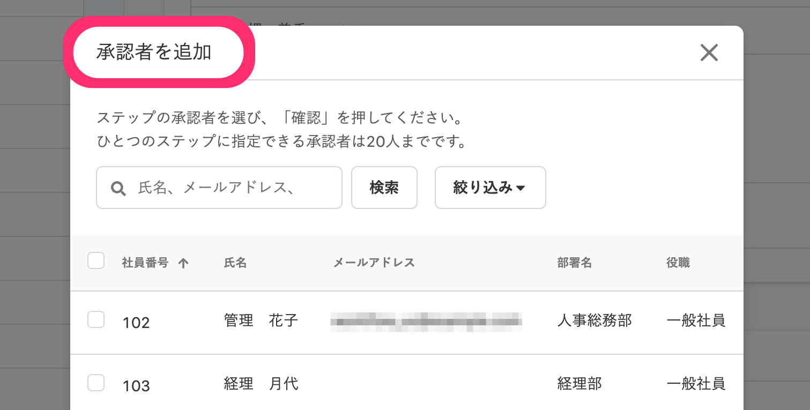
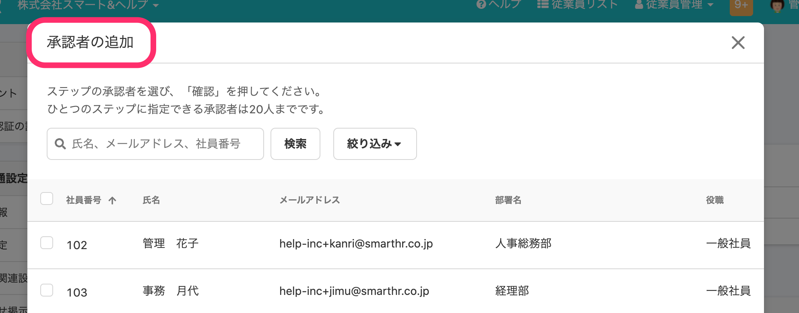

2020年10月26日（月）に行なったアップデートの詳細をお知らせします。

SmartHR基本機能のリリースは、カイゼン1件、不具合修正1件でした。

# 📈 カイゼン

## 経路の新規登録画面のタイトルを \[承認者の追加\] に変更しました

文言の統一をするため、経路の新規登録画面のダイアログタイトルを **\[承認者を追加\]** から **\[承認者の追加\]** に変更しました。

**\[共通設定\]** > **\[申請\]** > **\[新規登録\]** > **\[経路の新規登録\]** > **\[ステップを追加\]** をクリックするとダイアログが表示されます。

| 変更前 |  |
| --- | --- |
| 変更後 |  |

# 👨‍⚕️ 不具合修正

PDF表示に関する1件の不具合修正を行ないました。
