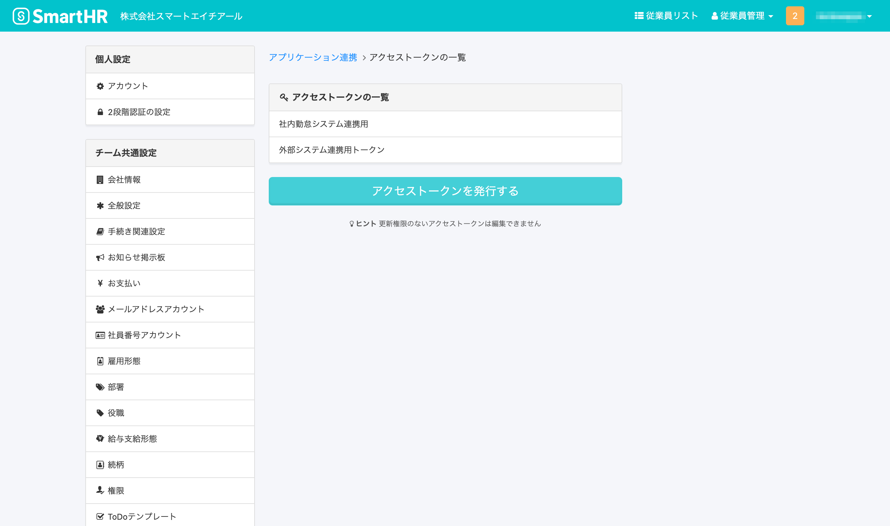
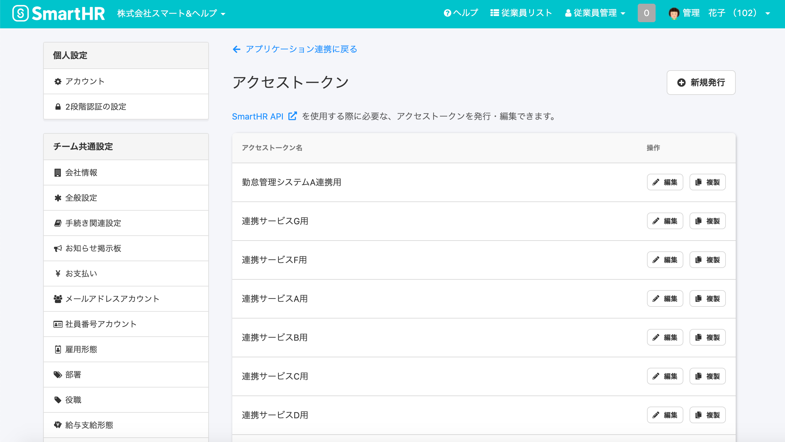
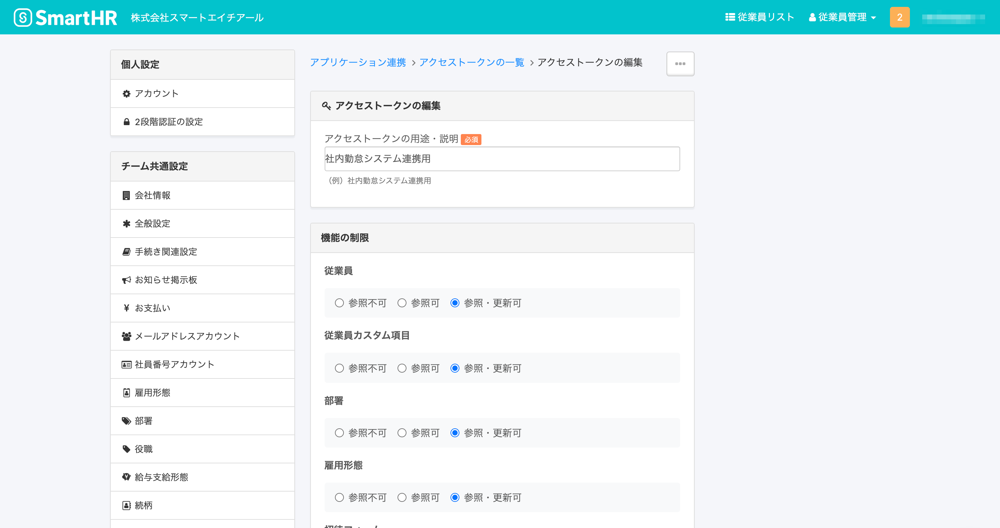
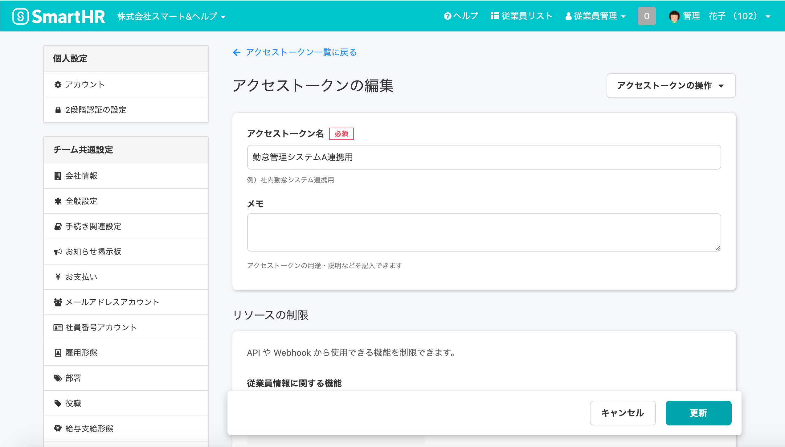
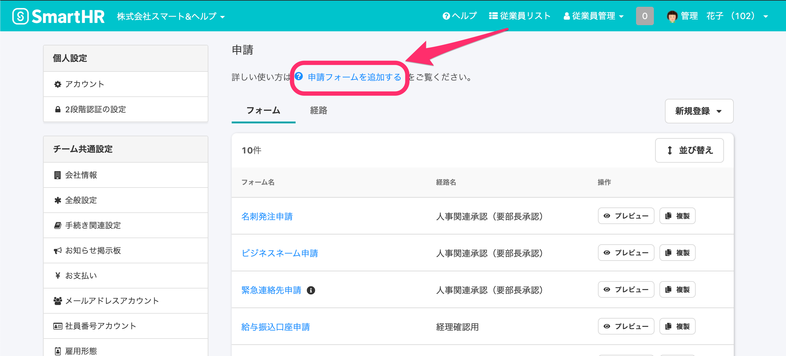
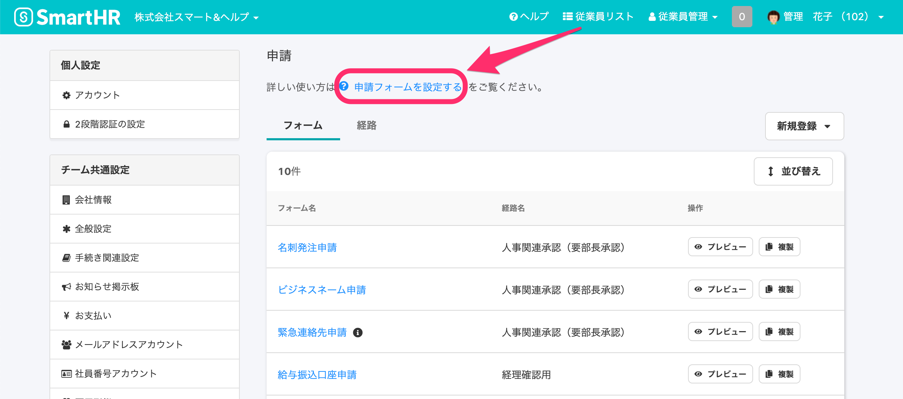
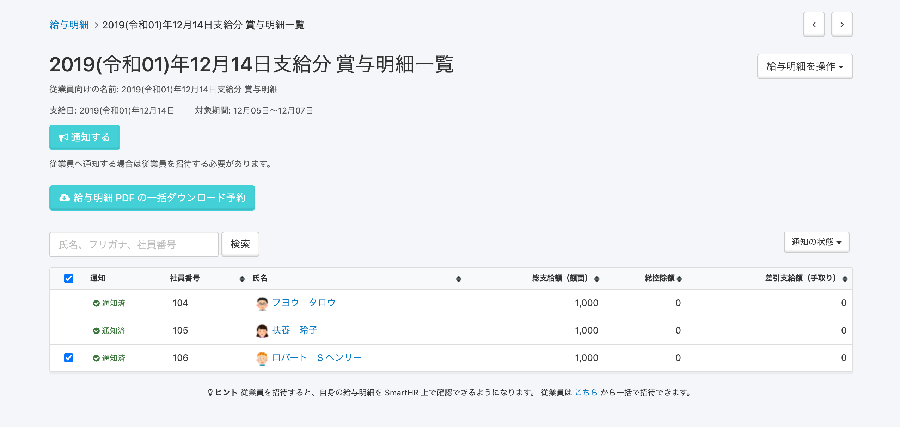

2020年10月27日（火）に行なったアップデートの詳細をお知らせします。

SmartHR基本機能のリリースは、新機能1件、カイゼン2件、不具合修正1件でした。

# ✨ 新機能

## アクセストークン画面を一新しました

アクセストークン画面を新しいUIに変更しました。

**\[共通設定\]** > **\[アプリケーション連携\]** > **\[アクセストークン\]** で確認できます。

:::related
[アクセストークンの発行方法](https://knowledge.smarthr.jp/hc/ja/articles/360026266033)
:::

**アクセストークンの一覧画面**

| 変更前 |  |
| --- | --- |
| 変更後 |  |

**アクセストークンの編集画面**

| 変更前 |  |
| --- | --- |
| 変更後 |  |

# 📈 カイゼン

## 申請画面のリンクタイトルを \[申請フォームを設定する\] に変更しました

**\[共通設定\]** > **\[申請\]** にある申請画面のヘルプページへのリンクタイトルを **\[申請フォームを追加する\]** から **\[申請フォームを設定する\]** に変更しました。

| 変更前 |  |
| --- | --- |
| 変更後 |  |

## 賞与明細一覧の \[通知する\] 際の内部動作を最適化しました

賞与明細一覧で **\[通知する\]** 際のシステム内部の動作を最適化しました。

**賞与明細一覧の通知設定画面**

# 👨‍⚕️ 不具合修正

扶養追加手続きに関する1件の不具合修正を行ないました。
