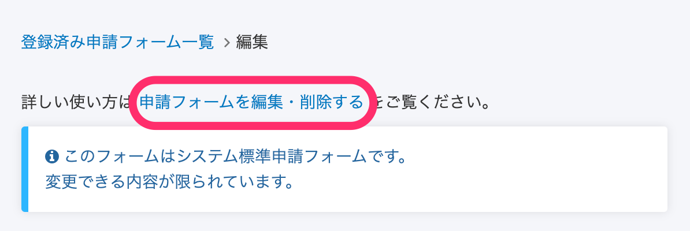
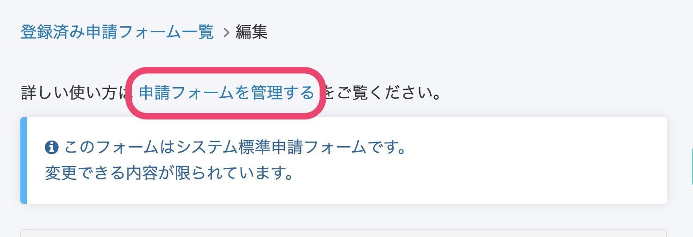
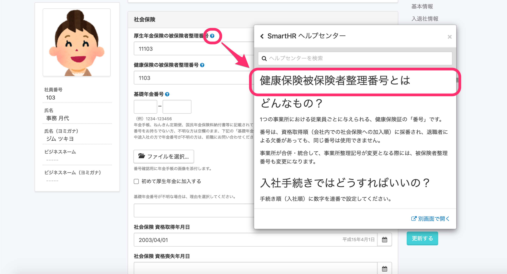
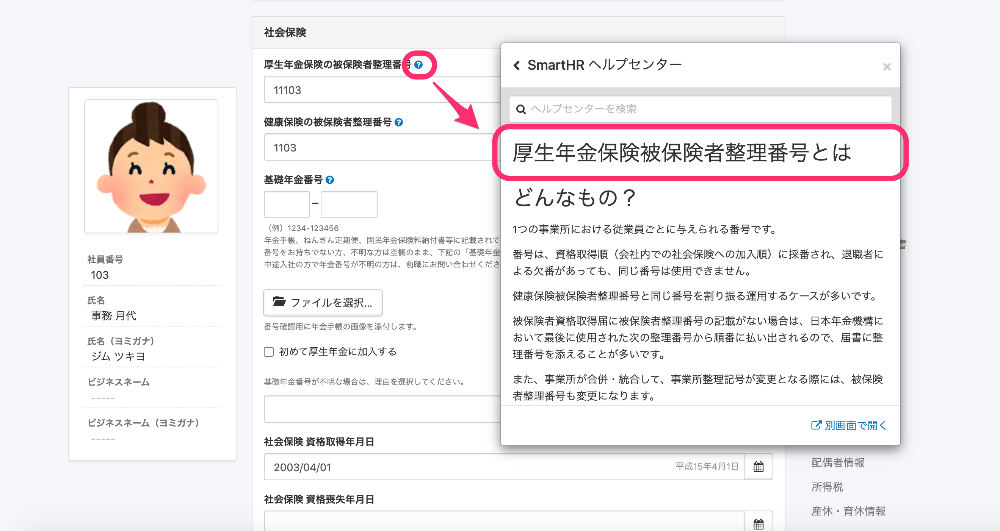

2020年10月29日（木）に行なったアップデートの詳細をお知らせします。
SmartHR基本機能の変更点は、カイゼン2件・不具合修正2件でした。

# 📈 カイゼン

## 登録済み申請フォームの編集画面にあるリンクタイトルを \[申請フォームを管理する\] に変更しました

登録済み申請フォームの編集画面にあるヘルプページへのリンクタイトルを **\[申請フォームを編集・削除する\]** から **\[申請フォームを管理する\]** に変更しました。

**\[共通設定\]** > **\[申請\]** \> **\[登録済みの申請フォームのタイトル\]** をクリックした編集画面から確認できます。

| 変更前 |  |
| --- | --- |
| 変更後 |  |

## 厚生年金保険の被保険者整理番号の「？」アイコンをクリックしたときに、厚生年金保険被保険者整理番号の記事が表示されるようにしました

これまでは、従業員情報の社会保険の欄にある厚生年金保険被保険者整理番号の隣の「？」をクリックすると **\[健康保険被保険者整理番号とは\]** という記事が表示されていました。

以前は、健康保険被保険者整理番号と厚生年金保険被保険者整理番号が共通になっていたこともあり、そのような仕様になっていましたが、今回 **\[厚生年金保険被保険者整理番号とは\]** という記事が表示されるように変更しました。

| 変更前 |  |
| --- | --- |
| 変更後 |  |

# 👨‍⚕️ 不具合修正

PDFの表示向きに関する修正など、2件の不具合修正を行ないました。
