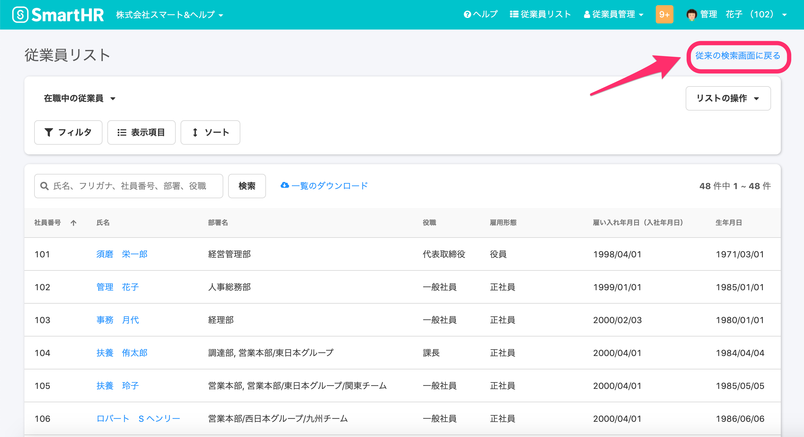
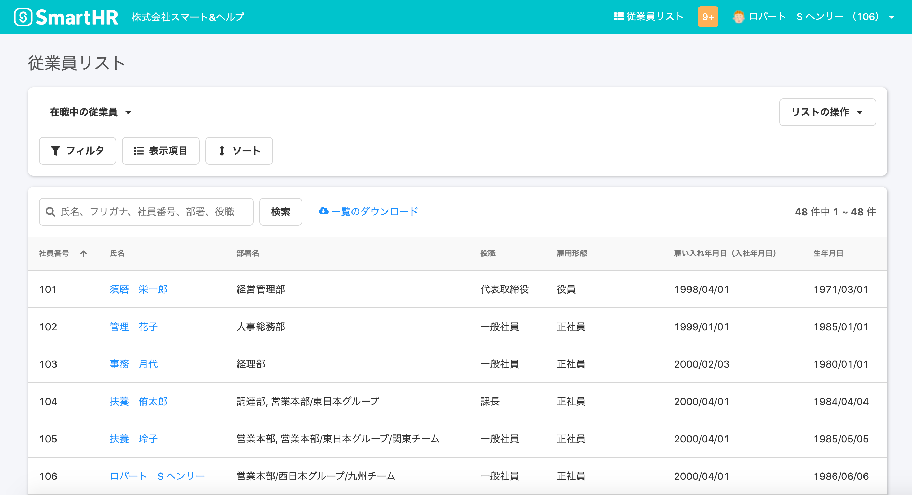
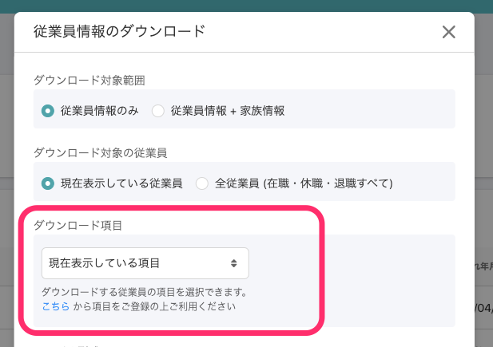
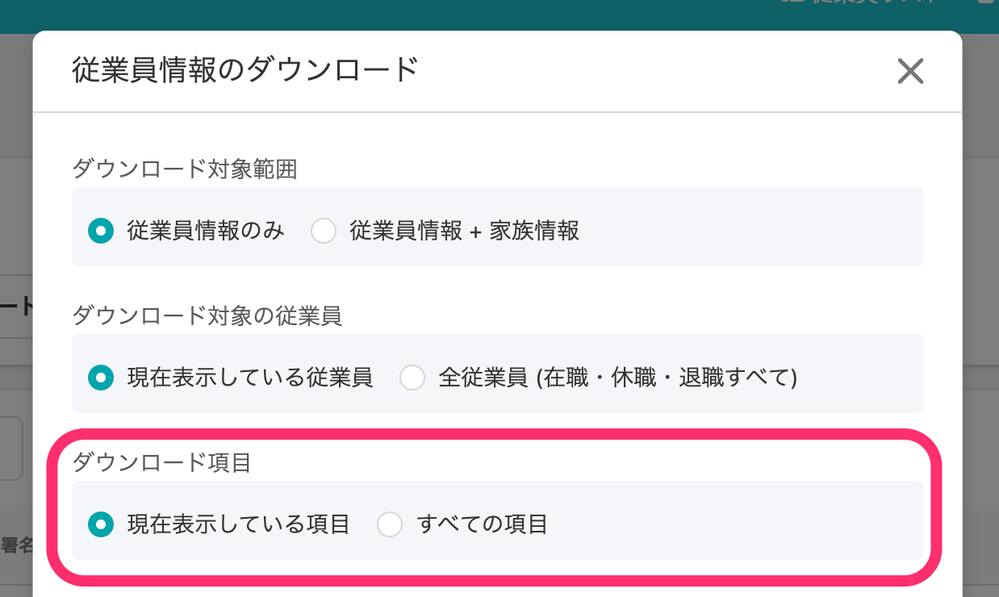

2020年10月30日（金）に行なったアップデートの詳細をお知らせします。
SmartHR基本機能の変更点は、カイゼン2件・不具合修正1件でした。

# 📈 カイゼン

## 従来の従業員検索画面は管理者のみアクセスできるようにしました

従業員の従業員検索画面は、管理者のみアクセスできるように制限しました。

今後追加予定の機能は、新しい従業員検索画面でのみ利用できるようになります。

| 管理者画面 |      |
| --- | --- |
| 従業員画面 |  |

時点指定をして従業員情報を表示する機能は、現在「従来の従業員検索画面」からのみ、ご利用いただけます。

## 従業員情報のダウンロード項目にある \[ダウンロード項目\]の表示を変更しました

**\[従業員情報のダウンロード\]** にある **\[ダウンロード項目\]** の表示をドロップダウンからラジオボタン形式に変更し、**\[現在表示している項目\]\[すべての項目\]** のどちらかのみ選択できるようにしました。

デフォルトでは **\[現在表示している項目\]** が選択されています。

| 変更前 |  |
| --- | --- |
| 変更後 |  |

従来の「ダウンロード項目」で行なっていた項目の絞り込みは、新しい従業員検索画面の「カスタムリスト」で行なえます。

カスタムリストの設定方法は、下記ページをご覧ください。

:::related
[従業員リストの使い方](https://knowledge.smarthr.jp/hc/ja/articles/360043824473)
:::

# 👨‍⚕️ 不具合修正

カスタム項目の更新権限に関する1件の不具合修正を行ないました。
