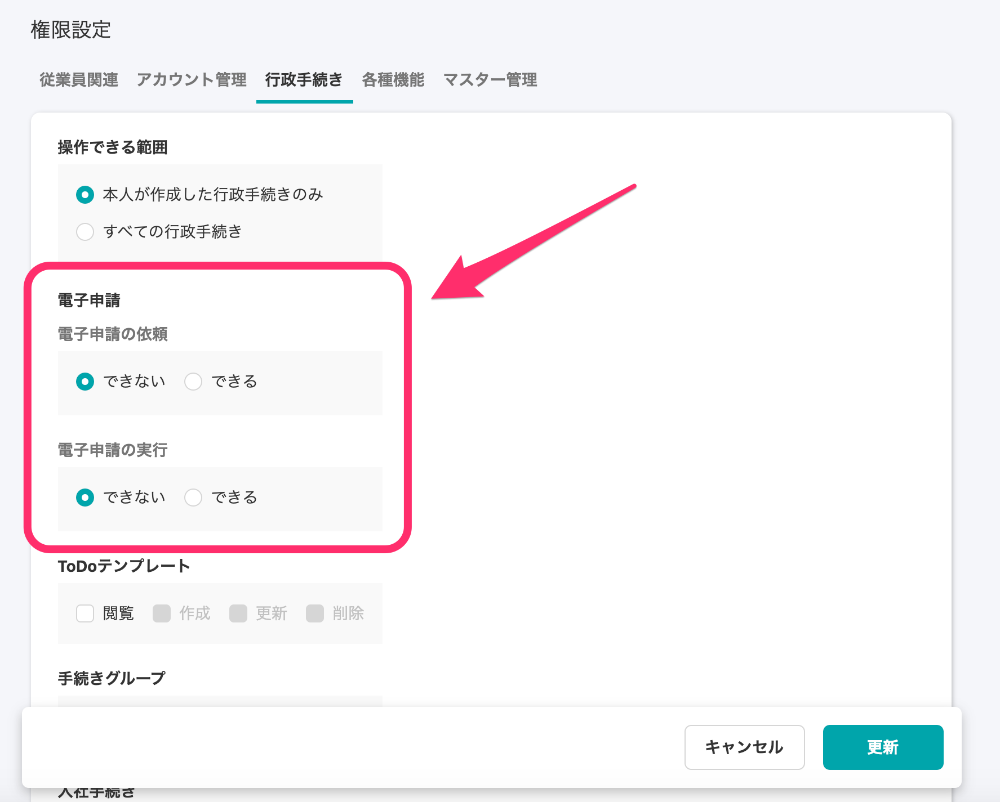
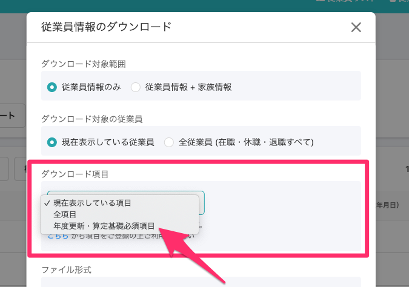
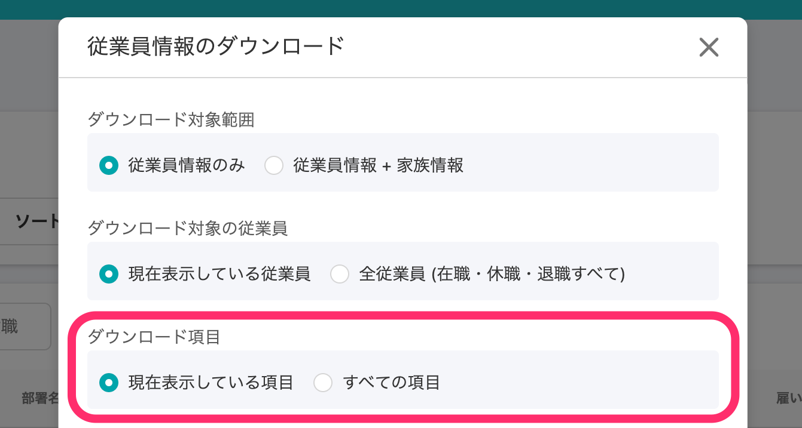
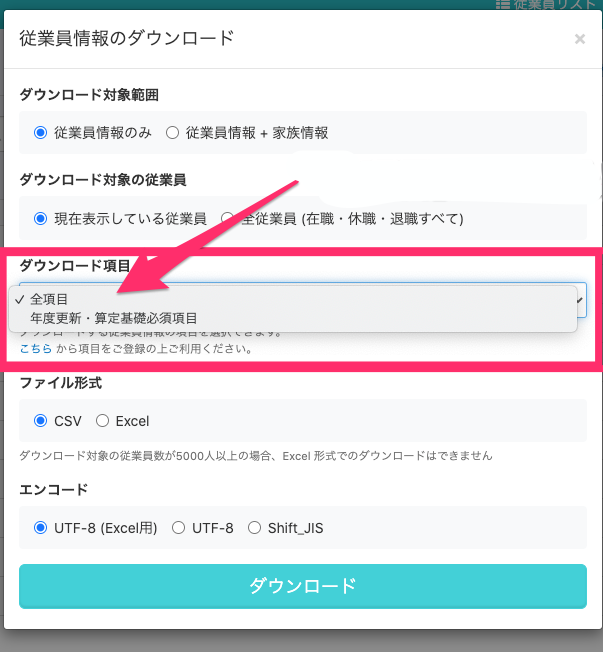
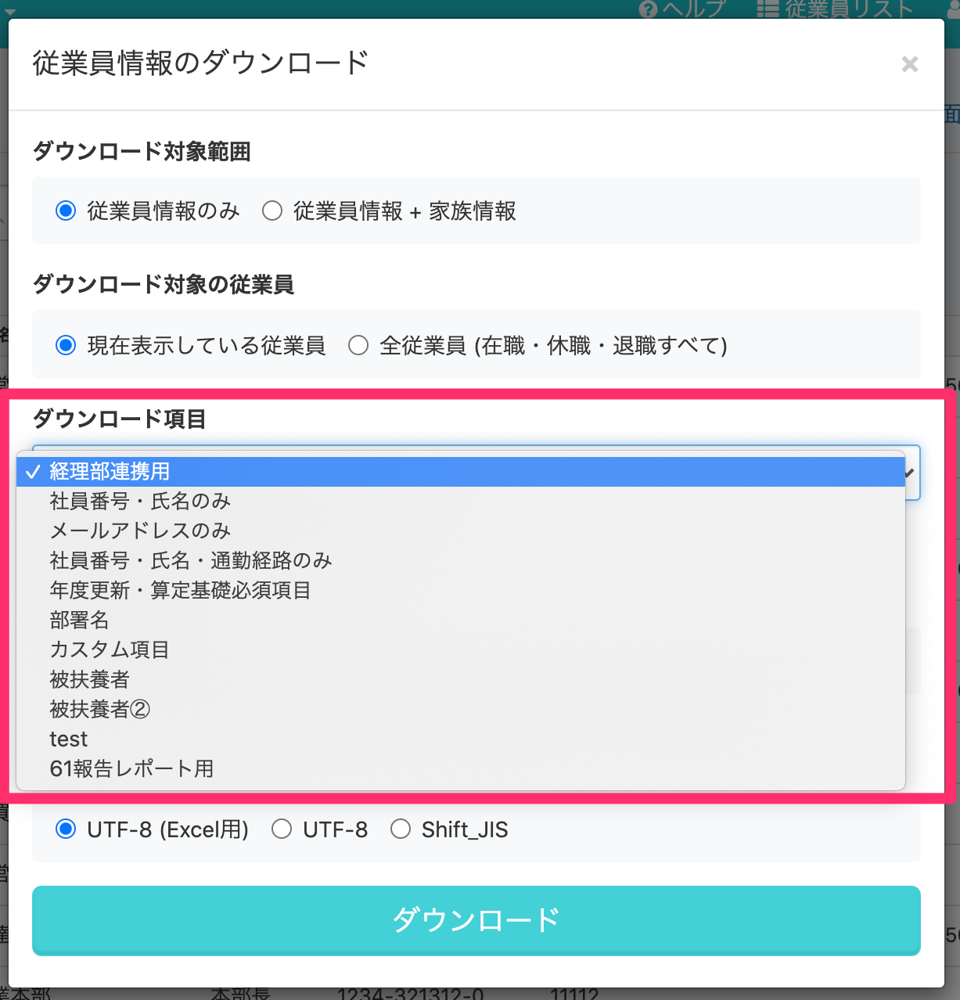
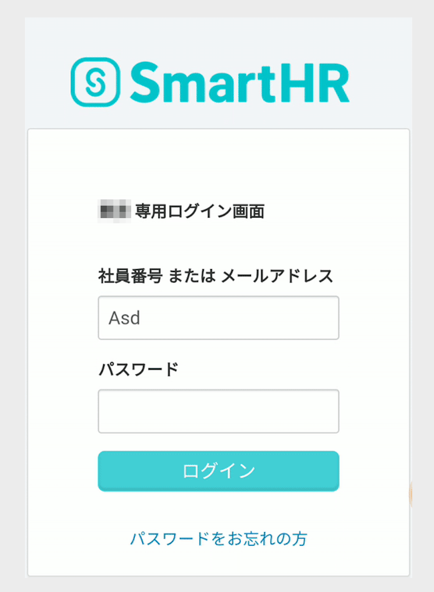
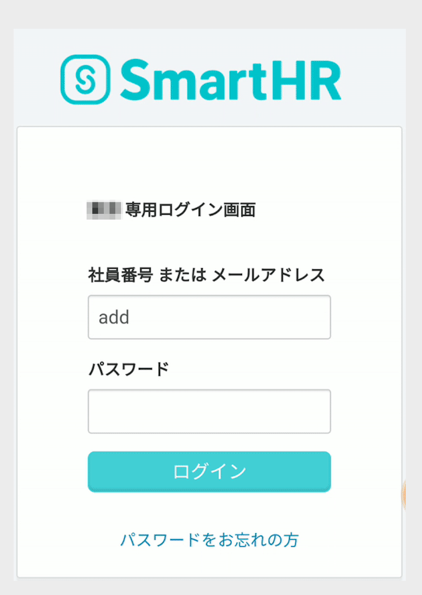

2020年11月5日（木）に行なったアップデートの詳細をお知らせします。

SmartHR基本機能の変更点は、新機能3件・カイゼン1件・不具合修正1件でした。

# ✨ 新機能

## 電子申請の権限を追加しました

権限設定に **\[電子申請の依頼\]** と **\[電子申請の実行\]** の項目を追加しました。

管理者以外でもカスタム権限を設定することで、電子申請が行えます。カスタム権限の追加方法は下記のページをご覧ください。

:::related
[カスタム権限を追加する](https://knowledge.smarthr.jp/hc/ja/articles/360026106594)
:::

**\[権限\]** > **\[アカウント権限\]** の編集画面をひらき、**\[権限設定\]** > **\[行政手続き\]** タブから設定できます。

## 従業員情報のダウンロード項目の仕様を変更しました

旧従業員リストの廃止に向けた改修にともない、従業員情報のダウンロードをする際のダウンロード項目の仕様を、新従業員リストと旧従業員リストでそれぞれ変更しました。

**新従業員リスト**

**\[従業員情報のダウンロード\]** \> **\[ダウンロード項目\]** から**\[ダウンロード項目グループで登録した項目\]** を削除しました。

| 変更前 |  |
| --- | --- |
| 変更後 |  |

従来の「ダウンロード項目」で行なっていた項目の絞り込みは、新しい従業員検索画面の「カスタムリスト」で行なえます。

カスタムリストの設定方法は、下記ページをご覧ください。

:::related
[従業員リストの使い方](https://knowledge.smarthr.jp/hc/ja/articles/360043824473)
:::

**旧従業員リスト**

**\[従業員情報のダウンロード\]** > **\[ダウンロード項目\]** から **\[全項目\]**を削除しました。

ダウンロード項目グループで登録した項目のみ選択肢に表示されます。

| 変更前 |  |
| --- | --- |
| 変更後 |  |

旧従業員リストで従業員情報の全項目をダウンロードする場合やダウンロードする項目を指定する方法は、下記のページをご覧ください。

:::related
[旧従業員リストでダウンロードする項目を絞り込む](https://knowledge.smarthr.jp/hc/ja/articles/360026265273)
:::

そのほか、CSVフォーマットの仕様変更につきましては、下記のお知らせも合わせてご覧ください。

[【重要】全項目ダウンロードの出力結果に関する仕様変更のお知らせ](https://smarthr.jp/update/21230)

[従業員情報のダウンロード項目の変更に関するお知らせ](https://smarthr.jp/update/20689)

## 申請機能を多言語化対応しました

申請機能を多言語化対応し、多言語化を有効にしている場合は、従業員が閲覧できる申請画面が翻訳されるようになりました。

多言語化対応については下記のページをご覧ください。

:::related
[多言語化対応について](https://knowledge.smarthr.jp/hc/ja/articles/360035659594)
:::

# 📈 カイゼン

## スマートフォンからのログイン時に自動でメールアドレスが大文字にならないようにしました

スマートフォンでログイン画面のメールアドレス入力の際に、先頭の文字が自動で大文字になっていたのを改修しました。

| 変更前 |  |
| --- | --- |
| 変更後 |  |

# 👨‍⚕️ 不具合修正

賞与明細一覧の通知設定に関する1件の不具合修正を行ないました。
