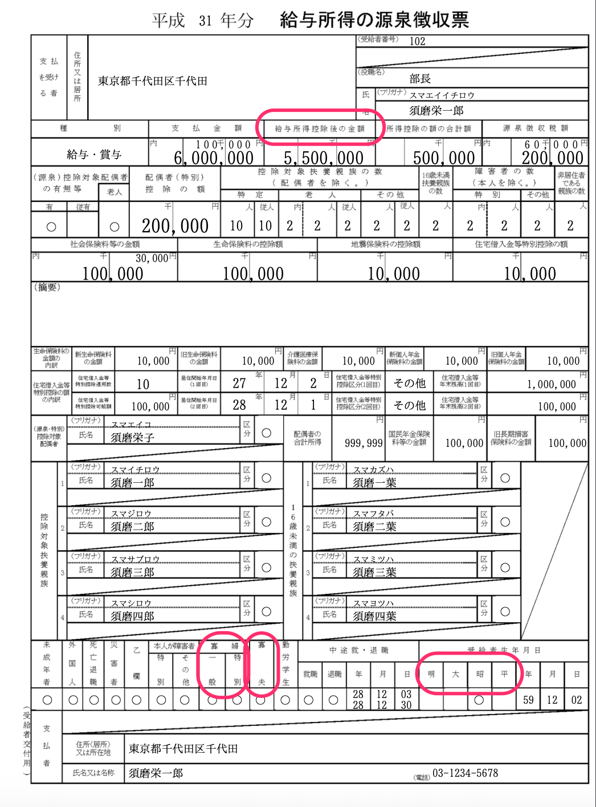
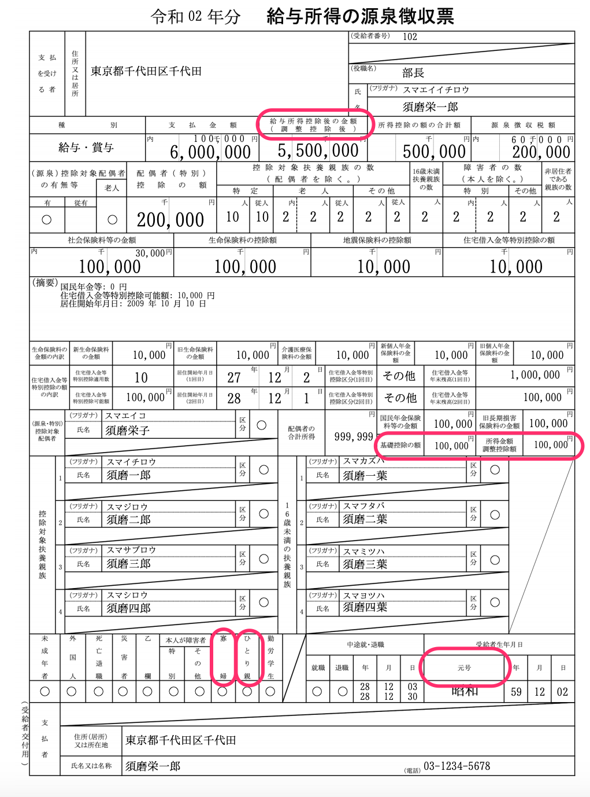
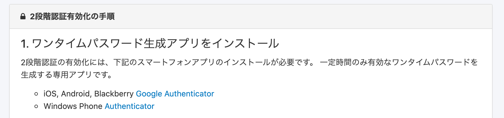
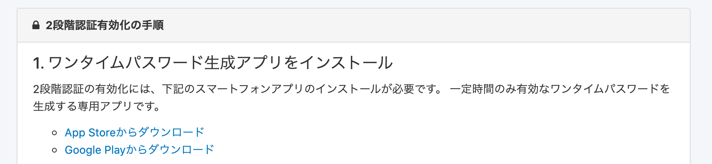

2020年11月9日（月）に行なったアップデートの詳細をお知らせします。

SmartHR基本機能の変更点は、新機能1件・カイゼン1件・不具合修正2件でした。

# ✨ 新機能

## 源泉徴収票のレイアウトを変更しました

令和2年所得税制改正にともない様式が変更されるため、下記のとおりに源泉徴収票のレイアウトを変更しました。

- **\[給与所得控除後の金額\]** → **\[給与所得控除後の金額（調整控除後）\]**
- **\[寡婦（一般）、寡婦（特別）\]** → **\[寡婦\]**　
- **\[寡夫\]** → 項目削除　
- **\[明・大・昭・平\]** のどれかに◯をつける → **\[元号\]** の表記になり、西暦から自動判別で入力
- **\[ひとり親\] \[基礎控除の額\] \[所得金額調整控除額\]** の項目を追加

| 変更前 | 変更後 |
| --- | --- |
|  |  |

# 📈 カイゼン

## Androidユーザー向けに、二段階認証アプリをインストールするための導線を設置しました

これまでAppl StoreとWindows Storeへのリンクのみの設置で、Androidユーザーが二段階認証を設定する際にはGooglePlayでアプリを探し直す手間がありました。

今回の改修でApp StoreとGoogle Playへのリンクを設置しなおし、Androidユーザーが二段階認証アプリをインストールする手間を簡略化しました。

| 変更前 |  |
| --- | --- |
| 変更後 |  |

# 👨‍⚕️ 不具合

扶養追加手続きに関する修正など、2件の不具合修正を行ないました。
