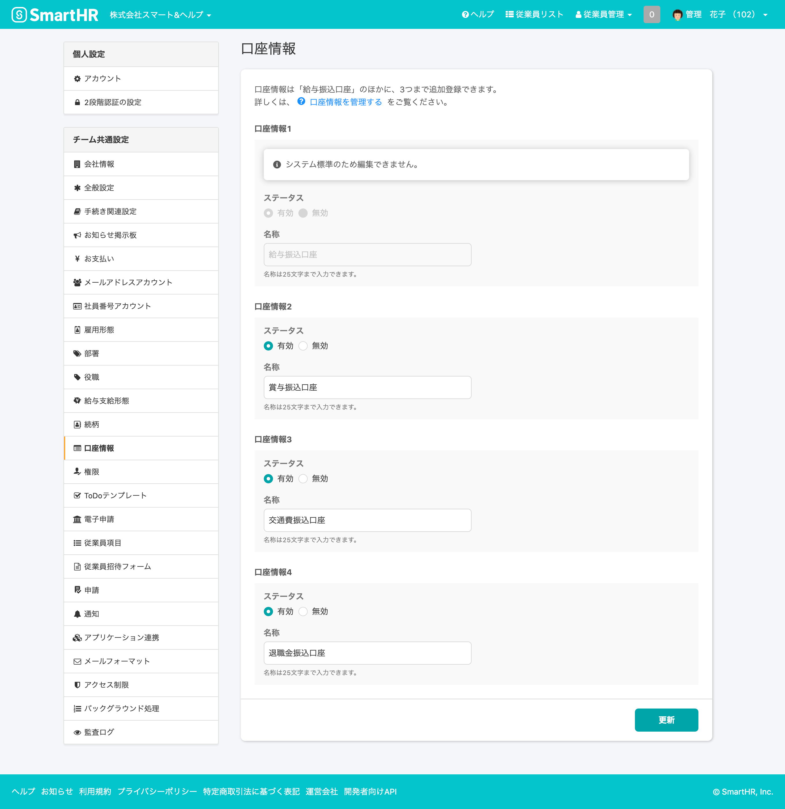
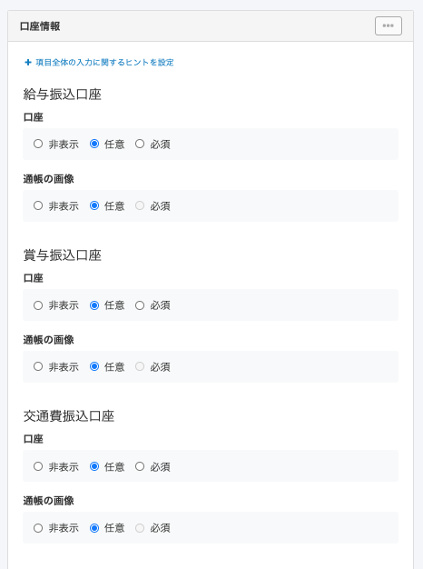

2020年11月10日（火）に行なったアップデートの詳細をお知らせします。

SmartHR基本機能のリリースは、新機能1件でした。

# ✨ 新機能

## 口座情報を複数登録できるようにしました

これまで従業員の口座情報の登録はシステム標準項目の1つでしたが、今回のリリースにより口座情報が最大4つまで登録できるようになりました。

給与・賞与・経費など用途ごとに振込先を分けて複数の口座を管理でき、従業員招待フォームや申請フォームで従業員から複数の口座情報を収集できます。

お知らせページも合わせてご覧ください。

[従業員の口座情報を複数登録できるようになりました](https://smarthr.jp/update/21442)

**\[共通設定\] > \[口座情報\] 画面**

**口座情報の申請フォーム設定画面**

口座情報の設定について、詳しくは下記のページをご覧ください。

:::related
[口座情報を管理する](https://knowledge.smarthr.jp/hc/ja/articles/360058045133)
:::
