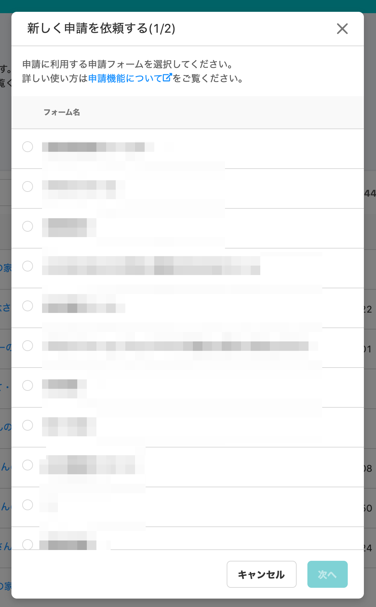
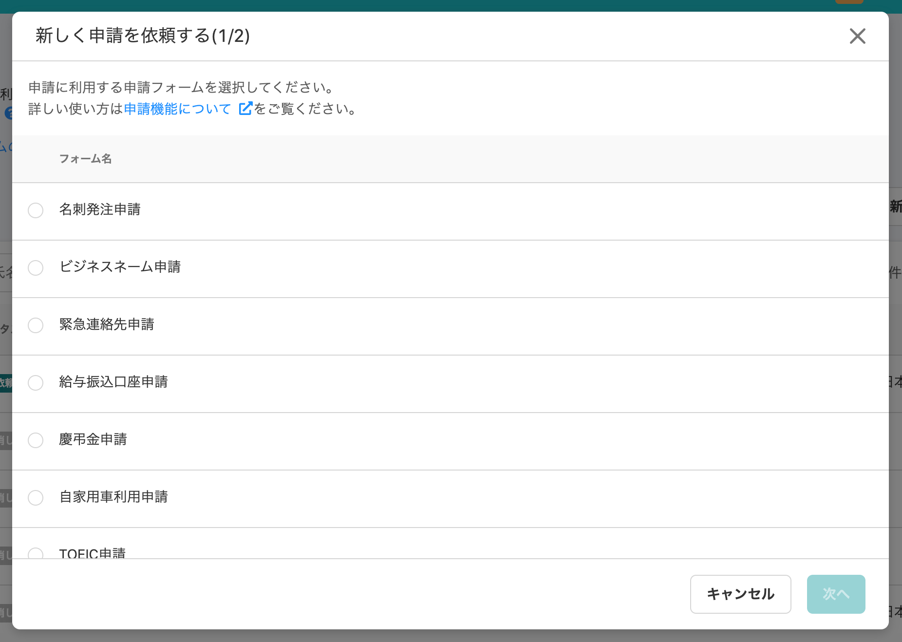
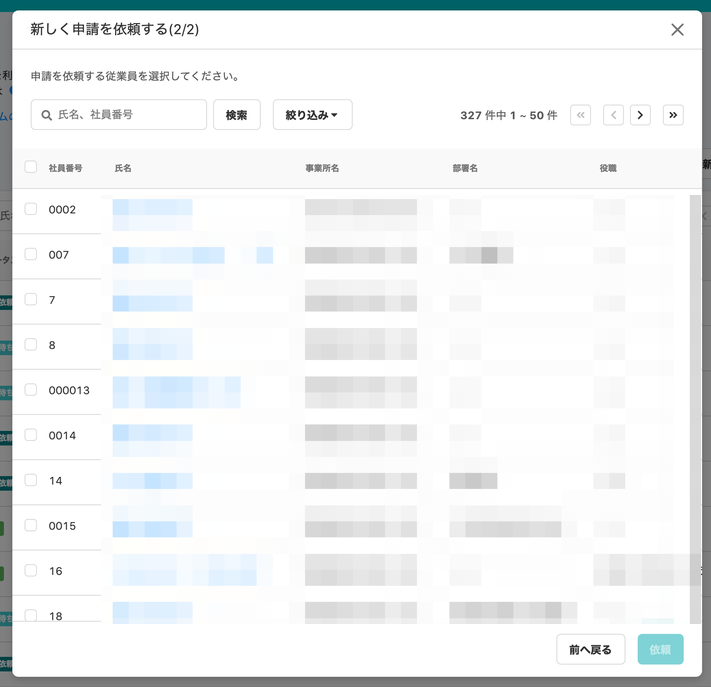
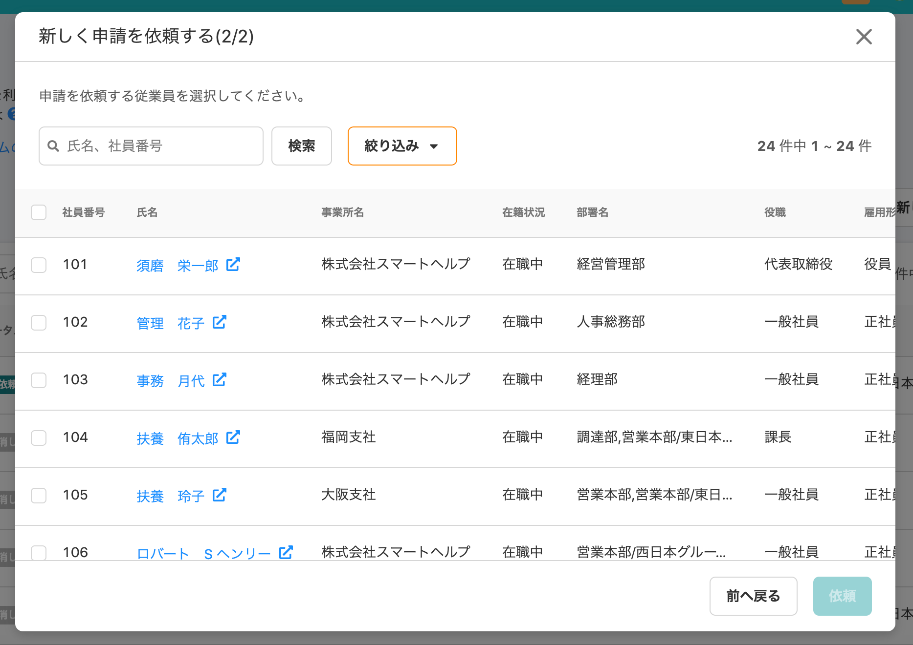
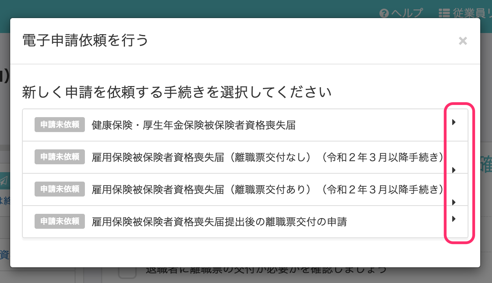
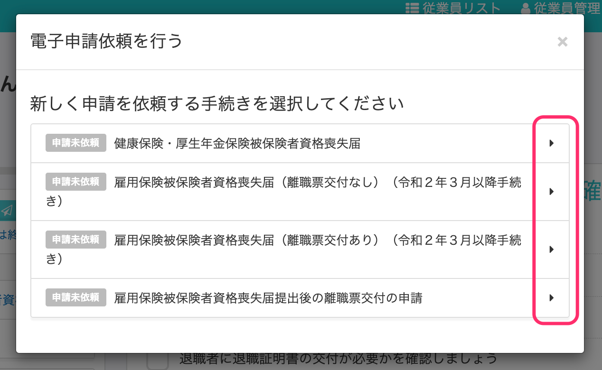

2020年11月24日（火）に行なったアップデートの詳細をお知らせします。

SmartHR基本機能の変更点は、カイゼン2件・不具合修正1件でした。

# 📈 カイゼン

## \[新しく申請を依頼する\]のダイアログの幅を整えました

これまで申請機能の **\[新しく申請を依頼する\]** のダイアログは、「申請フォーム選択中」「ローディング中」「従業員選択中」でそれぞれ幅が異なり、操作がしづらい状態でした。

そこで今回の改修で各ダイアログを同じ幅に設定し、ダイアログ内の操作を行ないやすくしました。

|   | **変更前** |   **変更後**   |
| --- | --- | --- |
| **申請フォーム選択画面** |  |      |
| **従業員選択画面** |      |      |

:::related
[申請機能でできること](https://knowledge.smarthr.jp/hc/ja/articles/360026103894)
:::

## \[電子申請依頼を行う\] のダイアログで \[▶︎\] 表示を均等に配置させました

手続き作成の **\[電子申請依頼を行う\]** のダイアログ内で、手続き名が長い場合に **\[▶︎\] アイコン**が枠にずれて表示されていたので、枠内に均等に配置されるように改修しました。

| 変更前 | 変更後 |
| --- | --- |
|  |  |

:::related
[電子申請手順 ① 申請を依頼する](https://knowledge.smarthr.jp/hc/ja/articles/360026266073)
:::

# 👨‍⚕️ 不具合修正

請求書送付先変更の編集に関する1件の不具合修正を行ないました。
