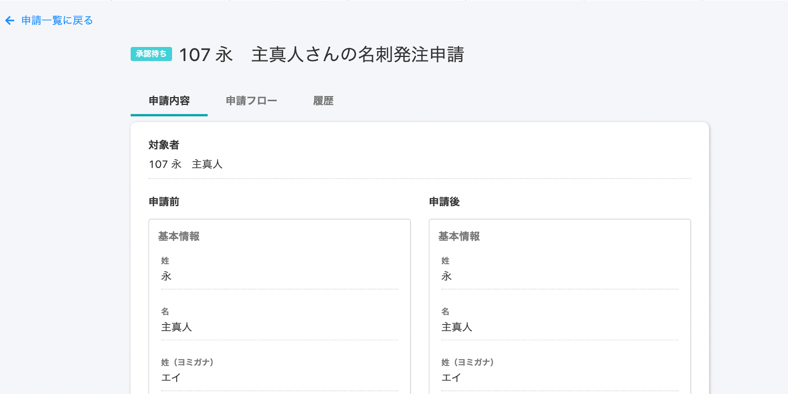
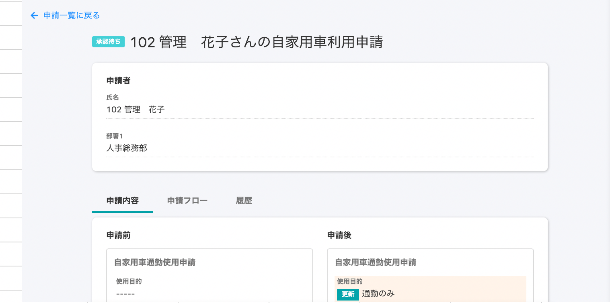

2020年11月25日（水）に行なったアップデートの詳細をお知らせします。

SmartHR基本機能の変更点は、カイゼン1件でした。

# 📈 カイゼン

## 申請詳細画面に申請者の部署情報を表示させました

申請機能で申請者がどの所属部署なのか知りたいという要望を受け、申請詳細画面に申請者の部署情報を表示するようにしました。

**\[機能\]** > **\[申請\]** > **\[申請一覧\]** から詳細画面をひらき、**\[申請者\]** の欄で **\[部署\]** が確認できます。

| 変更前 |  |
| --- | --- |
| 変更後 |      |

:::related
[申請機能でできること](https://knowledge.smarthr.jp/hc/ja/articles/360026103894)
:::
