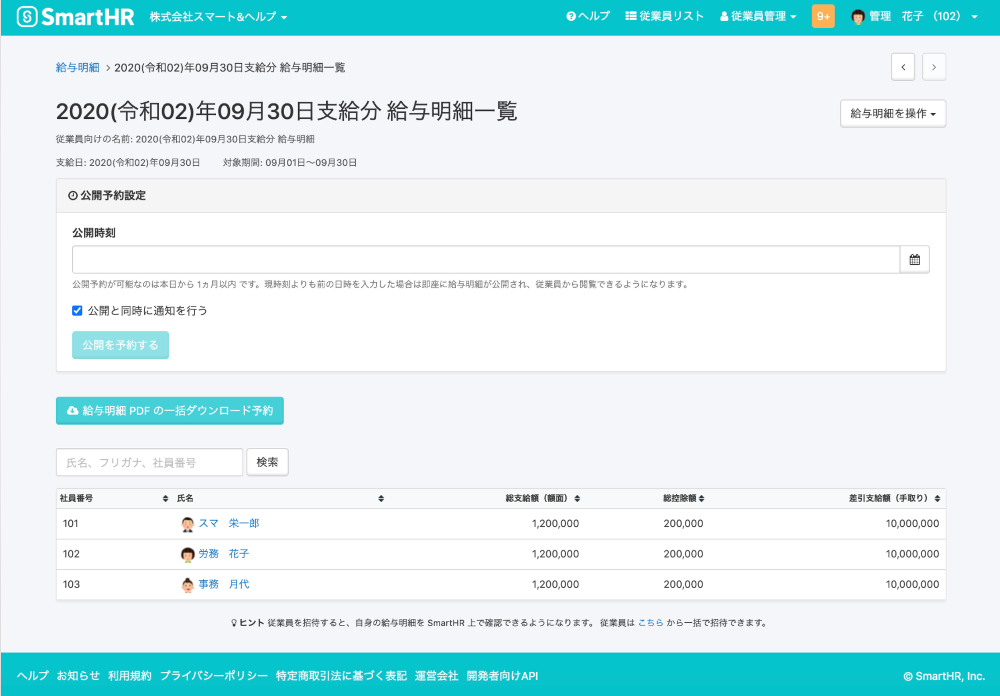
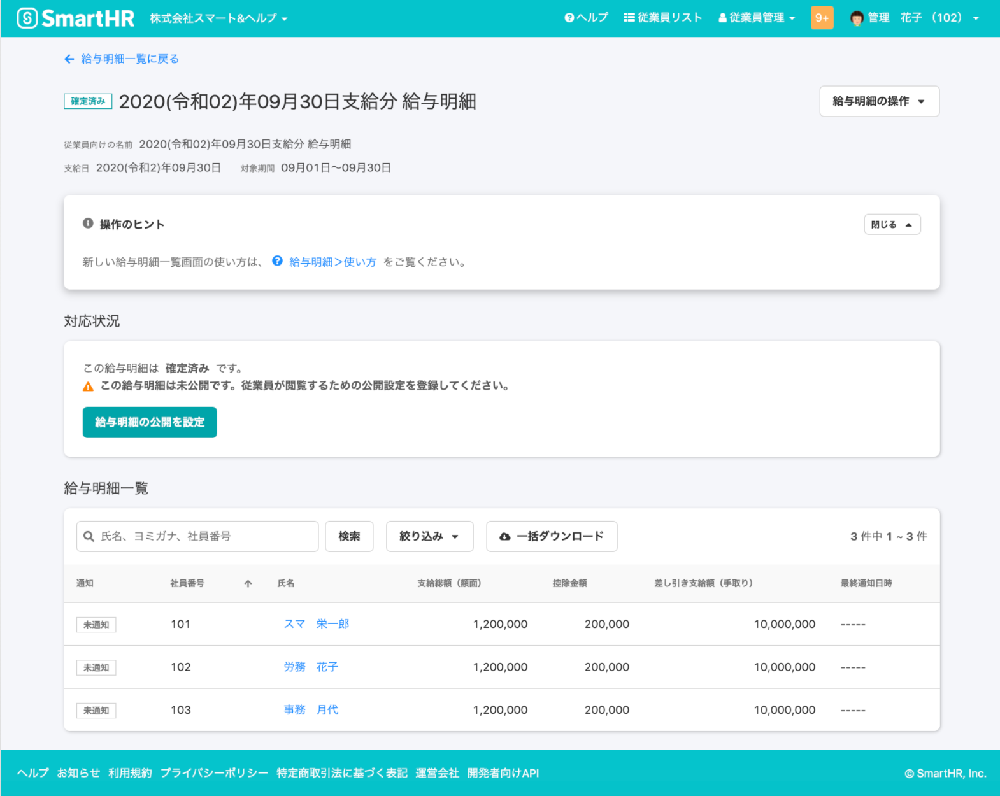
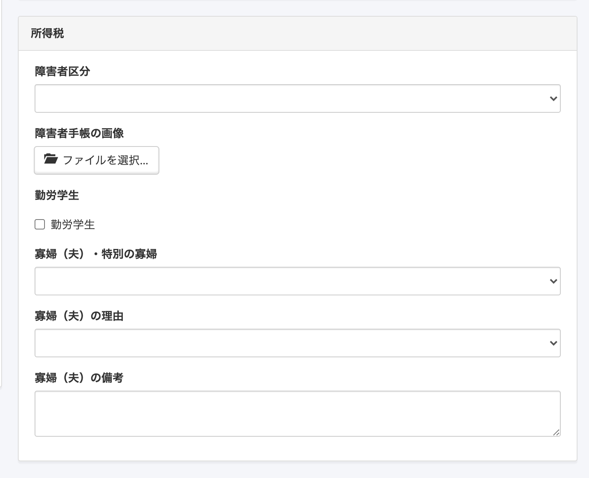
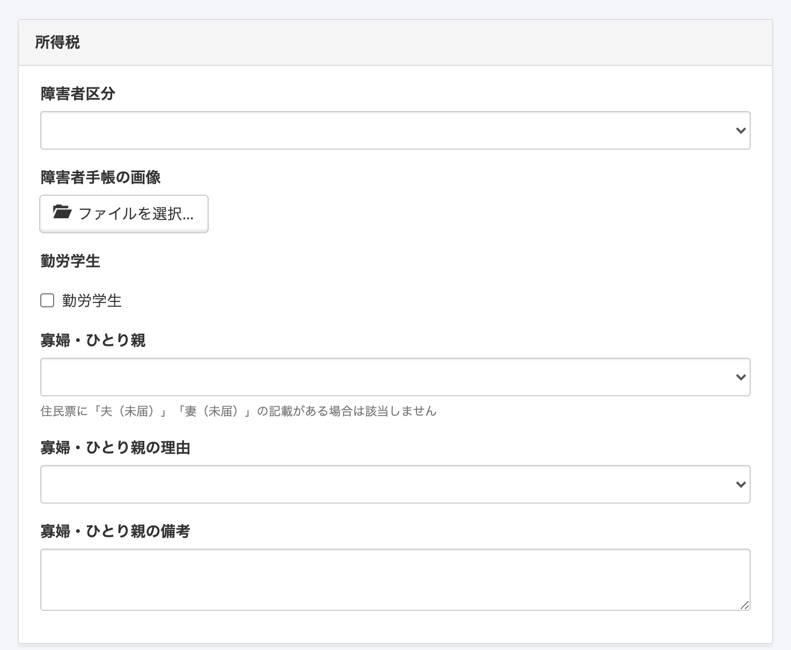
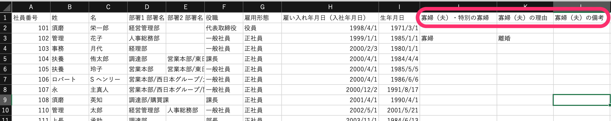
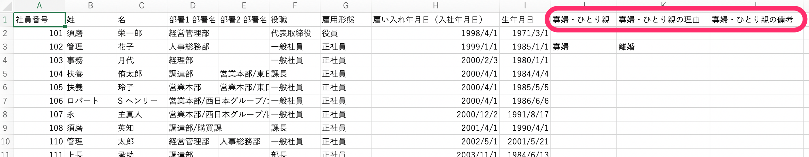

2020年11月26日（木）に行なったアップデートの詳細をお知らせします。

SmartHR基本機能の変更点は、新機能2件でした。

# ✨ 新機能

## 新しいデザインの給与明細一覧画面を公開しました

先日お知らせをした給与明細管理画面のデザイン変更・機能追加の一次リリースとして、新しいデザインの給与明細一覧画面を公開しました。

:::related
[給与明細管理画面がデザイン変更・機能追加されます](https://smarthr.jp/update/21138)
:::

新しいデザインの画面は当面ベータ版として提供し、これまでの画面と並行して利用できます。

今後行なう二次リリースで、ベータ版としての提供を終了し、新しいデザインに完全に移行する予定です。

並行利用期間中に、新しいデザインの画面をぜひお試しください。

給与明細一覧画面上部 **\[新しい画面デザインを利用する\]** をクリックすると、新しい画面をご利用いただけます。

| 変更前 |  |
| --- | --- |
| 変更後 |  |

:::related
[給与明細機能とは](https://knowledge.smarthr.jp/hc/ja/articles/360026107314)
:::

新デザイン向けの操作方法についは、下記のヘルプページをご覧ください。

:::related
[【新デザイン向け】給与明細を確定・公開する](https://knowledge.smarthr.jp/hc/ja/articles/360057942354)
[【新デザイン向け】給与明細の内容を確認・修正する](https://knowledge.smarthr.jp/hc/ja/articles/360059781313)
:::

## 「ひとり親控除」に対応しました

令和2年度税制改正により、未婚のひとり親に対する税制上の措置および寡婦（寡夫）控除の見直しが行われました。

本改正にともない、従業員情報 > **\[所得税\]** の「寡婦（夫）」項目を「ひとり親控除」に対応したものに変更しました。

変更は下記のとおりです。

- 項目名： **\[寡婦（夫）・特別の寡婦\]** → **\[寡婦・ひとり親\]** に変更 ／ 選択肢：**\[ひとり親\]** 追加、**\[特別の寡婦\] \[寡夫\]** 削除
- 項目名： **\[寡婦（夫）の理由\]** → **\[寡婦・ひとり親の理由\]** に変更 ／ 選択肢：**\[未婚\]** 追加
- 項目名： **\[寡婦（夫）の備考\]** → **\[寡婦・ひとり親の備考\]** に変更

| 変更前 | 変更後 |
| --- | --- |
|  |  |

従業員情報の登録ファイル・ダウンロードファイルの項目名も下記のとおり変更しました。

- **\[寡婦（夫）・特別の寡婦\]** → **\[寡婦・ひとり親\]**
- **\[寡婦（夫）の理由\]** → **\[寡婦・ひとり親の理由\]**
- **\[寡婦（夫）の備考\]** → **\[寡婦・ひとり親の備考\]**

| 変更前 |  |
| --- | --- |
| 変更後 |  |

お知らせも合わせてご覧ください。

:::related
[ひとり親控除の新設に伴う項目名変更のお知らせ](https://smarthr.jp/update/21450)
:::
