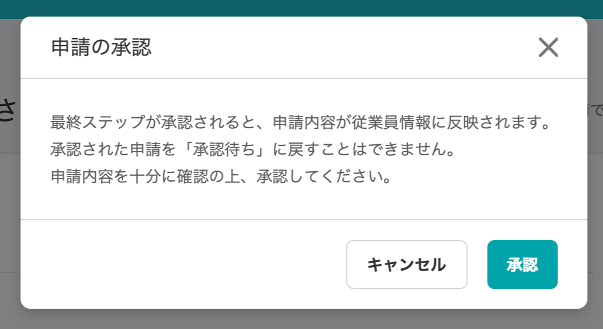
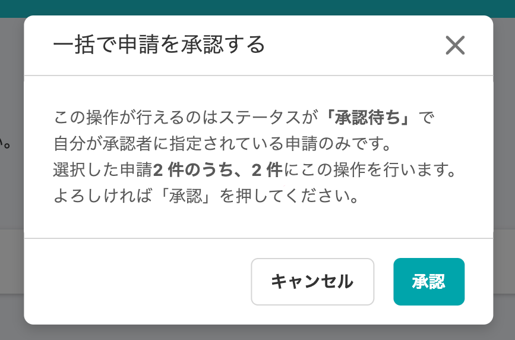

2020年11月27日（金）に行なったアップデートの詳細をお知らせします。

SmartHR基本機能の変更点は、カイゼン1件でした。

# 📈 カイゼン

## 申請承認時のダイアログタイトルの書き方を統一しました

SmartHR全体での表記ルールに合わせるため、申請の承認ステップで表示されるダイアログのタイトル書き方を下記のとおり統一しました。

- **\[申請を承認する\] → \[申請の承認\]**

| 変更前 | 変更後 |
| --- | --- |
|  |  |

- **\[一括で申請を承認する\] → \[申請の一括承認\]**

| 変更前 | 変更後 |
| --- | --- |
|  |  |

- **\[申請を差し戻しますか？\] → \[申請の差し戻し\]**

| 変更前 | 変更後 |
| --- | --- |
|  |  |

- **\[申請を取り消しますか？\] → \[申請の取り消し\]**

| 変更前 | 変更後 |
| --- | --- |
|  |  |
