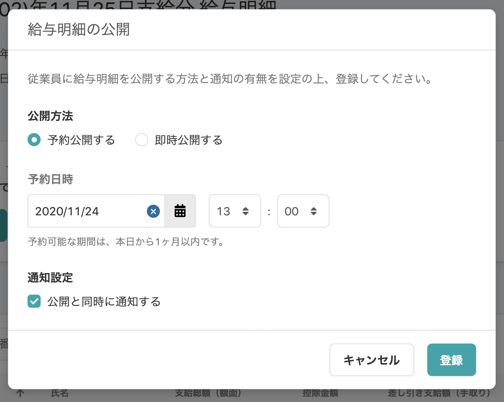
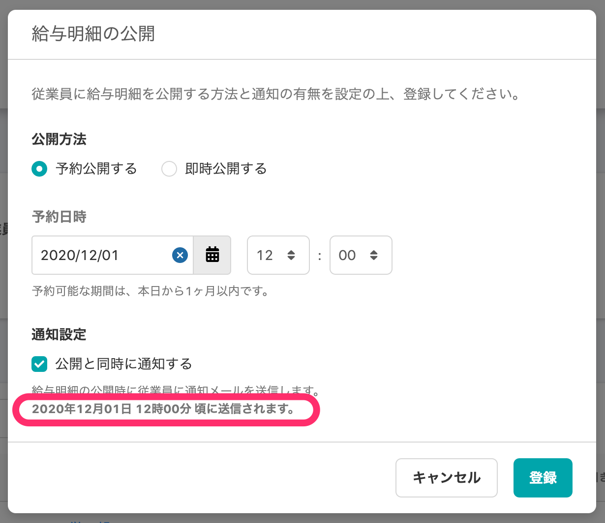
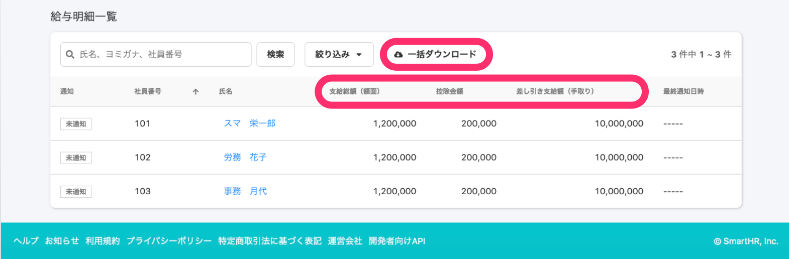
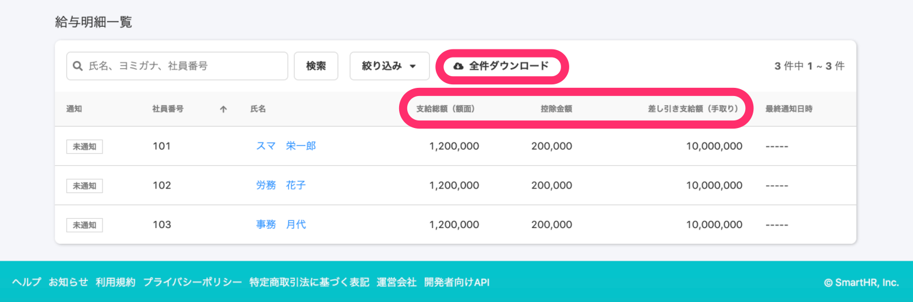
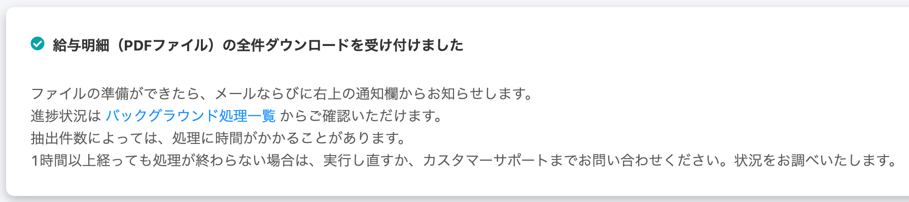
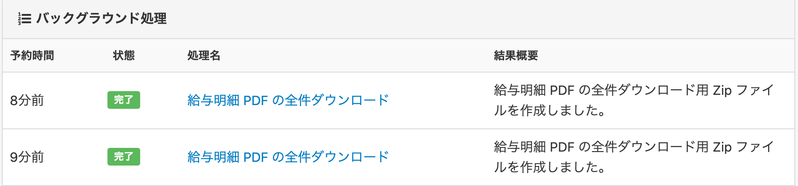
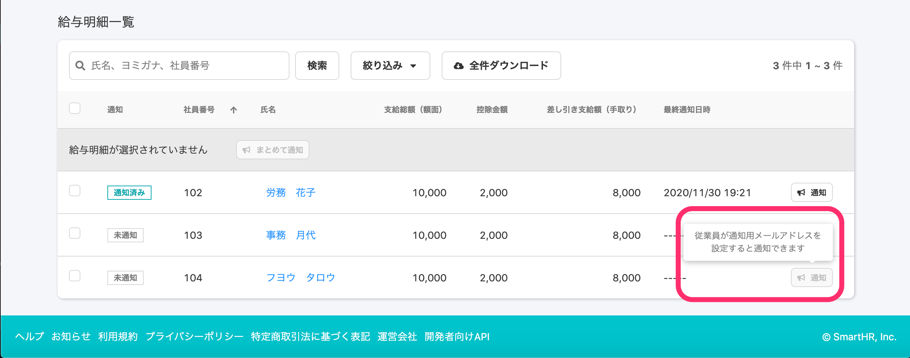

2020年11月30日（月）に行なったアップデートの詳細をお知らせします。

SmartHR基本機能の変更点は、カイゼン2件・不具合修正3件でした。

# 📈 カイゼン

## 新しい給与明細一覧画面のUIカイゼンをしました

11/26（木）にリリースした新しい給与明細一覧画面にUIのカイゼンを行ないました。

:::related
[2020/11/26 新しいデザインの給与明細一覧画面を公開しました 他1件](https://knowledge.smarthr.jp/hc/ja/articles/360059997613)
:::

公開設定ダイアログの通知設定をする際、**\[通知設定\]** > **\[公開と同時に通知する\]** にチェックを入れると、通知メールの具体的な送信時間が補足情報として表示されるようにしました。

| 変更前 |  |
| --- | --- |
| 変更後 |  |

:::related
[【新デザイン向け】給与明細を確定・公開する](https://knowledge.smarthr.jp/hc/ja/articles/360057942354)
:::

画面下 **\[給与明細一覧\]** のデザイン変更は下記のとおりです。

- ダウンロード機能のボタンラベルを **\[一括ダウンロード\]** → **\[全件ダウンロード\]**に変更
- 給与明細の金額テーブルのタイトルを右揃えに修正

| 変更前 |  |
| --- | --- |
| 変更後 |  |

そのほかの変更箇所は、下記のとおりです。

- 全件ダウンロードした際のパネルの文言
- バックグランド処理画面の文言
- 個別通知ボタンの Tooltip 文言

**パネル画面**

**バックグランド処理画面**

**個別通知ボタンのTooltip**

## 源泉徴収票を大量に登録した際の挙動をカイゼンしました

これまで源泉徴収票を大量に登録するとタイムアウトし画面が強制で閉じてしまいましたが、今回のアップデートで最大20万件登録しても画面が正常にひらくようにしました。

# 👨‍⚕️ 不具合修正

申請フォームでの口座情報の入力設定に関する修正など、3件の不具合修正を行ないました。
