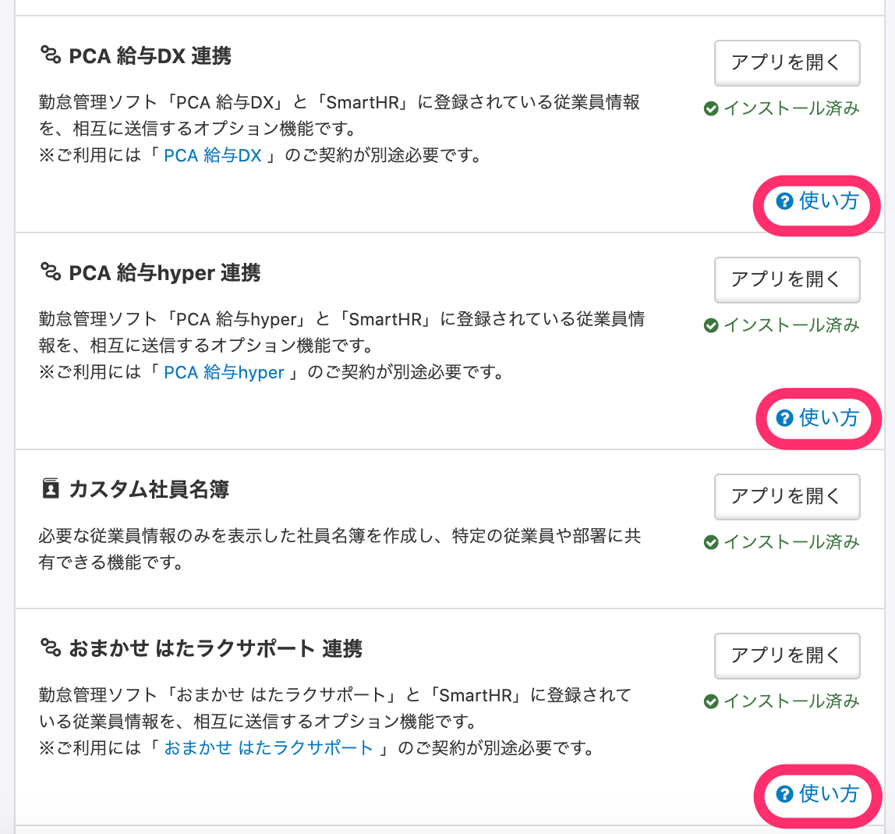

2020年12月1日（火）に行なったアップデートの詳細をお知らせします。

SmartHR基本機能の変更点は、新機能2件・カイゼン1件・不具合修正3件でした。

# ✨ 新機能

## 令和3年版の「給与所得者の扶養控除等の（異動）申告書」に対応しました

入社の手続き・扶養追加の手続き・扶養削除の手続きで令和3年版の「給与所得者の扶養控除等の（異動）申告書」も作成できるようになりました。

入社日、扶養追加日もしくは削除日を令和3年の日付にして手続きを作成すると、令和3年の様式が適用されます。

変更内容は以下のとおりです。

- **\[ひとり親\]** 項目の追加
- **\[特別の寡婦\] \[寡夫\]** の削除

## PCA 給与DX 連携、PCA 給与hyper 連携、おまかせ はたラクサポート連携の項目にヘルプページへの導線を設置しました

アプリケーション連携ページの **\[PCA 給与DX 連携\] \[PCA 給与hyper 連携\] \[おまかせ はたラクサポート連携\]** の欄に、関連したヘルプページへの導線を設置しました。

画面右上アカウント名 > **\[共通設定\]** > **\[アプリケーション連携\]** > **\[SmartHR オプション機能\]** から、

① **\[PCA 給与DX 連携\] / \[PCA 給与hyper 連携\]** > **\[使い方\]** をクリックすると、下記のヘルプページのリンクが表示されます。

- [【PCA給与 DXクラウド／クラウドhyper】連携設定（初回のみ）](https://knowledge.smarthr.jp/hc/ja/articles/360041146073)
- [【PCA給与 DXクラウド／クラウドhyper】従業員情報を同期する](https://knowledge.smarthr.jp/hc/ja/articles/360040744014)
- [【PCA給与 DXクラウド／クラウドhyper】連携可能な従業員情報](https://knowledge.smarthr.jp/hc/ja/articles/360040752454)

② **\[おまかせ はたラクサポート連携\]** > **\[使い方\]** をクリックすると、下記のヘルプページのリンクが表示されます。

- [【おまかせ はたラクサポート】連携設定（初回のみ）](https://knowledge.smarthr.jp/hc/ja/articles/360056035933)
- [【おまかせ はたラクサポート】従業員情報を同期する](https://knowledge.smarthr.jp/hc/ja/articles/360058038293)
- [【おまかせ はたラクサポート】同期可能な従業員情報について](https://knowledge.smarthr.jp/hc/ja/articles/360056232274) 

オプション機能のインストールについて詳しくは、下記のページをご覧ください。

:::related
[SmartHRオプション機能をインストールする](https://knowledge.smarthr.jp/hc/ja/articles/360026262553)
:::

# 📈 カイゼン

## 0件の給与明細を取り込んだ際の、新しい給与明細画面の表示を変更しました

0件の給与明細を取り込んだ際、もしくは全件エラーで0件取り込みとなった際の、新しい給与明細画面の表示を下記のとおり変更しました。

- **\[給与支給形態の追加\]** ボタンを削除
- 文言を **\[給与支給形態まだ追加されていません\]** → **\[給与明細がありません\]** に変更
- タイトルを **\[給与支給形態\]** → **\[給与明細一覧\]** に変更

# 👨‍⚕️ 不具合修正

口座情報の申請・承認に関する修正など、3件の不具合修正を行ないました。
