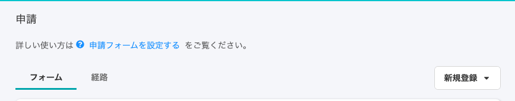
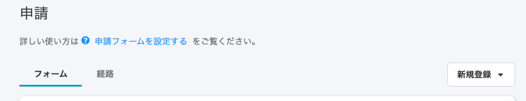

2020年12月2日（水）に行なったアップデートの詳細をお知らせします。

SmartHR基本機能の変更点は、カイゼン3件でした。

# 📈 カイゼン

## 社員番号アカウントのメールアドレスを再設定した発生したエラーの状態を、一覧画面とCSVに正しく反映させました

一度メールアドレスを認証した社員番号アカウントの従業員が別のアドレスを再設定し、そのアドレスでエラーが起きた場合、これまでは「社員番号アカウント一覧」と「社員番号アカウント一覧のCSV」にエラーの状態が正しく反映されていませんでした。

**社員番号アカウント一覧**

これまでは \[メールアドレス\] 列に認証済みマークが表示され、ユーザーはエラーに気づけない状態でしたが、今回の改修で、エラーが起きた事実を確認できるようにしました。

エラーの表記については下記のページをご覧ください。

:::related
[メールが届かない原因と対応方法は？](https://knowledge.smarthr.jp/hc/ja/articles/360026264593)
:::

**社員番号アカウント一覧CSV**

これまで、社員番号アカウント一覧CSVの **\[メールアドレス\]** 欄には、変更前のアドレスが表示されており、変更後のエラーが発生したアドレスが把握できませんでした。

一方で、**\[メールエラー\]\[エラーの理由\]** 欄では、変更後に発生したエラー内容を表示していました。

今回の改修で、 **\[メールアドレス\]** 欄に、再設定後のアドレスを表示させるようにしました。

社員番号アカウントの作成については、下記のページをご覧ください。

:::related
[社員番号アカウントを作成する](https://knowledge.smarthr.jp/hc/ja/articles/360026263373)
:::

## 申請の設定画面のタイトル文字の大きさを変更しました

SmartHR全体のガイドラインに合わせて、 **\[共通設定\]** \> **\[申請\]** で表示されるページのタイトル文字サイズを大きくしました。

| 変更前 |  |
| --- | --- |
| 変更後 |  |

## 古いデザインが残っていた画面をSmartHR UIに差し替えました

SmartHR全体でデザインを統一させるため、申請機能など一部のページで適用されていた古いデザインシステムを、Smart HR UIに差し替えました。
