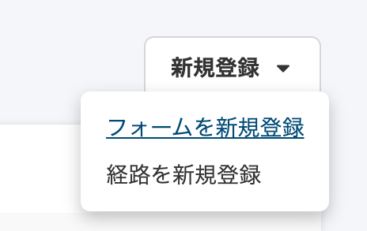
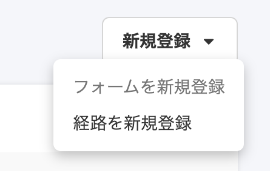

2020年12月4日（金）に行なったアップデートの詳細をお知らせします。

SmartHR基本機能の変更点は、カイゼン1件・不具合修正1件でした。

# 📈 カイゼン

## 申請の新規登録のドロップダウンメニューの表示を変更しました

SmartHR全体のガイドラインに合わせて、 **\[共通設定\]** \> **\[申請\]** > **\[新規登録\]** のドロップダウンメニューのデザインを変更しました。

| 変更前 | 変更後 |
| --- | --- |
|  |  |

# 👨‍⚕️ 不具合修正

申請フォームのエラーメッセージに関する1件の不具合修正を行ないました。
